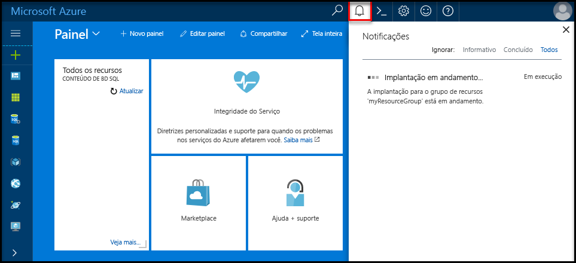

# <a name="design-your-first-azure-sql-database"></a>Criar seu primeiro banco de dados SQL do Azure

Banco de dados do SQL Azure é um relacional banco de dados como um serviço (DBaaS) no hello Microsoft Cloud ("Azure"). Neste tutorial, você aprenderá como toouse Olá portal do Azure e [SQL Server Management Studio](https://msdn.microsoft.com/library/ms174173.aspx) (SSMS) para: 

> [!div class="checklist"]
> * Criar um banco de dados Olá portal do Azure
> * Configurar uma regra de firewall de nível de servidor em Olá portal do Azure
> * Conectar-se o banco de dados toohello com SSMS
> * Criar tabelas com SSMS
> * Carregar dados em massa com o BCP
> * Consultar dados com o SSMS
> * Restaurar Olá tooa de banco de dados anterior [restauração pontual](sql-database-recovery-using-backups.md#point-in-time-restore) em Olá portal do Azure

Se você não tiver uma assinatura do Azure, [crie uma conta gratuita](https://azure.microsoft.com/free/) antes de começar.

## <a name="prerequisites"></a>Pré-requisitos

toocomplete este tutorial, verifique se você tiver instalado:
- versão mais recente de saudação do [SQL Server Management Studio](https://msdn.microsoft.com/library/ms174173.aspx) (SSMS).
- versão mais recente de saudação do [BCP e o SQLCMD](https://www.microsoft.com/download/details.aspx?id=36433).

## <a name="log-in-toohello-azure-portal"></a>Faça logon no toohello portal do Azure

Faça logon no toohello [portal do Azure](https://portal.azure.com/).

## <a name="create-a-blank-sql-database"></a>Criar um banco de dados SQL em branco

Um banco de dados SQL do Azure é criado com um conjunto definido de [recursos de computação e armazenamento](sql-database-service-tiers.md). banco de dados de saudação é criado em um [grupo de recursos do Azure](../azure-resource-manager/resource-group-overview.md) e, em um [servidor lógico do banco de dados do Azure SQL](sql-database-features.md). 

Siga essas etapas toocreate um banco de dados SQL em branco. 

1. Clique em Olá **novo** botão localizado no canto superior esquerdo de saudação do hello portal do Azure.

2. Selecione **bancos de dados** de saudação **novo** página e selecione **banco de dados SQL** de saudação **bancos de dados** página. 

   

3. Preencha formulário de banco de dados SQL Olá com hello seguintes informações, conforme mostrado na saudação anterior imagem:   

   | Configuração       | Valor sugerido | Descrição | 
   | ------------ | ------------------ | ------------------------------------------------- | 
   | **Nome do banco de dados** | mySampleDatabase | Para ver os nomes do banco de dados válidos, consulte [Identificadores do Banco de Dados](https://docs.microsoft.com/sql/relational-databases/databases/database-identifiers). | 
   | **Assinatura** | Sua assinatura  | Para obter detalhes sobre suas assinaturas, consulte [Assinaturas](https://account.windowsazure.com/Subscriptions). |
   | **Grupo de recursos** | myResourceGroup | Para ver os nomes do grupo de recursos válidos, consulte [Regras e restrições de nomenclatura](https://docs.microsoft.com/azure/architecture/best-practices/naming-conventions). |
   | **Selecionar fonte** | Banco de dados em branco | Especifica que um banco de dados em branco deve ser criado. |

4. Clique em **Server** toocreate e configurar um novo servidor para o novo banco de dados. Preencha Olá **novo formulário de servidor** com hello informações a seguir: 

   | Configuração       | Valor sugerido | Descrição | 
   | ------------ | ------------------ | ------------------------------------------------- | 
   | **Nome do servidor** | Qualquer nome exclusivo globalmente | Para ver os nomes do servidor válidos, consulte [Regras e restrições de nomenclatura](https://docs.microsoft.com/azure/architecture/best-practices/naming-conventions). | 
   | **Logon de administrador do servidor** | Qualquer nome válido | Para ver os nomes de logon válidos, consulte [Identificadores do Banco de Dados](https://docs.microsoft.com/sql/relational-databases/databases/database-identifiers).|
   | **Senha** | Qualquer senha válida | Sua senha deve ter pelo menos 8 caracteres e deve conter caracteres de três das Olá categorias a seguir: caracteres em letras maiusculas, letras minúsculas, números e caracteres não alfanuméricos. |
   | **Localidade** | Qualquer local válido | Para obter mais informações sobre as regiões, consulte [Regiões do Azure](https://azure.microsoft.com/regions/). |

   

5. Clique em **Selecionar**.

6. Clique em **preço** toospecify Olá desempenho e da camada de nível de serviço para o novo banco de dados. Para este tutorial, selecione **20 DTUs** e **250** GB de armazenamento.

   

7. Clique em **Aplicar**.  

8. Selecione um **agrupamento** para banco de dados em branco (para este tutorial, usar o valor padrão Olá) hello. Para obter mais informações sobre agrupamentos, consulte [Agrupamentos](https://docs.microsoft.com/sql/t-sql/statements/collations)

9. Clique em **criar** banco de dados do tooprovision hello. Provisionamento leva sobre toocomplete um minuto e meia. 

10. Na barra de ferramentas hello, clique em **notificações** toomonitor processo de implantação de saudação.

   

## <a name="create-a-server-level-firewall-rule"></a>Criar uma regra de firewall no nível de servidor

Olá serviço de banco de dados SQL cria um firewall em Olá nível de servidor que impede que aplicativos externos e ferramentas de conexão de servidor toohello ou bancos de dados no servidor de saudação, a menos que uma regra de firewall é criada um firewall de saudação tooopen para endereços IP específicos. Siga estas etapas toocreate um [regra de firewall de nível de servidor de banco de dados SQL](sql-database-firewall-configure.md) para o endereço IP do cliente e habilitar a conectividade externa através do firewall do banco de dados SQL Olá para seu endereço de IP. 

> [!NOTE]
> O Banco de Dados SQL se comunica pela porta 1433. Se você estiver tentando tooconnect de dentro de uma rede corporativa, o tráfego de saída pela porta 1433 talvez não consigam pelo firewall da rede. Nesse caso, você não pode conectar o servidor de banco de dados do Azure SQL tooyour, a menos que o departamento de TI abre a porta 1433.
>

1. Após a conclusão da implantação hello, clique em **bancos de dados SQL** no menu esquerdo hello e clique **mySampleDatabase** em Olá **bancos de dados SQL** página. Olá, página de visão geral para o banco de dados abre, mostrando a você Olá totalmente qualificado nome do servidor (como **mynewserver20170313.database.windows.net**) e fornece opções de configuração adicional. Copie esse nome totalmente qualificado do servidor para um uso posterior.

   > [!IMPORTANT]
   > É necessário que este servidor de tooyour de tooconnect de nome totalmente qualificado do servidor e seus bancos de dados em início rápido subsequente.
   > 

    

2. Clique em **definir o firewall do servidor** na barra de ferramentas Olá conforme mostrado na imagem anterior hello. Olá **configurações de Firewall** página para o servidor de banco de dados SQL Olá é aberta. 

    


3. Clique em **Adicionar IP do cliente** em Olá barra de ferramentas tooadd seu atual endereço IP tooa nova regra de firewall. Uma regra de firewall pode abrir a porta 1433 para um único endereço IP ou um intervalo de endereços IP.

4. Clique em **Salvar**. Uma regra de firewall de nível de servidor é criada para seu endereço IP atual, abrir a porta 1433 no servidor lógico hello.

    

4. Clique em **Okey** e, em seguida, feche Olá **configurações de Firewall** página.

Agora você pode conectar o servidor de banco de dados SQL toohello e seus bancos de dados usando o SQL Server Management Studio ou outra ferramenta de sua escolha usando esse endereço IP usando a conta de administrador de servidor de saudação criada anteriormente.

> [!IMPORTANT]
> Por padrão, o acesso através do firewall do banco de dados SQL hello está habilitado para todos os serviços do Azure. Clique em **OFF** em toodisable essa página para todos os serviços do Azure.

## <a name="sql-server-connection-information"></a>Informações de conexão do servidor SQL

Obter nome de totalmente qualificado do servidor de saudação de seu servidor de banco de dados do Azure SQL Olá portal do Azure. Você usa Olá totalmente qualificado nome tooconnect tooyour server usando o SQL Server Management Studio.

1. Faça logon no toohello [portal do Azure](https://portal.azure.com/).
2. Selecione **bancos de dados SQL** no menu esquerdo do hello e clique em seu banco de dados em Olá **bancos de dados SQL** página. 
3. Em Olá **Essentials** painel Olá página do portal do Azure para seu banco de dados, localize e copie Olá **nome do servidor**.

   

## <a name="connect-toohello-database-with-ssms"></a>Conectar-se o banco de dados toohello com SSMS

Use [SQL Server Management Studio](https://docs.microsoft.com/sql/ssms/sql-server-management-studio-ssms) tooestablish um servidor de banco de dados SQL do tooyour de conexão.

1. Abra o SQL Server Management Studio.

2. Em Olá **conectar tooServer** caixa de diálogo, digite Olá informações a seguir:

   | Configuração       | Valor sugerido | Descrição | 
   | ------------ | ------------------ | ------------------------------------------------- | 
   | Tipo de servidor | Mecanismo de banco de dados | Esse valor é obrigatório |
   | Nome do servidor | nome totalmente qualificado do servidor de saudação | Olá nome deve ser semelhante a esta: **mynewserver20170313.database.windows.net**. |
   | Autenticação | Autenticação do SQL Server | Autenticação do SQL é o tipo de autenticação somente de saudação que configuramos neste tutorial. |
   | Logon | conta de administrador do servidor de saudação | Essa é a conta de saudação que você especificou quando criou o servidor de saudação. |
   | Senha | senha de saudação para sua conta de administrador do servidor | Essa é a senha de saudação que você especificou quando criou o servidor de saudação. |

   

3. Clique em **opções** em Olá **conectar tooserver** caixa de diálogo. Em Olá **conectar toodatabase** seção, digite **mySampleDatabase** tooconnect toothis database.

     

4. Clique em **Conectar**. janela do Pesquisador de objetos de saudação é aberta no SSMS. 

5. No Pesquisador de objetos, expanda **bancos de dados** e, em seguida, expanda **mySampleDatabase** tooview objetos de saudação no banco de dados de exemplo hello.

     

## <a name="create-tables-in-hello-database"></a>Criar tabelas no banco de dados de saudação 

Criar um esquema de banco de dados com quatro tabelas que modelam um sistema de gerenciamento de aluno para universidades, usando o [Transact-SQL](https://docs.microsoft.com/sql/t-sql/language-reference):

- Pessoa
- Curso
- Aluno
- Crédito que modela um sistema de gerenciamento de aluno para universidades

Olá diagrama a seguir mostra como essas tabelas são relacionada tooeach outros. Algumas dessas tabelas fazem referência a colunas em outras tabelas. Por exemplo, a tabela de alunos Olá faz referência a saudação **PersonId** coluna da saudação **pessoa** tabela. Estudo Olá diagrama toounderstand como Olá tabelas neste tutorial são relacionada tooone outro. Para uma Visão aprofundada de como tabelas de banco de dados eficiente toocreate, consulte [criar tabelas de banco de dados eficiente](https://msdn.microsoft.com/library/cc505842.aspx). Para obter informações sobre como escolher tipos de dados, consulte [Tipos de dados](https://docs.microsoft.com/sql/t-sql/data-types/data-types-transact-sql).

> [!NOTE]
> Você também pode usar o hello [designer de tabela no SQL Server Management Studio](https://msdn.microsoft.com/library/hh272695.aspx) toocreate e estruturar suas tabelas. 


1. No Pesquisador de Objetos, clique com o botão direito em **mySampleDatabase** e clique em **Nova Consulta**. Uma janela de consulta em branco é aberto que é conectado tooyour banco de dados.

2. Na janela de consulta hello, execute Olá consulta toocreate quatro tabelas no banco de dados a seguir: 

   ```sql 
   -- Create Person table

   CREATE TABLE Person
   (
   PersonId   INT IDENTITY PRIMARY KEY,
   FirstName   NVARCHAR(128) NOT NULL,
   MiddelInitial NVARCHAR(10),
   LastName   NVARCHAR(128) NOT NULL,
   DateOfBirth   DATE NOT NULL
   )
   
   -- Create Student table
 
   CREATE TABLE Student
   (
   StudentId INT IDENTITY PRIMARY KEY,
   PersonId  INT REFERENCES Person (PersonId),
   Email   NVARCHAR(256)
   )
   
   -- Create Course table
 
   CREATE TABLE Course
   (
   CourseId  INT IDENTITY PRIMARY KEY,
   Name   NVARCHAR(50) NOT NULL,
   Teacher   NVARCHAR(256) NOT NULL
   ) 

   -- Create Credit table
 
   CREATE TABLE Credit
   (
   StudentId   INT REFERENCES Student (StudentId),
   CourseId   INT REFERENCES Course (CourseId),
   Grade   DECIMAL(5,2) CHECK (Grade <= 100.00),
   Attempt   TINYINT,
   CONSTRAINT  [UQ_studentgrades] UNIQUE CLUSTERED
   (
   StudentId, CourseId, Grade, Attempt
   )
   )
   ```

   

3. Expanda Olá 'tabelas' nas tabelas Olá SQL Server Management Studio Object explorer toosee Olá criado por você.

   

## <a name="load-data-into-hello-tables"></a>Carregar dados em tabelas de saudação

1. Crie uma pasta chamada **SampleTableData** em seus dados de exemplo de toostore da pasta de Downloads para seu banco de dados. 

2. A seguir com o botão direito Olá links e salvá-los em hello **SampleTableData** pasta. 

   - [SampleCourseData](https://sqldbtutorial.blob.core.windows.net/tutorials/SampleCourseData)
   - [SamplePersonData](https://sqldbtutorial.blob.core.windows.net/tutorials/SamplePersonData)
   - [SampleStudentData](https://sqldbtutorial.blob.core.windows.net/tutorials/SampleStudentData)
   - [SampleCreditData](https://sqldbtutorial.blob.core.windows.net/tutorials/SampleCreditData)

3. Abra uma janela de prompt de comando e navegue toohello SampleTableData pasta.

4. Executar Olá dados de exemplo tooinsert comandos a seguir em tabelas de saudação substituindo valores hello para **ServerName**, **DatabaseName**, **nome de usuário**e **Senha** com valores de saudação para seu ambiente.
  
   ```bcp
   bcp Course in SampleCourseData -S <ServerName>.database.windows.net -d <DatabaseName> -U <Username> -P <password> -q -c -t ","
   bcp Person in SamplePersonData -S <ServerName>.database.windows.net -d <DatabaseName> -U <Username> -P <password> -q -c -t ","
   bcp Student in SampleStudentData -S <ServerName>.database.windows.net -d <DatabaseName> -U <Username> -P <password> -q -c -t ","
   bcp Credit in SampleCreditData -S <ServerName>.database.windows.net -d <DatabaseName> -U <Username> -P <password> -q -c -t ","
   ```

Agora você carregou dados de exemplo em tabelas de saudação criado anteriormente.

## <a name="query-data"></a>Consultar dados

Execute Olá segue as informações de tooretrieve de consultas de tabelas de banco de dados de saudação. Consulte [escrevendo consultas de SQL](https://technet.microsoft.com/library/bb264565.aspx) toolearn mais sobre como escrever consultas SQL. consulta de primeira Olá une todos os quatro tabelas toofind todos eles Olá ministrados por ' Dominick Pope' que têm uma classificação superior a 75% em sua classe. consulta segundo Olá une todos os quatro tabelas e localiza todos os cursos em que 'Noe Coleman' já tenha registrado.

1. Em uma janela de consulta do SQL Server Management Studio, execute Olá consulta a seguir:

   ```sql 
   -- Find hello students taught by Dominick Pope who have a grade higher than 75%

   SELECT  person.FirstName,
   person.LastName,
   course.Name,
   credit.Grade
   FROM  Person AS person
   INNER JOIN Student AS student ON person.PersonId = student.PersonId
   INNER JOIN Credit AS credit ON student.StudentId = credit.StudentId
   INNER JOIN Course AS course ON credit.CourseId = course.courseId
   WHERE course.Teacher = 'Dominick Pope' 
   AND Grade > 75
   ```

2. Em uma janela de consulta do SQL Server Management Studio, execute a seguinte consulta:

   ```sql
   -- Find all hello courses in which Noe Coleman has ever enrolled

   SELECT  course.Name,
   course.Teacher,
   credit.Grade
   FROM  Course AS course
   INNER JOIN Credit AS credit ON credit.CourseId = course.CourseId
   INNER JOIN Student AS student ON student.StudentId = credit.StudentId
   INNER JOIN Person AS person ON person.PersonId = student.PersonId
   WHERE person.FirstName = 'Noe'
   AND person.LastName = 'Coleman'
   ```

## <a name="restore-a-database-tooa-previous-point-in-time"></a>Restaurar um ponto anterior do banco de dados tooa no tempo

Imagine que você excluiu acidentalmente uma tabela. Isso é algo que você não pode se recuperar facilmente. Banco de dados SQL do Azure permite que você toogo tooany back ponto no tempo no hello última até too35 dias e restaurar esse ponto no tempo tooa banco de dados. Você pode toorecover esse banco de dados os dados excluídos. Olá etapas a seguir restaura ponto de tooa de banco de dados de exemplo hello Olá tabelas foram adicionadas.

1. Na página de banco de dados SQL Olá para seu banco de dados, clique em **restaurar** na barra de ferramentas de saudação. Olá **restaurar** página será aberta.

   

2. Preencha Olá **restaurar** formulário com informações de saudação necessários:
    * Nome do Banco de Dados: fornece um nome de banco de dados 
    * Point-in-time: Olá selecione **Point-in-time** guia no formulário de restauração Olá 
    * Ponto de restauração: selecione uma hora que ocorre antes do banco de dados de saudação foi alterado
    * Servidor de destino: não é possível alterar esse valor ao restaurar um banco de dados 
    * Pool de banco de dados elástico: selecione **Nenhum**  
    * Tipo de preço: selecione **20 DTUs** e **250 GB** de armazenamento.

   

3. Clique em **Okey** toorestore Olá banco de dados muito[tooa ponto de restauração pontual](sql-database-recovery-using-backups.md#point-in-time-restore) antes Olá tabelas foram adicionadas. Restauração do banco de dados tooa outro ponto no tempo cria um banco de dados duplicado no hello mesmo servidor como banco de dados original a partir de saudação pontual Olá você especificar, desde que ele esteja dentro do período de retenção de saudação de seu [camada de serviço](sql-database-service-tiers.md).

## <a name="next-steps"></a>Próximas etapas 
Neste tutorial, você aprendeu a tarefas básicas de banco de dados, como criam um banco de dados e tabelas, carregar e consultar dados e Olá banco de dados tooa anterior ponto de restauração pontual. Você aprendeu como:
> [!div class="checklist"]
> * Criar um banco de dados
> * Configurar uma regra de firewall
> * Conecte-se o banco de dados toohello com [SQL Server Management Studio](https://msdn.microsoft.com/library/ms174173.aspx) (SSMS)
> * Criar tabelas
> * Carregar dados em massa
> * Consultar os dados
> * Olá banco de dados tooa anterior ponto de restauração usando o banco de dados SQL [restauração pontual](sql-database-recovery-using-backups.md#point-in-time-restore) recursos

Avançar toohello toolearn próximo de tutorial sobre como criar um banco de dados usando o Visual Studio e c#.

> [!div class="nextstepaction"]
>[Criar um banco de dados SQL do Azure e conectar-se com C# e o ADO.NET](sql-database-design-first-database-csharp.md)
