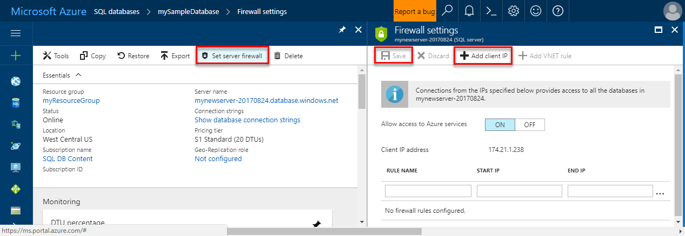

# <a name="azure-sql-database-server-level-and-database-level-firewall-rules"></a><span data-ttu-id="49c48-104">Regras de firewall de nível do servidor de banco de dados do Banco de Dados SQL do Azure</span><span class="sxs-lookup"><span data-stu-id="49c48-104">Azure SQL Database server-level and database-level firewall rules</span></span> 

<span data-ttu-id="49c48-105">O Banco de Dados SQL do Microsoft Azure fornece um serviço de banco de dados relacional para o Azure e outros aplicativos baseados na Internet.</span><span class="sxs-lookup"><span data-stu-id="49c48-105">Microsoft Azure SQL Database provides a relational database service for Azure and other Internet-based applications.</span></span> <span data-ttu-id="49c48-106">toohelp proteger seus dados, firewalls impedir que todos os servidores de banco de dados do access tooyour até que você especifique quais computadores têm permissão.</span><span class="sxs-lookup"><span data-stu-id="49c48-106">toohelp protect your data, firewalls prevent all access tooyour database server until you specify which computers have permission.</span></span> <span data-ttu-id="49c48-107">firewall de saudação concede acesso toodatabases com base em Olá endereços IP de cada solicitação de origem.</span><span class="sxs-lookup"><span data-stu-id="49c48-107">hello firewall grants access toodatabases based on hello originating IP address of each request.</span></span>

## <a name="overview"></a><span data-ttu-id="49c48-108">Visão geral</span><span class="sxs-lookup"><span data-stu-id="49c48-108">Overview</span></span>

<span data-ttu-id="49c48-109">Inicialmente, todos os do Azure SQL server Transact-SQL acesso tooyour é bloqueado pelo firewall de saudação.</span><span class="sxs-lookup"><span data-stu-id="49c48-109">Initially, all Transact-SQL access tooyour Azure SQL server is blocked by hello firewall.</span></span> <span data-ttu-id="49c48-110">toobegin usando seu servidor do SQL Azure, você deve especificar uma ou mais regras de firewall de nível de servidor que permitem acesso tooyour Azure do SQL server.</span><span class="sxs-lookup"><span data-stu-id="49c48-110">toobegin using your Azure SQL server, you must specify one or more server-level firewall rules that enable access tooyour Azure SQL server.</span></span> <span data-ttu-id="49c48-111">Use toospecify de regras de firewall Olá qual endereço IP varia de saudação Internet são permitidos, e se os aplicativos do Azure podem tentar tooconnect tooyour SQL do Azure server.</span><span class="sxs-lookup"><span data-stu-id="49c48-111">Use hello firewall rules toospecify which IP address ranges from hello Internet are allowed, and whether Azure applications can attempt tooconnect tooyour Azure SQL server.</span></span>

<span data-ttu-id="49c48-112">tooselectively conceder acesso toojust um Olá bancos de dados em seu servidor do SQL Azure, você deve criar uma regra de nível de banco de dados do banco de dados necessário hello.</span><span class="sxs-lookup"><span data-stu-id="49c48-112">tooselectively grant access toojust one of hello databases in your Azure SQL server, you must create a database-level rule for hello required database.</span></span> <span data-ttu-id="49c48-113">Especifique um intervalo de endereços IP para regra de firewall do banco de dados Olá ultrapassa Olá especificado na regra de firewall no nível de servidor de saudação do intervalo de endereços IP e certifique-se de que o endereço IP de saudação do cliente de saudação esteja no intervalo de saudação especificado na regra de nível de banco de dados de saudação.</span><span class="sxs-lookup"><span data-stu-id="49c48-113">Specify an IP address range for hello database firewall rule that is beyond hello IP address range specified in hello server-level firewall rule, and ensure that hello IP address of hello client falls in hello range specified in hello database-level rule.</span></span>

<span data-ttu-id="49c48-114">Olá de tentativas de Conexão de Internet e o Azure deve passar primeiramente pelo firewall Olá antes de poderem acessar seu servidor do SQL Azure ou o banco de dados SQL, conforme mostrado no diagrama a seguir de saudação:</span><span class="sxs-lookup"><span data-stu-id="49c48-114">Connection attempts from hello Internet and Azure must first pass through hello firewall before they can reach your Azure SQL server or SQL Database, as shown in hello following diagram:</span></span>

   ![Diagrama descrevendo a configuração de firewall.][1]

* <span data-ttu-id="49c48-116">**Regras de firewall de nível de servidor:** essas regras permitem que os clientes tooaccess o servidor inteiro do SQL Azure, ou seja, todos os bancos de dados de saudação em Olá mesmo servidor lógico.</span><span class="sxs-lookup"><span data-stu-id="49c48-116">**Server-level firewall rules:** These rules enable clients tooaccess your entire Azure SQL server, that is, all hello databases within hello same logical server.</span></span> <span data-ttu-id="49c48-117">Essas regras são armazenadas em Olá **mestre** banco de dados.</span><span class="sxs-lookup"><span data-stu-id="49c48-117">These rules are stored in hello **master** database.</span></span> <span data-ttu-id="49c48-118">Regras de firewall de nível de servidor podem ser configuradas usando o portal de saudação ou usando instruções Transact-SQL.</span><span class="sxs-lookup"><span data-stu-id="49c48-118">Server-level firewall rules can be configured by using hello portal or by using Transact-SQL statements.</span></span> <span data-ttu-id="49c48-119">regras de firewall de nível de servidor toocreate usando Olá portal do Azure ou o PowerShell, você deve ser o proprietário da assinatura hello ou um colaborador da assinatura.</span><span class="sxs-lookup"><span data-stu-id="49c48-119">toocreate server-level firewall rules using hello Azure portal or PowerShell, you must be hello subscription owner or a subscription contributor.</span></span> <span data-ttu-id="49c48-120">toocreate uma regra de firewall de nível de servidor usando o Transact-SQL, você deve conectar a instância de banco de dados SQL toohello como logon principal no nível de servidor hello ou administrador do Active Directory do Azure hello (o que significa que uma regra de firewall de nível de servidor deve ser criada primeiro por um usuário com permissões no nível do Azure).</span><span class="sxs-lookup"><span data-stu-id="49c48-120">toocreate a server-level firewall rule using Transact-SQL, you must connect toohello SQL Database instance as hello server-level principal login or hello Azure Active Directory administrator (which means that a server-level firewall rule must first be created by a user with Azure-level permissions).</span></span>
* <span data-ttu-id="49c48-121">**Regras de firewall de nível de banco de dados:** essas regras permitem que clientes tooaccess determinados (seguro) bancos de dados dentro de saudação mesmo servidor lógico.</span><span class="sxs-lookup"><span data-stu-id="49c48-121">**Database-level firewall rules:** These rules enable clients tooaccess certain (secure) databases within hello same logical server.</span></span> <span data-ttu-id="49c48-122">Você pode criar essas regras para cada banco de dados (incluindo Olá **mestre** database0) e são armazenados em bancos de dados individuais hello.</span><span class="sxs-lookup"><span data-stu-id="49c48-122">You can create these rules for each database (including hello **master** database0) and they are stored in hello individual databases.</span></span> <span data-ttu-id="49c48-123">Regras de firewall de nível de banco de dados só podem ser configuradas usando instruções Transact-SQL e somente depois que você configurou Olá primeiro firewall no nível de servidor.</span><span class="sxs-lookup"><span data-stu-id="49c48-123">Database-level firewall rules can only be configured by using Transact-SQL statements and only after you have configured hello first server-level firewall.</span></span> <span data-ttu-id="49c48-124">Se você especificar um intervalo de endereços IP na regra de firewall no nível de banco de dados de saudação que é especificado na regra de firewall no nível de servidor de saudação do intervalo de saudação fora, somente aqueles clientes que têm endereços IP no intervalo de nível de banco de dados de saudação acessar Olá banco de dados.</span><span class="sxs-lookup"><span data-stu-id="49c48-124">If you specify an IP address range in hello database-level firewall rule that is outside hello range specified in hello server-level firewall rule, only those clients that have IP addresses in hello database-level range can access hello database.</span></span> <span data-ttu-id="49c48-125">Você pode ter no máximo 128 regras de firewall no nível do banco de dados para um banco de dados.</span><span class="sxs-lookup"><span data-stu-id="49c48-125">You can have a maximum of 128 database-level firewall rules for a database.</span></span> <span data-ttu-id="49c48-126">Somente é possível criar e gerenciar regras de firewall no nível de banco de dados para bancos de dados mestre e de usuário por meio o Transact-SQL.</span><span class="sxs-lookup"><span data-stu-id="49c48-126">Database-level firewall rules for master and user databases can only be created and managed through Transact-SQL.</span></span> <span data-ttu-id="49c48-127">Para obter mais informações sobre como configurar regras de firewall de nível de banco de dados, consulte o exemplo hello adiante neste artigo e veja [sp_set_database_firewall_rule (bancos de dados do SQL Azure)](https://msdn.microsoft.com/library/dn270010.aspx).</span><span class="sxs-lookup"><span data-stu-id="49c48-127">For more information on configuring database-level firewall rules, see hello example later in this article and see [sp_set_database_firewall_rule (Azure SQL Databases)](https://msdn.microsoft.com/library/dn270010.aspx).</span></span>

<span data-ttu-id="49c48-128">**Recomendação:** Microsoft recomenda o uso de regras de firewall de nível de banco de dados sempre que possível tooenhance segurança e toomake seu banco de dados mais portáteis.</span><span class="sxs-lookup"><span data-stu-id="49c48-128">**Recommendation:** Microsoft recommends using database-level firewall rules whenever possible tooenhance security and toomake your database more portable.</span></span> <span data-ttu-id="49c48-129">Usar regras de firewall de nível de servidor para administradores e quando você tem muitos bancos de dados que têm Olá mesmos requisitos de acesso e você não desejar tempo toospend configurar cada banco de dados individualmente.</span><span class="sxs-lookup"><span data-stu-id="49c48-129">Use server-level firewall rules for administrators and when you have many databases that have hello same access requirements and you don't want toospend time configuring each database individually.</span></span>

> [!Note]
> <span data-ttu-id="49c48-130">Para obter informações sobre bancos de dados portátil no contexto de saudação de continuidade de negócios, consulte [requisitos de autenticação para a recuperação de desastres](sql-database-geo-replication-security-config.md).</span><span class="sxs-lookup"><span data-stu-id="49c48-130">For information about portable databases in hello context of business continuity, see [Authentication requirements for disaster recovery](sql-database-geo-replication-security-config.md).</span></span>
>

### <a name="connecting-from-hello-internet"></a><span data-ttu-id="49c48-131">Conectando-se de saudação da Internet</span><span class="sxs-lookup"><span data-stu-id="49c48-131">Connecting from hello Internet</span></span>

<span data-ttu-id="49c48-132">Quando um computador tenta tooconnect tooyour servidor de banco de dados de saudação da Internet, firewall Olá verifica primeiro Olá endereços IP da solicitação de saudação em relação a regras de firewall no nível de banco de dados hello, do banco de dados de saudação que está solicitando a conexão de saudação de origem:</span><span class="sxs-lookup"><span data-stu-id="49c48-132">When a computer attempts tooconnect tooyour database server from hello Internet, hello firewall first checks hello originating IP address of hello request against hello database-level firewall rules, for hello database that hello connection is requesting:</span></span>

* <span data-ttu-id="49c48-133">Se Olá endereço IP de saudação solicitação estiver dentro de um dos intervalos de saudação especificados nas regras de firewall de nível de banco de dados de hello, conexão Olá será concedida toohello banco de dados SQL que contém a regra de saudação.</span><span class="sxs-lookup"><span data-stu-id="49c48-133">If hello IP address of hello request is within one of hello ranges specified in hello database-level firewall rules, hello connection is granted toohello SQL Database that contains hello rule.</span></span>
* <span data-ttu-id="49c48-134">Se Olá endereço IP de saudação solicitação não estiver dentro de um dos intervalos de saudação especificados na regra de firewall no nível de banco de dados hello, regras de firewall no nível de servidor de saudação são verificadas.</span><span class="sxs-lookup"><span data-stu-id="49c48-134">If hello IP address of hello request is not within one of hello ranges specified in hello database-level firewall rule, hello server-level firewall rules are checked.</span></span> <span data-ttu-id="49c48-135">Se Olá endereço IP de saudação solicitação estiver dentro de um dos intervalos de saudação especificados nas regras de firewall de nível de servidor de saudação, conexão Olá será concedida.</span><span class="sxs-lookup"><span data-stu-id="49c48-135">If hello IP address of hello request is within one of hello ranges specified in hello server-level firewall rules, hello connection is granted.</span></span> <span data-ttu-id="49c48-136">Regras de firewall de nível de servidor se aplicam a tooall bancos de dados SQL no servidor do SQL Azure hello.</span><span class="sxs-lookup"><span data-stu-id="49c48-136">Server-level firewall rules apply tooall SQL databases on hello Azure SQL server.</span></span>  
* <span data-ttu-id="49c48-137">Se Olá endereço IP de saudação solicitação não está dentro de intervalos de saudação especificado em qualquer Olá nível de banco de dados ou regras de firewall no nível de servidor, falha de solicitação de conexão de saudação.</span><span class="sxs-lookup"><span data-stu-id="49c48-137">If hello IP address of hello request is not within hello ranges specified in any of hello database-level or server-level firewall rules, hello connection request fails.</span></span>

> [!NOTE]
> <span data-ttu-id="49c48-138">tooaccess banco de dados SQL do computador local, certifique-se de firewall Olá na sua rede e o computador local permita a comunicação de saída na porta TCP 1433.</span><span class="sxs-lookup"><span data-stu-id="49c48-138">tooaccess Azure SQL Database from your local computer, ensure hello firewall on your network and local computer allows outgoing communication on TCP port 1433.</span></span>
> 

### <a name="connecting-from-azure"></a><span data-ttu-id="49c48-139">Conexão pelo Azure</span><span class="sxs-lookup"><span data-stu-id="49c48-139">Connecting from Azure</span></span>
<span data-ttu-id="49c48-140">tooallow aplicativos do Azure tooconnect tooyour servidor SQL do Azure, as conexões do Azure devem ser habilitados.</span><span class="sxs-lookup"><span data-stu-id="49c48-140">tooallow applications from Azure tooconnect tooyour Azure SQL server, Azure connections must be enabled.</span></span> <span data-ttu-id="49c48-141">Quando um aplicativo do Azure tenta o servidor de banco de dados de tooyour tooconnect, firewall Olá verifica que são permitidas conexões do Azure.</span><span class="sxs-lookup"><span data-stu-id="49c48-141">When an application from Azure attempts tooconnect tooyour database server, hello firewall verifies that Azure connections are allowed.</span></span> <span data-ttu-id="49c48-142">Uma configuração de firewall com inicial e final too0.0.0.0 igual endereço indica que essas conexões são permitidas.</span><span class="sxs-lookup"><span data-stu-id="49c48-142">A firewall setting with starting and ending address equal too0.0.0.0 indicates these connections are allowed.</span></span> <span data-ttu-id="49c48-143">Se a tentativa de conexão de saudação não é permitida, solicitação Olá não alcançar o servidor de banco de dados do Azure SQL hello.</span><span class="sxs-lookup"><span data-stu-id="49c48-143">If hello connection attempt is not allowed, hello request does not reach hello Azure SQL Database server.</span></span>

> [!IMPORTANT]
> <span data-ttu-id="49c48-144">Esta opção configura Olá firewall tooallow todas as conexões do Azure conexões incluindo de assinaturas de saudação de outros clientes.</span><span class="sxs-lookup"><span data-stu-id="49c48-144">This option configures hello firewall tooallow all connections from Azure including connections from hello subscriptions of other customers.</span></span> <span data-ttu-id="49c48-145">Quando esta opção, verifique se seu logon e permissões de usuário limitam tooonly acesso a usuários autorizados.</span><span class="sxs-lookup"><span data-stu-id="49c48-145">When selecting this option, make sure your login and user permissions limit access tooonly authorized users.</span></span>
> 

## <a name="creating-and-managing-firewall-rules"></a><span data-ttu-id="49c48-146">Criar e gerenciar regras de firewall</span><span class="sxs-lookup"><span data-stu-id="49c48-146">Creating and managing firewall rules</span></span>
<span data-ttu-id="49c48-147">configuração de firewall no nível de servidor primeiro Olá pode ser criada usando Olá [portal do Azure](https://portal.azure.com/) ou programaticamente usando [Azure PowerShell](https://msdn.microsoft.com/library/azure/dn546724.aspx), [CLI do Azure](/cli/azure/sql/server/firewall-rule#create), ou hello [API REST](https://msdn.microsoft.com/library/azure/dn505712.aspx).</span><span class="sxs-lookup"><span data-stu-id="49c48-147">hello first server-level firewall setting can be created using hello [Azure portal](https://portal.azure.com/) or programmatically using [Azure PowerShell](https://msdn.microsoft.com/library/azure/dn546724.aspx), [Azure CLI](/cli/azure/sql/server/firewall-rule#create), or hello [REST API](https://msdn.microsoft.com/library/azure/dn505712.aspx).</span></span> <span data-ttu-id="49c48-148">As regras de firewall no nível de servidor subsequentes podem ser criadas e gerenciados usando esses métodos e por meio de Transact-SQL.</span><span class="sxs-lookup"><span data-stu-id="49c48-148">Subsequent server-level firewall rules can be created and managed using these methods, and through Transact-SQL.</span></span> 

> [!IMPORTANT]
> <span data-ttu-id="49c48-149">As regras de firewall no nível de banco de dados só podem ser criadas e gerenciadas usando com o Transact-SQL.</span><span class="sxs-lookup"><span data-stu-id="49c48-149">Database-level firewall rules can only be created and managed using Transact-SQL.</span></span> 
>

<span data-ttu-id="49c48-150">desempenho tooimprove, regras são temporariamente armazenados em cache no nível de banco de dados de saudação de firewall de nível de servidor.</span><span class="sxs-lookup"><span data-stu-id="49c48-150">tooimprove performance, server-level firewall rules are temporarily cached at hello database level.</span></span> <span data-ttu-id="49c48-151">cache de saudação toorefresh, consulte [DBCC FLUSHAUTHCACHE](https://msdn.microsoft.com/library/mt627793.aspx).</span><span class="sxs-lookup"><span data-stu-id="49c48-151">toorefresh hello cache, see [DBCC FLUSHAUTHCACHE](https://msdn.microsoft.com/library/mt627793.aspx).</span></span> 

> [!TIP]
> <span data-ttu-id="49c48-152">Você pode usar [auditoria de banco de dados SQL](sql-database-auditing.md) tooaudit alterações de firewall no nível de servidor e nível de banco de dados.</span><span class="sxs-lookup"><span data-stu-id="49c48-152">You can use [SQL Database Auditing](sql-database-auditing.md) tooaudit server-level and database-level firewall changes.</span></span>
>

### <a name="azure-portal"></a><span data-ttu-id="49c48-153">Portal do Azure</span><span class="sxs-lookup"><span data-stu-id="49c48-153">Azure portal</span></span>

<span data-ttu-id="49c48-154">tooset uma regra de firewall de nível de servidor em Olá portal do Azure, você pode ir página de visão geral do toohello ou para a sua página de visão geral de saudação ou de banco de dados SQL do Azure para seu servidor lógico do banco de dados do Azure.</span><span class="sxs-lookup"><span data-stu-id="49c48-154">tooset a server-level firewall rule in hello Azure portal, you can either go toohello Overview page for your Azure SQL database or hello Overview page for your Azure Database logical server.</span></span>

> [!TIP]
> <span data-ttu-id="49c48-155">Para obter um tutorial, consulte [criar um banco de dados usando Olá portal do Azure](sql-database-get-started-portal.md).</span><span class="sxs-lookup"><span data-stu-id="49c48-155">For a tutorial, see [Create a DB using hello Azure portal](sql-database-get-started-portal.md).</span></span>
>

<span data-ttu-id="49c48-156">**Na página de visão geral de banco de dados**</span><span class="sxs-lookup"><span data-stu-id="49c48-156">**From database overview page**</span></span>

1. <span data-ttu-id="49c48-157">tooset uma regra de firewall de nível de servidor na página de visão geral do banco de dados de saudação, clique em **definir o firewall do servidor** na barra de ferramentas Olá conforme Olá a imagem a seguir: Olá **configurações de Firewall** página Olá SQL Servidor de banco de dados será aberto.</span><span class="sxs-lookup"><span data-stu-id="49c48-157">tooset a server-level firewall rule from hello database overview page, click **Set server firewall** on hello toolbar as shown in hello following image: hello **Firewall settings** page for hello SQL Database server opens.</span></span>

       

2. <span data-ttu-id="49c48-159">Clique em **Adicionar IP do cliente** no endereço IP de Olá Olá barra de ferramentas tooadd do computador Olá você está usando no momento e, em seguida, clique em **salvar**.</span><span class="sxs-lookup"><span data-stu-id="49c48-159">Click **Add client IP** on hello toolbar tooadd hello IP address of hello computer you are currently using and then click **Save**.</span></span> <span data-ttu-id="49c48-160">Uma regra de firewall no nível do servidor é criada para seu endereço IP atual.</span><span class="sxs-lookup"><span data-stu-id="49c48-160">A server-level firewall rule is created for your current IP address.</span></span>

       

<span data-ttu-id="49c48-162">**Da página de visão geral de servidor**</span><span class="sxs-lookup"><span data-stu-id="49c48-162">**From server overview page**</span></span>

<span data-ttu-id="49c48-163">Olá, página de visão geral para server abre, mostrando a você Olá totalmente qualificado nome do servidor (como **mynewserver20170403.database.windows.net**) e fornece opções de configuração adicional.</span><span class="sxs-lookup"><span data-stu-id="49c48-163">hello overview page for your server opens, showing you hello fully qualified server name (such as **mynewserver20170403.database.windows.net**) and provides options for further configuration.</span></span>

1. <span data-ttu-id="49c48-164">tooset uma regra de nível de servidor na página de visão geral do servidor, clique em **Firewall** no menu esquerdo de saudação em configurações, conforme mostrado em Olá a imagem a seguir:</span><span class="sxs-lookup"><span data-stu-id="49c48-164">tooset a server-level rule from server overview page, click **Firewall** in hello left-hand menu under Settings as showed in hello following image:</span></span> 

     

2. <span data-ttu-id="49c48-166">Clique em **Adicionar IP do cliente** no endereço IP de Olá Olá barra de ferramentas tooadd do computador Olá você está usando no momento e, em seguida, clique em **salvar**.</span><span class="sxs-lookup"><span data-stu-id="49c48-166">Click **Add client IP** on hello toolbar tooadd hello IP address of hello computer you are currently using and then click **Save**.</span></span> <span data-ttu-id="49c48-167">Uma regra de firewall no nível do servidor é criada para seu endereço IP atual.</span><span class="sxs-lookup"><span data-stu-id="49c48-167">A server-level firewall rule is created for your current IP address.</span></span>

     

### <a name="transact-sql"></a><span data-ttu-id="49c48-169">Transact-SQL</span><span class="sxs-lookup"><span data-stu-id="49c48-169">Transact-SQL</span></span>
| <span data-ttu-id="49c48-170">Exibição do catálogo ou Procedimento armazenado</span><span class="sxs-lookup"><span data-stu-id="49c48-170">Catalog View or Stored Procedure</span></span> | <span data-ttu-id="49c48-171">Nível</span><span class="sxs-lookup"><span data-stu-id="49c48-171">Level</span></span> | <span data-ttu-id="49c48-172">Descrição</span><span class="sxs-lookup"><span data-stu-id="49c48-172">Description</span></span> |
| --- | --- | --- |
| [<span data-ttu-id="49c48-173">sys.firewall_rules</span><span class="sxs-lookup"><span data-stu-id="49c48-173">sys.firewall_rules</span></span>](https://msdn.microsoft.com/library/dn269980.aspx) |<span data-ttu-id="49c48-174">Servidor</span><span class="sxs-lookup"><span data-stu-id="49c48-174">Server</span></span> |<span data-ttu-id="49c48-175">Exibe regras de firewall no nível de servidor atual Olá</span><span class="sxs-lookup"><span data-stu-id="49c48-175">Displays hello current server-level firewall rules</span></span> |
| [<span data-ttu-id="49c48-176">sp_set_firewall_rule</span><span class="sxs-lookup"><span data-stu-id="49c48-176">sp_set_firewall_rule</span></span>](https://msdn.microsoft.com/library/dn270017.aspx) |<span data-ttu-id="49c48-177">Servidor</span><span class="sxs-lookup"><span data-stu-id="49c48-177">Server</span></span> |<span data-ttu-id="49c48-178">Cria ou atualiza as regras de firewall no nível de servidor</span><span class="sxs-lookup"><span data-stu-id="49c48-178">Creates or updates server-level firewall rules</span></span> |
| [<span data-ttu-id="49c48-179">sp_delete_firewall_rule</span><span class="sxs-lookup"><span data-stu-id="49c48-179">sp_delete_firewall_rule</span></span>](https://msdn.microsoft.com/library/dn270024.aspx) |<span data-ttu-id="49c48-180">Servidor</span><span class="sxs-lookup"><span data-stu-id="49c48-180">Server</span></span> |<span data-ttu-id="49c48-181">Remove as regras de firewall no nível de servidor</span><span class="sxs-lookup"><span data-stu-id="49c48-181">Removes server-level firewall rules</span></span> |
| [<span data-ttu-id="49c48-182">sys.database_firewall_rules</span><span class="sxs-lookup"><span data-stu-id="49c48-182">sys.database_firewall_rules</span></span>](https://msdn.microsoft.com/library/dn269982.aspx) |<span data-ttu-id="49c48-183">Banco de dados</span><span class="sxs-lookup"><span data-stu-id="49c48-183">Database</span></span> |<span data-ttu-id="49c48-184">Exibe regras de firewall no nível de banco de dados atual Olá</span><span class="sxs-lookup"><span data-stu-id="49c48-184">Displays hello current database-level firewall rules</span></span> |
| [<span data-ttu-id="49c48-185">sp_set_database_firewall_rule</span><span class="sxs-lookup"><span data-stu-id="49c48-185">sp_set_database_firewall_rule</span></span>](https://msdn.microsoft.com/library/dn270010.aspx) |<span data-ttu-id="49c48-186">Banco de dados</span><span class="sxs-lookup"><span data-stu-id="49c48-186">Database</span></span> |<span data-ttu-id="49c48-187">Cria ou atualiza regras de firewall no nível de banco de dados de saudação</span><span class="sxs-lookup"><span data-stu-id="49c48-187">Creates or updates hello database-level firewall rules</span></span> |
| [<span data-ttu-id="49c48-188">sp_delete_database_firewall_rule</span><span class="sxs-lookup"><span data-stu-id="49c48-188">sp_delete_database_firewall_rule</span></span>](https://msdn.microsoft.com/library/dn270030.aspx) |<span data-ttu-id="49c48-189">Bancos de dados</span><span class="sxs-lookup"><span data-stu-id="49c48-189">Databases</span></span> |<span data-ttu-id="49c48-190">Remove as regras de firewall no nível de banco de dados</span><span class="sxs-lookup"><span data-stu-id="49c48-190">Removes database-level firewall rules</span></span> |


<span data-ttu-id="49c48-191">Hello exemplos a seguir examine as regras existentes hello, habilitar um intervalo de endereços IP no servidor de saudação Contoso e exclui uma regra de firewall:</span><span class="sxs-lookup"><span data-stu-id="49c48-191">hello following examples review hello existing rules, enable a range of IP addresses on hello server Contoso, and deletes a firewall rule:</span></span>
   
```sql
SELECT * FROM sys.firewall_rules ORDER BY name;
```
  
<span data-ttu-id="49c48-192">Em seguida, adicione uma regra de firewall.</span><span class="sxs-lookup"><span data-stu-id="49c48-192">Next, add a firewall rule.</span></span>
   
```sql
EXECUTE sp_set_firewall_rule @name = N'ContosoFirewallRule',
   @start_ip_address = '192.168.1.1', @end_ip_address = '192.168.1.10'
```

<span data-ttu-id="49c48-193">toodelete uma regra de firewall de nível de servidor, executar o procedimento de sp_delete_firewall_rule armazenado hello.</span><span class="sxs-lookup"><span data-stu-id="49c48-193">toodelete a server-level firewall rule, execute hello sp_delete_firewall_rule stored procedure.</span></span> <span data-ttu-id="49c48-194">Olá exemplo a seguir exclui a regra de saudação nomeada ContosoFirewallRule:</span><span class="sxs-lookup"><span data-stu-id="49c48-194">hello following example deletes hello rule named ContosoFirewallRule:</span></span>
   
```sql
EXECUTE sp_delete_firewall_rule @name = N'ContosoFirewallRule'
```   

### <a name="azure-powershell"></a><span data-ttu-id="49c48-195">Azure PowerShell</span><span class="sxs-lookup"><span data-stu-id="49c48-195">Azure PowerShell</span></span>
| <span data-ttu-id="49c48-196">Cmdlet</span><span class="sxs-lookup"><span data-stu-id="49c48-196">Cmdlet</span></span> | <span data-ttu-id="49c48-197">Nível</span><span class="sxs-lookup"><span data-stu-id="49c48-197">Level</span></span> | <span data-ttu-id="49c48-198">Descrição</span><span class="sxs-lookup"><span data-stu-id="49c48-198">Description</span></span> |
| --- | --- | --- |
| [<span data-ttu-id="49c48-199">Get-AzureSqlDatabaseServerFirewallRule</span><span class="sxs-lookup"><span data-stu-id="49c48-199">Get-AzureSqlDatabaseServerFirewallRule</span></span>](https://msdn.microsoft.com/library/azure/dn546731.aspx) |<span data-ttu-id="49c48-200">Servidor</span><span class="sxs-lookup"><span data-stu-id="49c48-200">Server</span></span> |<span data-ttu-id="49c48-201">Retorna as regras atuais de firewall de nível de servidor Olá</span><span class="sxs-lookup"><span data-stu-id="49c48-201">Returns hello current server-level firewall rules</span></span> |
| [<span data-ttu-id="49c48-202">New-AzureSqlDatabaseServerFirewallRule</span><span class="sxs-lookup"><span data-stu-id="49c48-202">New-AzureSqlDatabaseServerFirewallRule</span></span>](https://msdn.microsoft.com/library/azure/dn546724.aspx) |<span data-ttu-id="49c48-203">Servidor</span><span class="sxs-lookup"><span data-stu-id="49c48-203">Server</span></span> |<span data-ttu-id="49c48-204">Cria as regras de firewall no nível de servidor</span><span class="sxs-lookup"><span data-stu-id="49c48-204">Creates a new server-level firewall rule</span></span> |
| [<span data-ttu-id="49c48-205">Set-AzureSqlDatabaseServerFirewallRule</span><span class="sxs-lookup"><span data-stu-id="49c48-205">Set-AzureSqlDatabaseServerFirewallRule</span></span>](https://msdn.microsoft.com/library/azure/dn546739.aspx) |<span data-ttu-id="49c48-206">Servidor</span><span class="sxs-lookup"><span data-stu-id="49c48-206">Server</span></span> |<span data-ttu-id="49c48-207">Atualiza as propriedades de saudação de uma regra de firewall de nível de servidor existente</span><span class="sxs-lookup"><span data-stu-id="49c48-207">Updates hello properties of an existing server-level firewall rule</span></span> |
| [<span data-ttu-id="49c48-208">Remove-AzureSqlDatabaseServerFirewallRule</span><span class="sxs-lookup"><span data-stu-id="49c48-208">Remove-AzureSqlDatabaseServerFirewallRule</span></span>](https://msdn.microsoft.com/library/azure/dn546727.aspx) |<span data-ttu-id="49c48-209">Servidor</span><span class="sxs-lookup"><span data-stu-id="49c48-209">Server</span></span> |<span data-ttu-id="49c48-210">Remove as regras de firewall no nível de servidor</span><span class="sxs-lookup"><span data-stu-id="49c48-210">Removes server-level firewall rules</span></span> |


<span data-ttu-id="49c48-211">saudação de exemplo a seguir define uma regra de firewall de nível de servidor usando o PowerShell:</span><span class="sxs-lookup"><span data-stu-id="49c48-211">hello following example sets a server-level firewall rule using PowerShell:</span></span>

```powershell
New-AzureRmSqlServerFirewallRule -ResourceGroupName "myResourceGroup" `
    -ServerName $servername `
    -FirewallRuleName "AllowSome" -StartIpAddress "0.0.0.0" -EndIpAddress "0.0.0.0"
```

> [!TIP]
> <span data-ttu-id="49c48-212">Para exemplos do PowerShell no contexto de saudação de um início rápido, consulte [criar banco de dados - PowerShell](sql-database-get-started-powershell.md) e [criar um banco de dados e configurar uma regra de firewall usando o PowerShell](scripts/sql-database-create-and-configure-database-powershell.md)</span><span class="sxs-lookup"><span data-stu-id="49c48-212">For PowerShell examples in hello context of a quick start, see [Create DB - PowerShell](sql-database-get-started-powershell.md) and [Create a single database and configure a firewall rule using PowerShell](scripts/sql-database-create-and-configure-database-powershell.md)</span></span>
>

### <a name="azure-cli"></a><span data-ttu-id="49c48-213">CLI do Azure</span><span class="sxs-lookup"><span data-stu-id="49c48-213">Azure CLI</span></span>
| <span data-ttu-id="49c48-214">Cmdlet</span><span class="sxs-lookup"><span data-stu-id="49c48-214">Cmdlet</span></span> | <span data-ttu-id="49c48-215">Nível</span><span class="sxs-lookup"><span data-stu-id="49c48-215">Level</span></span> | <span data-ttu-id="49c48-216">Descrição</span><span class="sxs-lookup"><span data-stu-id="49c48-216">Description</span></span> |
| --- | --- | --- |
| [<span data-ttu-id="49c48-217">az sql server firewall create</span><span class="sxs-lookup"><span data-stu-id="49c48-217">az sql server firewall create</span></span>](/cli/azure/sql/server/firewall-rule#create) | <span data-ttu-id="49c48-218">Cria um firewall regra tooallow acesso tooall bancos de dados SQL no servidor de saudação do intervalo de endereços IP hello inserido.</span><span class="sxs-lookup"><span data-stu-id="49c48-218">Creates a firewall rule tooallow access tooall SQL Databases on hello server from hello entered IP address range.</span></span>|
| [<span data-ttu-id="49c48-219">az sql server firewall delete</span><span class="sxs-lookup"><span data-stu-id="49c48-219">az sql server firewall delete</span></span>](/cli/azure/sql/server/firewall-rule#delete)| <span data-ttu-id="49c48-220">Exclui uma regra de firewall.</span><span class="sxs-lookup"><span data-stu-id="49c48-220">Deletes a firewall rule.</span></span>|
| [<span data-ttu-id="49c48-221">az sql server firewall list</span><span class="sxs-lookup"><span data-stu-id="49c48-221">az sql server firewall list</span></span>](/cli/azure/sql/server/firewall-rule#list)| <span data-ttu-id="49c48-222">Lista as regras de firewall hello.</span><span class="sxs-lookup"><span data-stu-id="49c48-222">Lists hello firewall rules.</span></span>|
| [<span data-ttu-id="49c48-223">az sql server firewall rule show</span><span class="sxs-lookup"><span data-stu-id="49c48-223">az sql server firewall rule show</span></span>](/cli/azure/sql/server/firewall-rule#show)| <span data-ttu-id="49c48-224">Mostra detalhes de saudação de uma regra de firewall.</span><span class="sxs-lookup"><span data-stu-id="49c48-224">Shows hello details of a firewall rule.</span></span>|
| [<span data-ttu-id="49c48-225">ax sql server firewall rule update</span><span class="sxs-lookup"><span data-stu-id="49c48-225">ax sql server firewall rule update</span></span>](/cli/azure/sql/server/firewall-rule#update)| <span data-ttu-id="49c48-226">Atualiza uma regra de firewall.</span><span class="sxs-lookup"><span data-stu-id="49c48-226">Updates a firewall rule.</span></span>

<span data-ttu-id="49c48-227">saudação de exemplo a seguir define uma regra de firewall de nível de servidor usando Olá CLI do Azure:</span><span class="sxs-lookup"><span data-stu-id="49c48-227">hello following example sets a server-level firewall rule using hello Azure CLI:</span></span> 

```azurecli-interactive
az sql server firewall-rule create --resource-group myResourceGroup --server $servername \
    -n AllowYourIp --start-ip-address 0.0.0.0 --end-ip-address 0.0.0.0
```

> [!TIP]
> <span data-ttu-id="49c48-228">Para obter um exemplo de CLI do Azure no contexto de saudação de um início rápido, consulte [criar BDD - CLI do Azure](sql-database-get-started-cli.md) e [criar um banco de dados e configurar uma regra de firewall usando Olá CLI do Azure](scripts/sql-database-create-and-configure-database-cli.md)</span><span class="sxs-lookup"><span data-stu-id="49c48-228">For an Azure CLI example in hello context of a quick start, see [Create DDB - Azure CLI](sql-database-get-started-cli.md) and [Create a single database and configure a firewall rule using hello Azure CLI](scripts/sql-database-create-and-configure-database-cli.md)</span></span>
>

### <a name="rest-api"></a><span data-ttu-id="49c48-229">API REST</span><span class="sxs-lookup"><span data-stu-id="49c48-229">REST API</span></span>
| <span data-ttu-id="49c48-230">API</span><span class="sxs-lookup"><span data-stu-id="49c48-230">API</span></span> | <span data-ttu-id="49c48-231">Nível</span><span class="sxs-lookup"><span data-stu-id="49c48-231">Level</span></span> | <span data-ttu-id="49c48-232">Descrição</span><span class="sxs-lookup"><span data-stu-id="49c48-232">Description</span></span> |
| --- | --- | --- |
| [<span data-ttu-id="49c48-233">Listar regras de firewall</span><span class="sxs-lookup"><span data-stu-id="49c48-233">List Firewall Rules</span></span>](https://msdn.microsoft.com/library/azure/dn505715.aspx) |<span data-ttu-id="49c48-234">Servidor</span><span class="sxs-lookup"><span data-stu-id="49c48-234">Server</span></span> |<span data-ttu-id="49c48-235">Exibe regras de firewall no nível de servidor atual Olá</span><span class="sxs-lookup"><span data-stu-id="49c48-235">Displays hello current server-level firewall rules</span></span> |
| [<span data-ttu-id="49c48-236">Criar uma regra de firewall</span><span class="sxs-lookup"><span data-stu-id="49c48-236">Create Firewall Rule</span></span>](https://msdn.microsoft.com/library/azure/dn505712.aspx) |<span data-ttu-id="49c48-237">Servidor</span><span class="sxs-lookup"><span data-stu-id="49c48-237">Server</span></span> |<span data-ttu-id="49c48-238">Cria ou atualiza as regras de firewall no nível de servidor</span><span class="sxs-lookup"><span data-stu-id="49c48-238">Creates or updates server-level firewall rules</span></span> |
| [<span data-ttu-id="49c48-239">Definir regra de firewall</span><span class="sxs-lookup"><span data-stu-id="49c48-239">Set Firewall Rule</span></span>](https://msdn.microsoft.com/library/azure/dn505707.aspx) |<span data-ttu-id="49c48-240">Servidor</span><span class="sxs-lookup"><span data-stu-id="49c48-240">Server</span></span> |<span data-ttu-id="49c48-241">Atualiza as propriedades de saudação de uma regra de firewall de nível de servidor existente</span><span class="sxs-lookup"><span data-stu-id="49c48-241">Updates hello properties of an existing server-level firewall rule</span></span> |
| [<span data-ttu-id="49c48-242">Excluir regra de firewall</span><span class="sxs-lookup"><span data-stu-id="49c48-242">Delete Firewall Rule</span></span>](https://msdn.microsoft.com/library/azure/dn505706.aspx) |<span data-ttu-id="49c48-243">Servidor</span><span class="sxs-lookup"><span data-stu-id="49c48-243">Server</span></span> |<span data-ttu-id="49c48-244">Remove as regras de firewall no nível de servidor</span><span class="sxs-lookup"><span data-stu-id="49c48-244">Removes server-level firewall rules</span></span> |

## <a name="server-level-firewall-rule-versus-a-database-level-firewall-rule"></a><span data-ttu-id="49c48-245">Regra de firewall de nível de servidor em vez de uma regra de firewall de nível de banco de dados</span><span class="sxs-lookup"><span data-stu-id="49c48-245">Server-level firewall rule versus a database-level firewall rule</span></span>
<span data-ttu-id="49c48-246">P.</span><span class="sxs-lookup"><span data-stu-id="49c48-246">Q.</span></span> <span data-ttu-id="49c48-247">Os usuários de um banco de dados devem ser totalmente isolados de outro banco de dados?</span><span class="sxs-lookup"><span data-stu-id="49c48-247">Should users of one database be fully isolated from another database?</span></span>   
  <span data-ttu-id="49c48-248">Em caso afirmativo, conceda o acesso usando regras de firewall no nível de banco de dados.</span><span class="sxs-lookup"><span data-stu-id="49c48-248">If yes, grant access using database-level firewall rules.</span></span> <span data-ttu-id="49c48-249">Isso evita o uso de regras de firewall de nível de servidor, que permitem o acesso através do firewall Olá tooall bancos de dados, reduzindo a profundidade de saudação do defesas.</span><span class="sxs-lookup"><span data-stu-id="49c48-249">This avoids using server-level firewall rules, which permit access through hello firewall tooall databases, reducing hello depth of your defenses.</span></span>   
 
<span data-ttu-id="49c48-250">P.</span><span class="sxs-lookup"><span data-stu-id="49c48-250">Q.</span></span> <span data-ttu-id="49c48-251">Os usuários do endereço de IP hello necessário tooall bancos de dados acessam?</span><span class="sxs-lookup"><span data-stu-id="49c48-251">Do users at hello IP address’s need access tooall databases?</span></span>   
  <span data-ttu-id="49c48-252">Use o firewall de nível de servidor regras tooreduce hello, o número de vezes que você deve configurar as regras de firewall.</span><span class="sxs-lookup"><span data-stu-id="49c48-252">Use server-level firewall rules tooreduce hello number of times you must configure firewall rules.</span></span>   

<span data-ttu-id="49c48-253">P.</span><span class="sxs-lookup"><span data-stu-id="49c48-253">Q.</span></span> <span data-ttu-id="49c48-254">Pessoa hello ou equipe Configurando regras de firewall Olá só tem acesso por meio de Olá do portal do Azure, PowerShell ou Olá API REST?</span><span class="sxs-lookup"><span data-stu-id="49c48-254">Does hello person or team configuring hello firewall rules only have access through hello Azure portal, PowerShell, or hello REST API?</span></span>   
  <span data-ttu-id="49c48-255">É necessário usar regras de firewall no nível de servidor.</span><span class="sxs-lookup"><span data-stu-id="49c48-255">You must use server-level firewall rules.</span></span> <span data-ttu-id="49c48-256">As regras de firewall no nível de banco de dados só podem ser configuradas com o Transact-SQL.</span><span class="sxs-lookup"><span data-stu-id="49c48-256">Database-level firewall rules can only be configured using Transact-SQL.</span></span>  

<span data-ttu-id="49c48-257">P.</span><span class="sxs-lookup"><span data-stu-id="49c48-257">Q.</span></span> <span data-ttu-id="49c48-258">Pessoa hello ou equipe Configurando regras de firewall de saudação é proibido de ter permissão de alto nível no nível de banco de dados Olá?</span><span class="sxs-lookup"><span data-stu-id="49c48-258">Is hello person or team configuring hello firewall rules prohibited from having high-level permission at hello database level?</span></span>   
  <span data-ttu-id="49c48-259">Use regras de firewall no nível de servidor.</span><span class="sxs-lookup"><span data-stu-id="49c48-259">Use server-level firewall rules.</span></span> <span data-ttu-id="49c48-260">Configurando regras de firewall de nível de banco de dados usando o Transact-SQL, requer pelo menos `CONTROL DATABASE` permissão no nível de banco de dados de saudação.</span><span class="sxs-lookup"><span data-stu-id="49c48-260">Configuring database-level firewall rules using Transact-SQL, requires at least `CONTROL DATABASE` permission at hello database level.</span></span>  

<span data-ttu-id="49c48-261">P.</span><span class="sxs-lookup"><span data-stu-id="49c48-261">Q.</span></span> <span data-ttu-id="49c48-262">É a pessoa hello ou equipe auditoria regras de firewall hello, ou configurando gerenciar centralmente as regras de firewall para muitos (talvez 100) de bancos de dados?</span><span class="sxs-lookup"><span data-stu-id="49c48-262">Is hello person or team configuring or auditing hello firewall rules, centrally managing firewall rules for many (perhaps 100s) of databases?</span></span>   
  <span data-ttu-id="49c48-263">Essa seleção depende de suas necessidades e do ambiente.</span><span class="sxs-lookup"><span data-stu-id="49c48-263">This selection depends upon your needs and environment.</span></span> <span data-ttu-id="49c48-264">Regras de firewall de nível de servidor podem ser mais fácil tooconfigure, mas o script pode configurar regras em Olá nível de banco de dados.</span><span class="sxs-lookup"><span data-stu-id="49c48-264">Server-level firewall rules might be easier tooconfigure, but scripting can configure rules at hello database-level.</span></span> <span data-ttu-id="49c48-265">E mesmo se você usar regras de firewall de nível de servidor, talvez seja necessário regras de firewall de banco de dados de saudação do tooaudit, toosee se os usuários com `CONTROL` permissão no banco de dados de saudação criou regras de firewall de nível de banco de dados.</span><span class="sxs-lookup"><span data-stu-id="49c48-265">And even if you use server-level firewall rules, you might need tooaudit hello database-firewall rules, toosee if users with `CONTROL` permission on hello database have created database-level firewall rules.</span></span>   

<span data-ttu-id="49c48-266">P.</span><span class="sxs-lookup"><span data-stu-id="49c48-266">Q.</span></span> <span data-ttu-id="49c48-267">Posso usar uma combinação das regras de firewall no nível de servidor e de banco de dados?</span><span class="sxs-lookup"><span data-stu-id="49c48-267">Can I use a mix of both server-level and database-level firewall rules?</span></span>   
  <span data-ttu-id="49c48-268">Sim.</span><span class="sxs-lookup"><span data-stu-id="49c48-268">Yes.</span></span> <span data-ttu-id="49c48-269">Alguns usuários, como administradores, podem precisar de regras de firewall no nível de servidor.</span><span class="sxs-lookup"><span data-stu-id="49c48-269">Some users, such as administrators might need server-level firewall rules.</span></span> <span data-ttu-id="49c48-270">Outros usuários, como usuários de um aplicativo de banco de dados, podem precisar de regras de firewall no nível de banco de dados.</span><span class="sxs-lookup"><span data-stu-id="49c48-270">Other users, such as users of a database application, might need database-level firewall rules.</span></span>   

## <a name="troubleshooting-hello-database-firewall"></a><span data-ttu-id="49c48-271">Solucionando problemas do firewall do banco de dados de saudação</span><span class="sxs-lookup"><span data-stu-id="49c48-271">Troubleshooting hello database firewall</span></span>
<span data-ttu-id="49c48-272">Considere Olá pontos a seguir ao fazer acesso toohello serviço de banco de dados SQL do Microsoft Azure não se comportar conforme o esperado:</span><span class="sxs-lookup"><span data-stu-id="49c48-272">Consider hello following points when access toohello Microsoft Azure SQL Database service does not behave as you expect:</span></span>

* <span data-ttu-id="49c48-273">**Configuração de firewall local:** antes do computador pode acessar o banco de dados do SQL Azure, talvez seja necessário toocreate uma exceção de firewall no seu computador para a porta TCP 1433.</span><span class="sxs-lookup"><span data-stu-id="49c48-273">**Local firewall configuration:** Before your computer can access Azure SQL Database, you may need toocreate a firewall exception on your computer for TCP port 1433.</span></span> <span data-ttu-id="49c48-274">Se você estiver fazendo conexões dentro do limite de nuvem do Azure hello, você pode ter tooopen de portas adicionais.</span><span class="sxs-lookup"><span data-stu-id="49c48-274">If you are making connections inside hello Azure cloud boundary, you may have tooopen additional ports.</span></span> <span data-ttu-id="49c48-275">Para obter mais informações, consulte Olá **banco de dados SQL: fora versus dentro de** seção [portas além 1433 para ADO.NET 4.5 e o banco de dados SQL](sql-database-develop-direct-route-ports-adonet-v12.md).</span><span class="sxs-lookup"><span data-stu-id="49c48-275">For more information, see hello **SQL Database: Outside vs inside** section of [Ports beyond 1433 for ADO.NET 4.5 and SQL Database](sql-database-develop-direct-route-ports-adonet-v12.md).</span></span>
* <span data-ttu-id="49c48-276">**Rede NAT (NAT):** tooNAT de vencimento, o endereço IP de saudação usado pelo seu tooAzure tooconnect de computador banco de dados SQL pode ser diferente do endereço IP hello mostrado nas configurações de configuração de IP do computador.</span><span class="sxs-lookup"><span data-stu-id="49c48-276">**Network address translation (NAT):** Due tooNAT, hello IP address used by your computer tooconnect tooAzure SQL Database may be different than hello IP address shown in your computer IP configuration settings.</span></span> <span data-ttu-id="49c48-277">endereço IP de saudação tooview seu computador está usando tooconnect tooAzure, faça logon no portal de toohello e navegue toohello **configurar** guia no servidor de saudação que hospeda seu banco de dados.</span><span class="sxs-lookup"><span data-stu-id="49c48-277">tooview hello IP address your computer is using tooconnect tooAzure, log in toohello portal and navigate toohello **Configure** tab on hello server that hosts your database.</span></span> <span data-ttu-id="49c48-278">Em Olá **endereços IP permitidos** seção, hello **endereço IP do cliente atual** é exibido.</span><span class="sxs-lookup"><span data-stu-id="49c48-278">Under hello **Allowed IP Addresses** section, hello **Current Client IP Address** is displayed.</span></span> <span data-ttu-id="49c48-279">Clique em **adicionar** toohello **endereços IP permitidos** tooallow este servidor de saudação do computador tooaccess.</span><span class="sxs-lookup"><span data-stu-id="49c48-279">Click **Add** toohello **Allowed IP Addresses** tooallow this computer tooaccess hello server.</span></span>
* <span data-ttu-id="49c48-280">**Lista de permissões toohello alterações não entraram em vigor ainda:** pode haver quanto um atraso de cinco minutos para efeito de tootake de configuração de firewall do toohello banco de dados SQL é alterado.</span><span class="sxs-lookup"><span data-stu-id="49c48-280">**Changes toohello allow list have not taken effect yet:** There may be as much as a five-minute delay for changes toohello Azure SQL Database firewall configuration tootake effect.</span></span>
* <span data-ttu-id="49c48-281">**logon de saudação não está autorizado ou uma senha incorreta foi usada:** se um logon não tem permissões no servidor de banco de dados do Azure SQL hello ou Olá senha usada estiver incorreta, o servidor de banco de dados SQL do hello conexão toohello foi negado.</span><span class="sxs-lookup"><span data-stu-id="49c48-281">**hello login is not authorized or an incorrect password was used:** If a login does not have permissions on hello Azure SQL Database server or hello password used is incorrect, hello connection toohello Azure SQL Database server is denied.</span></span> <span data-ttu-id="49c48-282">Criar uma configuração de firewall apenas oferece aos clientes com uma tooattempt oportunidade conectando o servidor tooyour; cada cliente deve fornecer credenciais de segurança necessárias hello.</span><span class="sxs-lookup"><span data-stu-id="49c48-282">Creating a firewall setting only provides clients with an opportunity tooattempt connecting tooyour server; each client must provide hello necessary security credentials.</span></span> <span data-ttu-id="49c48-283">Para saber mais sobre a preparação de logons, consulte Gerenciando bancos de dados, logons e usuários no Banco de Dados SQL do Azure.</span><span class="sxs-lookup"><span data-stu-id="49c48-283">For more information about preparing logins, see Managing Databases, Logins, and Users in Azure SQL Database.</span></span>
* <span data-ttu-id="49c48-284">**Endereço IP dinâmico:** se você tiver uma conexão de Internet com endereçamento IP dinâmico e você estiver tendo dificuldades para atravessar o firewall hello, tente uma saudação soluções a seguir:</span><span class="sxs-lookup"><span data-stu-id="49c48-284">**Dynamic IP address:** If you have an Internet connection with dynamic IP addressing and you are having trouble getting through hello firewall, you could try one of hello following solutions:</span></span>
  
  * <span data-ttu-id="49c48-285">Peça ao seu provedor de serviço de Internet (ISP) para o intervalo de endereços IP hello atribuído tooyour computadores nesse servidor de banco de dados do Azure SQL Olá acesso e, em seguida, adicionar intervalo de endereços IP hello como uma regra de firewall.</span><span class="sxs-lookup"><span data-stu-id="49c48-285">Ask your Internet Service Provider (ISP) for hello IP address range assigned tooyour client computers that access hello Azure SQL Database server, and then add hello IP address range as a firewall rule.</span></span>
  * <span data-ttu-id="49c48-286">Obter o endereçamento IP estático em vez disso, para seus computadores cliente e, em seguida, adicionar endereços IP hello como regras de firewall.</span><span class="sxs-lookup"><span data-stu-id="49c48-286">Get static IP addressing instead for your client computers, and then add hello IP addresses as firewall rules.</span></span>

## <a name="next-steps"></a><span data-ttu-id="49c48-287">Próximas etapas</span><span class="sxs-lookup"><span data-stu-id="49c48-287">Next steps</span></span>

- <span data-ttu-id="49c48-288">Para um início rápido sobre como criar um banco de dados e uma regra de firewall de nível de servidor, consulte [Criar um Banco de Dados SQL do Azure](sql-database-get-started-portal.md).</span><span class="sxs-lookup"><span data-stu-id="49c48-288">For a quick start on creating a database and a server-level firewall rule, see [Create an Azure SQL database](sql-database-get-started-portal.md).</span></span>
- <span data-ttu-id="49c48-289">Para obter ajuda no banco de dados do SQL Azure tooan conexão de fonte aberta ou aplicativos de terceiros, consulte [tooSQL banco de dados de exemplos de código de início rápido do cliente](https://msdn.microsoft.com/library/azure/ee336282.aspx).</span><span class="sxs-lookup"><span data-stu-id="49c48-289">For help in connecting tooan Azure SQL database from open source or third-party applications, see [Client quick-start code samples tooSQL Database](https://msdn.microsoft.com/library/azure/ee336282.aspx).</span></span>
- <span data-ttu-id="49c48-290">Para obter informações sobre portas adicionais que talvez você precise tooopen, consulte Olá **banco de dados SQL: fora versus dentro de** seção [portas além 1433 para ADO.NET 4.5 e o banco de dados SQL](sql-database-develop-direct-route-ports-adonet-v12.md)</span><span class="sxs-lookup"><span data-stu-id="49c48-290">For information on additional ports that you may need tooopen, see hello **SQL Database: Outside vs inside** section of [Ports beyond 1433 for ADO.NET 4.5 and SQL Database](sql-database-develop-direct-route-ports-adonet-v12.md)</span></span>
- <span data-ttu-id="49c48-291">Para obter uma visão geral de segurança do Banco de Dados SQL do Azure, consulte [Protegendo seu banco de dados](sql-database-security-overview.md)</span><span class="sxs-lookup"><span data-stu-id="49c48-291">For an overview of Azure SQL Database security, see [Securing your database](sql-database-security-overview.md)</span></span>

<!--Image references-->
[1]: ./media/sql-database-firewall-configure/sqldb-firewall-1.png
