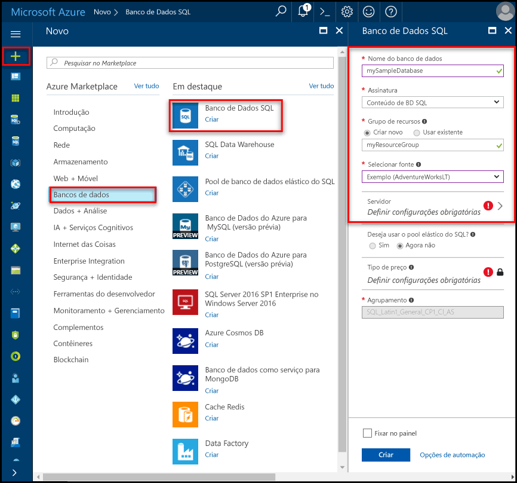
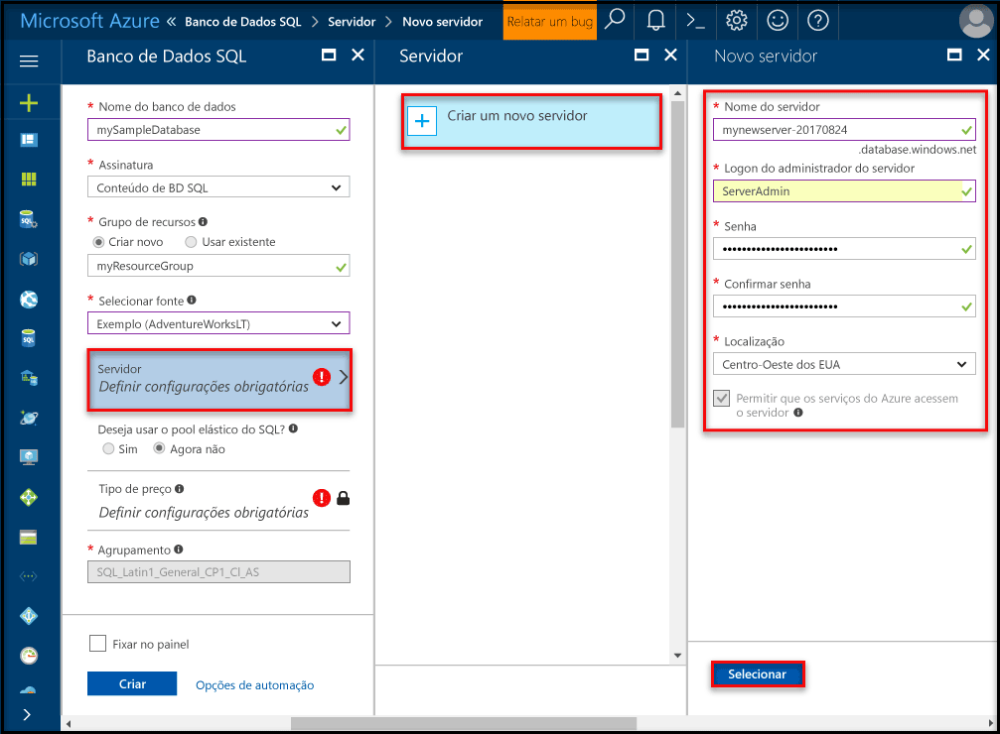
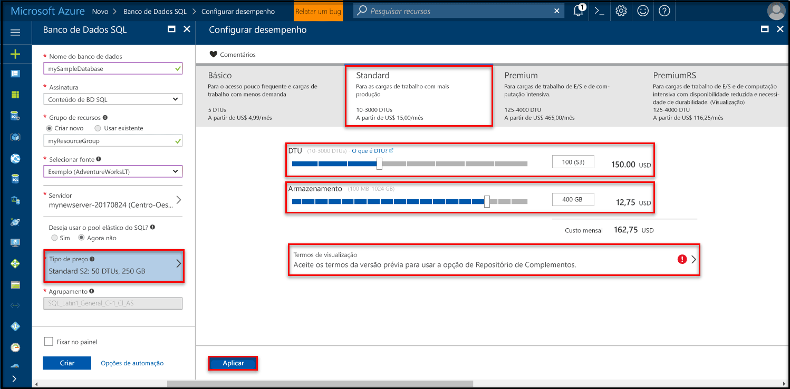
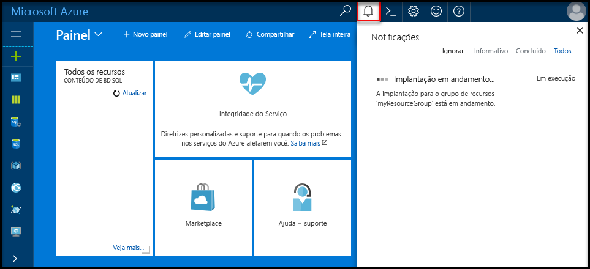

# <a name="create-an-azure-sql-database-in-hello-azure-portal"></a><span data-ttu-id="b20b3-105">Criar um banco de dados do SQL Azure no portal do Azure de saudação</span><span class="sxs-lookup"><span data-stu-id="b20b3-105">Create an Azure SQL database in hello Azure portal</span></span>

<span data-ttu-id="b20b3-106">Este tutorial de início rápido orienta como toocreate um SQL banco de dados no Azure.</span><span class="sxs-lookup"><span data-stu-id="b20b3-106">This quick start tutorial walks through how toocreate a SQL database in Azure.</span></span> <span data-ttu-id="b20b3-107">Banco de dados do SQL Azure é um "banco de dados-como-um-serviço" que permite a você toorun escala altamente disponíveis do SQL Server bancos de dados e na nuvem de saudação da oferta.</span><span class="sxs-lookup"><span data-stu-id="b20b3-107">Azure SQL Database is a “Database-as-a-Service” offering that enables you toorun and scale highly available SQL Server databases in hello cloud.</span></span> <span data-ttu-id="b20b3-108">Esse início rápido mostra como tooget iniciado com a criação de um banco de dados SQL usando Olá portal do Azure.</span><span class="sxs-lookup"><span data-stu-id="b20b3-108">This quick start shows you how tooget started by creating a SQL database using hello Azure portal.</span></span>

<span data-ttu-id="b20b3-109">Se você não tiver uma assinatura do Azure, crie uma conta [gratuita](https://azure.microsoft.com/free/) antes de começar.</span><span class="sxs-lookup"><span data-stu-id="b20b3-109">If you don't have an Azure subscription, create a [free](https://azure.microsoft.com/free/) account before you begin.</span></span>

## <a name="log-in-toohello-azure-portal"></a><span data-ttu-id="b20b3-110">Faça logon no toohello portal do Azure</span><span class="sxs-lookup"><span data-stu-id="b20b3-110">Log in toohello Azure portal</span></span>

<span data-ttu-id="b20b3-111">Faça logon no toohello [portal do Azure](https://portal.azure.com/).</span><span class="sxs-lookup"><span data-stu-id="b20b3-111">Log in toohello [Azure portal](https://portal.azure.com/).</span></span>

## <a name="create-a-sql-database"></a><span data-ttu-id="b20b3-112">Criar um banco de dados SQL</span><span class="sxs-lookup"><span data-stu-id="b20b3-112">Create a SQL database</span></span>

<span data-ttu-id="b20b3-113">Um banco de dados SQL do Azure é criado com um conjunto definido de [recursos de computação e armazenamento](sql-database-service-tiers.md).</span><span class="sxs-lookup"><span data-stu-id="b20b3-113">An Azure SQL database is created with a defined set of [compute and storage resources](sql-database-service-tiers.md).</span></span> <span data-ttu-id="b20b3-114">banco de dados de saudação é criado em um [grupo de recursos do Azure](../azure-resource-manager/resource-group-overview.md) e, em um [servidor lógico do banco de dados do Azure SQL](sql-database-features.md).</span><span class="sxs-lookup"><span data-stu-id="b20b3-114">hello database is created within an [Azure resource group](../azure-resource-manager/resource-group-overview.md) and in an [Azure SQL Database logical server](sql-database-features.md).</span></span> 

<span data-ttu-id="b20b3-115">Siga estas etapas toocreate um banco de dados SQL que contém dados de exemplo Adventure Works LT hello.</span><span class="sxs-lookup"><span data-stu-id="b20b3-115">Follow these steps toocreate a SQL database containing hello Adventure Works LT sample data.</span></span> 

1. <span data-ttu-id="b20b3-116">Clique em Olá **novo** botão localizado no canto superior esquerdo de saudação do hello portal do Azure.</span><span class="sxs-lookup"><span data-stu-id="b20b3-116">Click hello **New** button found on hello upper left-hand corner of hello Azure portal.</span></span>

2. <span data-ttu-id="b20b3-117">Selecione **bancos de dados** de saudação **novo** página e selecione **banco de dados SQL** de saudação **bancos de dados** página.</span><span class="sxs-lookup"><span data-stu-id="b20b3-117">Select **Databases** from hello **New** page, and select **SQL Database** from hello **Databases** page.</span></span>

   

3. <span data-ttu-id="b20b3-119">Preencha formulário de banco de dados SQL Olá com hello seguintes informações, conforme mostrado na saudação anterior imagem:</span><span class="sxs-lookup"><span data-stu-id="b20b3-119">Fill out hello SQL Database form with hello following information, as shown on hello preceding image:</span></span>   

   | <span data-ttu-id="b20b3-120">Configuração</span><span class="sxs-lookup"><span data-stu-id="b20b3-120">Setting</span></span>       | <span data-ttu-id="b20b3-121">Valor sugerido</span><span class="sxs-lookup"><span data-stu-id="b20b3-121">Suggested value</span></span> | <span data-ttu-id="b20b3-122">Descrição</span><span class="sxs-lookup"><span data-stu-id="b20b3-122">Description</span></span> | 
   | ------------ | ------------------ | ------------------------------------------------- | 
   | <span data-ttu-id="b20b3-123">**Nome do banco de dados**</span><span class="sxs-lookup"><span data-stu-id="b20b3-123">**Database name**</span></span> | <span data-ttu-id="b20b3-124">mySampleDatabase</span><span class="sxs-lookup"><span data-stu-id="b20b3-124">mySampleDatabase</span></span> | <span data-ttu-id="b20b3-125">Para ver os nomes do banco de dados válidos, consulte [Identificadores do Banco de Dados](https://docs.microsoft.com/en-us/sql/relational-databases/databases/database-identifiers).</span><span class="sxs-lookup"><span data-stu-id="b20b3-125">For valid database names, see [Database Identifiers](https://docs.microsoft.com/en-us/sql/relational-databases/databases/database-identifiers).</span></span> | 
   | <span data-ttu-id="b20b3-126">**Assinatura**</span><span class="sxs-lookup"><span data-stu-id="b20b3-126">**Subscription**</span></span> | <span data-ttu-id="b20b3-127">Sua assinatura</span><span class="sxs-lookup"><span data-stu-id="b20b3-127">Your subscription</span></span>  | <span data-ttu-id="b20b3-128">Para obter detalhes sobre suas assinaturas, consulte [Assinaturas](https://account.windowsazure.com/Subscriptions).</span><span class="sxs-lookup"><span data-stu-id="b20b3-128">For details about your subscriptions, see [Subscriptions](https://account.windowsazure.com/Subscriptions).</span></span> |
   | <span data-ttu-id="b20b3-129">**Grupo de recursos**</span><span class="sxs-lookup"><span data-stu-id="b20b3-129">**Resource group**</span></span>  | <span data-ttu-id="b20b3-130">myResourceGroup</span><span class="sxs-lookup"><span data-stu-id="b20b3-130">myResourceGroup</span></span> | <span data-ttu-id="b20b3-131">Para ver os nomes do grupo de recursos válidos, consulte [Regras e restrições de nomenclatura](https://docs.microsoft.com/azure/architecture/best-practices/naming-conventions).</span><span class="sxs-lookup"><span data-stu-id="b20b3-131">For valid resource group names, see [Naming rules and restrictions](https://docs.microsoft.com/azure/architecture/best-practices/naming-conventions).</span></span> |
   | <span data-ttu-id="b20b3-132">**Fonte da origem**</span><span class="sxs-lookup"><span data-stu-id="b20b3-132">**Source source**</span></span> | <span data-ttu-id="b20b3-133">Exemplo (AdventureWorksLT)</span><span class="sxs-lookup"><span data-stu-id="b20b3-133">Sample (AdventureWorksLT)</span></span> | <span data-ttu-id="b20b3-134">Carrega Olá AdventureWorksLT esquema e os dados no novo banco de dados</span><span class="sxs-lookup"><span data-stu-id="b20b3-134">Loads hello AdventureWorksLT schema and data into your new database</span></span> |

   > [!IMPORTANT]
   > <span data-ttu-id="b20b3-135">Você deve selecionar o banco de dados de exemplo de hello neste formulário porque ela é usada no restante da saudação deste início rápido.</span><span class="sxs-lookup"><span data-stu-id="b20b3-135">You must select hello sample database on this form because it is used in hello remainder of this quick start.</span></span>
   > 

4. <span data-ttu-id="b20b3-136">Em **servidor**, clique em **definir as configurações necessárias** e preencha Olá formulário do SQL server (servidor lógico) com hello seguintes informações, conforme mostrado na Olá a imagem a seguir:</span><span class="sxs-lookup"><span data-stu-id="b20b3-136">Under **Server**, click **Configure required settings** and fill out hello SQL server (logical server) form with hello following information, as shown on hello following image:</span></span>   

   | <span data-ttu-id="b20b3-137">Configuração</span><span class="sxs-lookup"><span data-stu-id="b20b3-137">Setting</span></span>       | <span data-ttu-id="b20b3-138">Valor sugerido</span><span class="sxs-lookup"><span data-stu-id="b20b3-138">Suggested value</span></span> | <span data-ttu-id="b20b3-139">Descrição</span><span class="sxs-lookup"><span data-stu-id="b20b3-139">Description</span></span> | 
   | ------------ | ------------------ | ------------------------------------------------- | 
   | <span data-ttu-id="b20b3-140">**Nome do servidor**</span><span class="sxs-lookup"><span data-stu-id="b20b3-140">**Server name**</span></span> | <span data-ttu-id="b20b3-141">Qualquer nome exclusivo globalmente</span><span class="sxs-lookup"><span data-stu-id="b20b3-141">Any globally unique name</span></span> | <span data-ttu-id="b20b3-142">Para ver os nomes do servidor válidos, consulte [Regras e restrições de nomenclatura](https://docs.microsoft.com/azure/architecture/best-practices/naming-conventions).</span><span class="sxs-lookup"><span data-stu-id="b20b3-142">For valid server names, see [Naming rules and restrictions](https://docs.microsoft.com/azure/architecture/best-practices/naming-conventions).</span></span> | 
   | <span data-ttu-id="b20b3-143">**Logon de administrador do servidor**</span><span class="sxs-lookup"><span data-stu-id="b20b3-143">**Server admin login**</span></span> | <span data-ttu-id="b20b3-144">Qualquer nome válido</span><span class="sxs-lookup"><span data-stu-id="b20b3-144">Any valid name</span></span> | <span data-ttu-id="b20b3-145">Para ver os nomes de logon válidos, consulte [Identificadores do Banco de Dados](https://docs.microsoft.com/en-us/sql/relational-databases/databases/database-identifiers).</span><span class="sxs-lookup"><span data-stu-id="b20b3-145">For valid login names, see [Database Identifiers](https://docs.microsoft.com/en-us/sql/relational-databases/databases/database-identifiers).</span></span> |
   | <span data-ttu-id="b20b3-146">**Senha**</span><span class="sxs-lookup"><span data-stu-id="b20b3-146">**Password**</span></span> | <span data-ttu-id="b20b3-147">Qualquer senha válida</span><span class="sxs-lookup"><span data-stu-id="b20b3-147">Any valid password</span></span> | <span data-ttu-id="b20b3-148">Sua senha deve ter pelo menos 8 caracteres e deve conter caracteres de três das Olá categorias a seguir: caracteres em letras maiusculas, letras minúsculas, números e caracteres não alfanuméricos e.</span><span class="sxs-lookup"><span data-stu-id="b20b3-148">Your password must have at least 8 characters and must contain characters from three of hello following categories: upper case characters, lower case characters, numbers, and and non-alphanumeric characters.</span></span> |
   | <span data-ttu-id="b20b3-149">**Assinatura**</span><span class="sxs-lookup"><span data-stu-id="b20b3-149">**Subscription**</span></span> | <span data-ttu-id="b20b3-150">Sua assinatura</span><span class="sxs-lookup"><span data-stu-id="b20b3-150">Your subscription</span></span> | <span data-ttu-id="b20b3-151">Para obter detalhes sobre suas assinaturas, consulte [Assinaturas](https://account.windowsazure.com/Subscriptions).</span><span class="sxs-lookup"><span data-stu-id="b20b3-151">For details about your subscriptions, see [Subscriptions](https://account.windowsazure.com/Subscriptions).</span></span> |
   | <span data-ttu-id="b20b3-152">**Grupo de recursos**</span><span class="sxs-lookup"><span data-stu-id="b20b3-152">**Resource group**</span></span> | <span data-ttu-id="b20b3-153">myResourceGroup</span><span class="sxs-lookup"><span data-stu-id="b20b3-153">myResourceGroup</span></span> | <span data-ttu-id="b20b3-154">Para ver os nomes do grupo de recursos válidos, consulte [Regras e restrições de nomenclatura](https://docs.microsoft.com/azure/architecture/best-practices/naming-conventions).</span><span class="sxs-lookup"><span data-stu-id="b20b3-154">For valid resource group names, see [Naming rules and restrictions](https://docs.microsoft.com/azure/architecture/best-practices/naming-conventions).</span></span> |
   | <span data-ttu-id="b20b3-155">**Localidade**</span><span class="sxs-lookup"><span data-stu-id="b20b3-155">**Location**</span></span> | <span data-ttu-id="b20b3-156">Qualquer local válido</span><span class="sxs-lookup"><span data-stu-id="b20b3-156">Any valid location</span></span> | <span data-ttu-id="b20b3-157">Para obter mais informações sobre as regiões, consulte [Regiões do Azure](https://azure.microsoft.com/regions/).</span><span class="sxs-lookup"><span data-stu-id="b20b3-157">For information about regions, see [Azure Regions](https://azure.microsoft.com/regions/).</span></span> |

   > [!IMPORTANT]
   > <span data-ttu-id="b20b3-158">Olá administrador logon e senha que você especificar aqui são toolog necessária no servidor de toohello e seus bancos de dados mais tarde nesse início rápido.</span><span class="sxs-lookup"><span data-stu-id="b20b3-158">hello server admin login and password that you specify here are required toolog in toohello server and its databases later in this quick start.</span></span> <span data-ttu-id="b20b3-159">Lembre-se ou registre essas informações para o uso posterior.</span><span class="sxs-lookup"><span data-stu-id="b20b3-159">Remember or record this information for later use.</span></span> 
   >  

   

5. <span data-ttu-id="b20b3-161">Quando tiver preenchido o formulário de saudação, clique em **selecione**.</span><span class="sxs-lookup"><span data-stu-id="b20b3-161">When you have completed hello form, click **Select**.</span></span>

6. <span data-ttu-id="b20b3-162">Clique em **preço** toospecify Olá desempenho e da camada de nível de serviço para o novo banco de dados.</span><span class="sxs-lookup"><span data-stu-id="b20b3-162">Click **Pricing tier** toospecify hello service tier and performance level for your new database.</span></span> <span data-ttu-id="b20b3-163">Use Olá controle deslizante tooselect **20 DTUs** e **250** GB de armazenamento.</span><span class="sxs-lookup"><span data-stu-id="b20b3-163">Use hello slider tooselect **20 DTUs** and **250** GB of storage.</span></span> <span data-ttu-id="b20b3-164">Para obter mais informações sobre as DTUs, consulte [O que é DTU?](sql-database-what-is-a-dtu.md).</span><span class="sxs-lookup"><span data-stu-id="b20b3-164">For more information on DTUs, see [What is a DTU?](sql-database-what-is-a-dtu.md).</span></span>

   

7. <span data-ttu-id="b20b3-166">Depois de quantidade de saudação selecionado de DTUs, clique em **aplicar**.</span><span class="sxs-lookup"><span data-stu-id="b20b3-166">After selected hello amount of DTUs, click **Apply**.</span></span>  

8. <span data-ttu-id="b20b3-167">Agora que você concluiu o formulário de banco de dados SQL hello, clique em **criar** banco de dados do tooprovision hello.</span><span class="sxs-lookup"><span data-stu-id="b20b3-167">Now that you have completed hello SQL Database form, click **Create** tooprovision hello database.</span></span> <span data-ttu-id="b20b3-168">O provisionamento demora alguns minutos.</span><span class="sxs-lookup"><span data-stu-id="b20b3-168">Provisioning takes a few minutes.</span></span> 

9. <span data-ttu-id="b20b3-169">Na barra de ferramentas hello, clique em **notificações** toomonitor processo de implantação de saudação.</span><span class="sxs-lookup"><span data-stu-id="b20b3-169">On hello toolbar, click **Notifications** toomonitor hello deployment process.</span></span>

   

## <a name="create-a-server-level-firewall-rule"></a><span data-ttu-id="b20b3-171">Criar uma regra de firewall no nível de servidor</span><span class="sxs-lookup"><span data-stu-id="b20b3-171">Create a server-level firewall rule</span></span>

<span data-ttu-id="b20b3-172">Olá serviço de banco de dados SQL cria um firewall em Olá nível de servidor que impede que aplicativos externos e ferramentas de conexão de servidor toohello ou bancos de dados no servidor de saudação, a menos que uma regra de firewall é criada um firewall de saudação tooopen para endereços IP específicos.</span><span class="sxs-lookup"><span data-stu-id="b20b3-172">hello SQL Database service creates a firewall at hello server-level that prevents external applications and tools from connecting toohello server or any databases on hello server unless a firewall rule is created tooopen hello firewall for specific IP addresses.</span></span> <span data-ttu-id="b20b3-173">Siga estas etapas toocreate um [regra de firewall de nível de servidor de banco de dados SQL](sql-database-firewall-configure.md) para o endereço IP do cliente e habilitar a conectividade externa através do firewall do banco de dados SQL Olá para seu endereço de IP.</span><span class="sxs-lookup"><span data-stu-id="b20b3-173">Follow these steps toocreate a [SQL Database server-level firewall rule](sql-database-firewall-configure.md) for your client's IP address and enable external connectivity through hello SQL Database firewall for your IP address only.</span></span> 

> [!NOTE]
> <span data-ttu-id="b20b3-174">O Banco de Dados SQL se comunica pela porta 1433.</span><span class="sxs-lookup"><span data-stu-id="b20b3-174">SQL Database communicates over port 1433.</span></span> <span data-ttu-id="b20b3-175">Se você estiver tentando tooconnect de dentro de uma rede corporativa, o tráfego de saída pela porta 1433 talvez não consigam pelo firewall da rede.</span><span class="sxs-lookup"><span data-stu-id="b20b3-175">If you are trying tooconnect from within a corporate network, outbound traffic over port 1433 may not be allowed by your network's firewall.</span></span> <span data-ttu-id="b20b3-176">Nesse caso, você não pode conectar o servidor de banco de dados do Azure SQL tooyour, a menos que o departamento de TI abre a porta 1433.</span><span class="sxs-lookup"><span data-stu-id="b20b3-176">If so, you cannot connect tooyour Azure SQL Database server unless your IT department opens port 1433.</span></span>
>

1. <span data-ttu-id="b20b3-177">Após a conclusão da implantação hello, clique em **bancos de dados SQL** no menu esquerdo hello e clique **mySampleDatabase** em Olá **bancos de dados SQL** página.</span><span class="sxs-lookup"><span data-stu-id="b20b3-177">After hello deployment completes, click **SQL databases** from hello left-hand menu and then click **mySampleDatabase** on hello **SQL databases** page.</span></span> <span data-ttu-id="b20b3-178">Olá, página de visão geral para o banco de dados abre, mostrando a você Olá totalmente qualificado nome do servidor (como **mynewserver20170313.database.windows.net**) e fornece opções de configuração adicional.</span><span class="sxs-lookup"><span data-stu-id="b20b3-178">hello overview page for your database opens, showing you hello fully qualified server name (such as **mynewserver20170313.database.windows.net**) and provides options for further configuration.</span></span> <span data-ttu-id="b20b3-179">Copie esse nome totalmente qualificado do servidor para um uso posterior.</span><span class="sxs-lookup"><span data-stu-id="b20b3-179">Copy this fully qualified server name for use later.</span></span>

   > [!IMPORTANT]
   > <span data-ttu-id="b20b3-180">É necessário que este servidor de tooyour de tooconnect de nome totalmente qualificado do servidor e seus bancos de dados em início rápido subsequente.</span><span class="sxs-lookup"><span data-stu-id="b20b3-180">You need this fully qualified server name tooconnect tooyour server and its databases in subsequent quick starts.</span></span>
   > 

    

2. <span data-ttu-id="b20b3-182">Clique em **definir o firewall do servidor** na barra de ferramentas Olá conforme mostrado na imagem anterior hello.</span><span class="sxs-lookup"><span data-stu-id="b20b3-182">Click **Set server firewall** on hello toolbar as shown in hello previous image.</span></span> <span data-ttu-id="b20b3-183">Olá **configurações de Firewall** página para o servidor de banco de dados SQL Olá é aberta.</span><span class="sxs-lookup"><span data-stu-id="b20b3-183">hello **Firewall settings** page for hello SQL Database server opens.</span></span> 

    

3. <span data-ttu-id="b20b3-185">Clique em **Adicionar IP do cliente** em Olá barra de ferramentas tooadd seu atual endereço IP tooa nova regra de firewall.</span><span class="sxs-lookup"><span data-stu-id="b20b3-185">Click **Add client IP** on hello toolbar tooadd your current IP address tooa new firewall rule.</span></span> <span data-ttu-id="b20b3-186">Uma regra de firewall pode abrir a porta 1433 para um único endereço IP ou um intervalo de endereços IP.</span><span class="sxs-lookup"><span data-stu-id="b20b3-186">A firewall rule can open port 1433 for a single IP address or a range of IP addresses.</span></span>

4. <span data-ttu-id="b20b3-187">Clique em **Salvar**.</span><span class="sxs-lookup"><span data-stu-id="b20b3-187">Click **Save**.</span></span> <span data-ttu-id="b20b3-188">Uma regra de firewall de nível de servidor é criada para seu endereço IP atual, abrir a porta 1433 no servidor lógico hello.</span><span class="sxs-lookup"><span data-stu-id="b20b3-188">A server-level firewall rule is created for your current IP address opening port 1433 on hello logical server.</span></span>

    

4. <span data-ttu-id="b20b3-190">Clique em **Okey** e, em seguida, feche Olá **configurações de Firewall** página.</span><span class="sxs-lookup"><span data-stu-id="b20b3-190">Click **OK** and then close hello **Firewall settings** page.</span></span>

<span data-ttu-id="b20b3-191">Agora você pode conectar o servidor de banco de dados SQL toohello e seus bancos de dados usando o SQL Server Management Studio ou outra ferramenta de sua escolha usando esse endereço IP usando a conta de administrador de servidor de saudação criada anteriormente.</span><span class="sxs-lookup"><span data-stu-id="b20b3-191">You can now connect toohello SQL Database server and its databases using SQL Server Management Studio or another tool of your choice from this IP address using hello server admin account created previously.</span></span>

> [!IMPORTANT]
> <span data-ttu-id="b20b3-192">Por padrão, o acesso através do firewall do banco de dados SQL hello está habilitado para todos os serviços do Azure.</span><span class="sxs-lookup"><span data-stu-id="b20b3-192">By default, access through hello SQL Database firewall is enabled for all Azure services.</span></span> <span data-ttu-id="b20b3-193">Clique em **OFF** em toodisable essa página para todos os serviços do Azure.</span><span class="sxs-lookup"><span data-stu-id="b20b3-193">Click **OFF** on this page toodisable for all Azure services.</span></span>
>

## <a name="query-hello-sql-database"></a><span data-ttu-id="b20b3-194">Banco de dados do SQL consulta Olá</span><span class="sxs-lookup"><span data-stu-id="b20b3-194">Query hello SQL database</span></span>

<span data-ttu-id="b20b3-195">Agora que você criou um banco de dados de exemplo no Azure, vamos usar a ferramenta de consulta interna hello dentro Olá tooconfirm portal do Azure que você pode se conectar a dados de saudação de banco de dados e consulta toohello.</span><span class="sxs-lookup"><span data-stu-id="b20b3-195">Now that you have created a sample database in Azure, let’s use hello built-in query tool within hello Azure portal tooconfirm that you can connect toohello database and query hello data.</span></span> 

1. <span data-ttu-id="b20b3-196">Na página de banco de dados SQL Olá para seu banco de dados, clique em **ferramentas** na barra de ferramentas de saudação.</span><span class="sxs-lookup"><span data-stu-id="b20b3-196">On hello SQL Database page for your database, click **Tools** on hello toolbar.</span></span> <span data-ttu-id="b20b3-197">Olá **ferramentas** página será aberta.</span><span class="sxs-lookup"><span data-stu-id="b20b3-197">hello **Tools** page opens.</span></span>

    

2. <span data-ttu-id="b20b3-199">Clique em **editor de consultas (visualização)**, clique em Olá **visualizar termos** caixa de seleção e, em seguida, clique em **Okey**.</span><span class="sxs-lookup"><span data-stu-id="b20b3-199">Click **Query editor (preview)**, click hello **Preview terms** checkbox, and then click **OK**.</span></span> <span data-ttu-id="b20b3-200">Abre a página do editor de consulta de saudação.</span><span class="sxs-lookup"><span data-stu-id="b20b3-200">hello Query editor page opens.</span></span>

3. <span data-ttu-id="b20b3-201">Clique em **Login** e, em seguida, quando solicitado, selecione **autenticação do SQL server** e forneça logon de administrador do servidor de saudação e a senha que você criou anteriormente.</span><span class="sxs-lookup"><span data-stu-id="b20b3-201">Click **Login** and then, when prompted, select **SQL server authentication** and then provide hello server admin login and password that you created earlier.</span></span>

    

4. <span data-ttu-id="b20b3-203">Clique em **Okey** toolog no.</span><span class="sxs-lookup"><span data-stu-id="b20b3-203">Click **OK** toolog in.</span></span>

5. <span data-ttu-id="b20b3-204">Depois que você está autenticado, digite o seguinte Olá consulta no painel do editor de consultas de saudação.</span><span class="sxs-lookup"><span data-stu-id="b20b3-204">After you are authenticated, type hello following query in hello query editor pane.</span></span>

   ```sql
   SELECT TOP 20 pc.Name as CategoryName, p.name as ProductName
   FROM SalesLT.ProductCategory pc
   JOIN SalesLT.Product p
   ON pc.productcategoryid = p.productcategoryid;
   ```

6. <span data-ttu-id="b20b3-205">Clique em **executar** e analise os resultados da consulta Olá em Olá **resultados** painel.</span><span class="sxs-lookup"><span data-stu-id="b20b3-205">Click **Run** and then review hello query results in hello **Results** pane.</span></span>

   

7. <span data-ttu-id="b20b3-207">Olá fechar **editor de consultas** página e hello **ferramentas** página.</span><span class="sxs-lookup"><span data-stu-id="b20b3-207">Close hello **Query editor** page and hello **Tools** page.</span></span>

## <a name="clean-up-resources"></a><span data-ttu-id="b20b3-208">Limpar recursos</span><span class="sxs-lookup"><span data-stu-id="b20b3-208">Clean up resources</span></span>

<span data-ttu-id="b20b3-209">Se você não precisa desses recursos para outro/tutorial de início rápido (consulte [próximas etapas](#next-steps)), você pode excluí-los, Olá seguinte:</span><span class="sxs-lookup"><span data-stu-id="b20b3-209">If you don't need these resources for another quickstart/tutorial (see [Next steps](#next-steps)), you can delete them by doing hello following:</span></span>


1. <span data-ttu-id="b20b3-210">No menu esquerdo de saudação do hello portal do Azure, clique em **grupos de recursos** e, em seguida, clique em **myResourceGroup**.</span><span class="sxs-lookup"><span data-stu-id="b20b3-210">From hello left-hand menu in hello Azure portal, click **Resource groups** and then click **myResourceGroup**.</span></span> 
2. <span data-ttu-id="b20b3-211">Na sua página de grupo de recursos, clique em **excluir**, tipo **myResourceGroup** Olá caixa de texto e, em seguida, clique em **excluir**.</span><span class="sxs-lookup"><span data-stu-id="b20b3-211">On your resource group page, click **Delete**, type **myResourceGroup** in hello text box, and then click **Delete**.</span></span>

## <a name="next-steps"></a><span data-ttu-id="b20b3-212">Próximas etapas</span><span class="sxs-lookup"><span data-stu-id="b20b3-212">Next steps</span></span>

<span data-ttu-id="b20b3-213">Agora que você tem um banco de dados, você pode se conectar e consultar usando suas ferramentas favoritas.</span><span class="sxs-lookup"><span data-stu-id="b20b3-213">Now that you have a database, you can connect and query using your favorite tools.</span></span> <span data-ttu-id="b20b3-214">Saiba mais escolhendo sua ferramenta abaixo:</span><span class="sxs-lookup"><span data-stu-id="b20b3-214">Learn more by choosing your tool below:</span></span>

- [<span data-ttu-id="b20b3-215">SQL Server Management Studio</span><span class="sxs-lookup"><span data-stu-id="b20b3-215">SQL Server Management Studio</span></span>](sql-database-connect-query-ssms.md)
- [<span data-ttu-id="b20b3-216">Visual Studio Code</span><span class="sxs-lookup"><span data-stu-id="b20b3-216">Visual Studio Code</span></span>](sql-database-connect-query-vscode.md)
- [<span data-ttu-id="b20b3-217">.NET</span><span class="sxs-lookup"><span data-stu-id="b20b3-217">.NET</span></span>](sql-database-connect-query-dotnet.md)
- [<span data-ttu-id="b20b3-218">PHP</span><span class="sxs-lookup"><span data-stu-id="b20b3-218">PHP</span></span>](sql-database-connect-query-php.md)
- [<span data-ttu-id="b20b3-219">Node.js</span><span class="sxs-lookup"><span data-stu-id="b20b3-219">Node.js</span></span>](sql-database-connect-query-nodejs.md)
- [<span data-ttu-id="b20b3-220">Java</span><span class="sxs-lookup"><span data-stu-id="b20b3-220">Java</span></span>](sql-database-connect-query-java.md)
- [<span data-ttu-id="b20b3-221">Python</span><span class="sxs-lookup"><span data-stu-id="b20b3-221">Python</span></span>](sql-database-connect-query-python.md)
- [<span data-ttu-id="b20b3-222">Ruby</span><span class="sxs-lookup"><span data-stu-id="b20b3-222">Ruby</span></span>](sql-database-connect-query-ruby.md)
