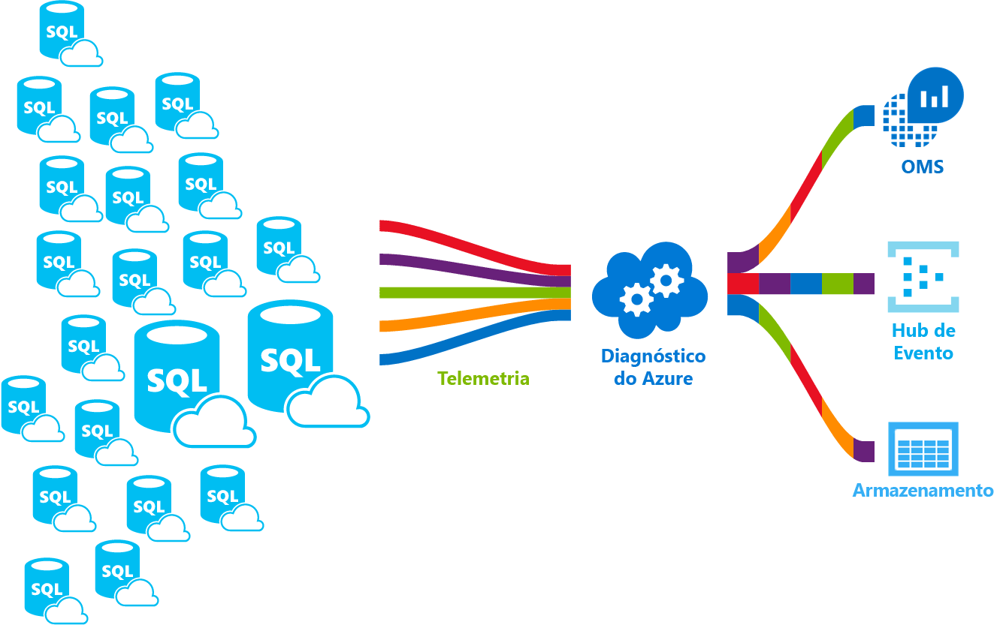

# <a name="azure-sql-database-metrics-and-diagnostics-logging"></a>Métricas de banco de dados SQL do Azure e o log de diagnóstico 
O Banco de Dados SQL do Azure pode emitir métrica e logs de diagnóstico para facilitar o monitoramento. Você pode configurar o uso de recursos do banco de dados do Azure SQL toostore, trabalhadores e sessões e conectividade em um desses recursos do Azure:
- **Armazenamento do Azure**: para o arquivamento de grandes quantidades de telemetria por um pequeno baixo
- **Hub de Eventos do Azure**: para a integração de telemetria de Banco de Dados SQL do Azure com a sua solução de monitoramento personalizada ou pipelines ativos
- **Análise de logs do Azure**: para fora da caixa Olá solução com relatórios, alertas e redução de recursos de monitoramento 

    

## <a name="enable-logging"></a>Habilitar o registro em log

Métricas e log de diagnóstico não está habilitado por padrão. Você pode habilitar e gerenciar o log de diagnóstico usando um dos métodos a seguir de saudação e métricas:
- Portal do Azure
- PowerShell
- CLI do Azure
- API REST 
- Modelo do Resource Manager

Quando você habilitar o log de diagnóstico e métricas, você precisa toospecify Olá recursos do Azure, onde os dados selecionados são coletados. Opções disponíveis:
- Log Analytics
- Hub de evento
- Armazenamento do Azure 

Você pode provisionar um novo recurso do Azure ou selecionar um recurso existente. Depois de selecionar o recurso de armazenamento Olá, é necessário toospecify toocollect os dados. As opções disponíveis incluem:

- **[métricas de 1 minuto](sql-database-metrics-diag-logging.md#1-minute-metrics)**  - contém o percentual DTU, o limite DTU, o percentual de CPU, porcentagem de leitura de dados físicos, porcentagem de gravação de log, êxito/falha/bloqueados por conexões de firewall, porcentagem de sessões, porcentagem de funcionários, armazenamento, porcentagem de armazenamento, porcentagem de armazenamento XTP

Se você especificar uma conta de AzureStorage ou Hub de eventos, você pode especificar um toospecify de política de retenção que os dados mais antigos do que um período de tempo é excluído. Se você especificar a análise de Log, política de retenção Olá depende de camada de preços selecionada hello. Saiba mais sobre [Preço do Log Analytics](https://azure.microsoft.com/pricing/details/log-analytics/). 

É recomendável que você leia os dois Olá [visão geral das métricas no Microsoft Azure](../monitoring-and-diagnostics/monitoring-overview-metrics.md) e [visão geral do Azure Logs de diagnóstico](../monitoring-and-diagnostics/monitoring-overview-of-diagnostic-logs.md) artigos toogain entender não apenas como tooenable registro em log, mas Olá categorias de log e métricas suporte Olá vários serviços do Azure.

### <a name="azure-portal"></a>Portal do Azure

métricas de tooenable e coleta de logs de diagnóstico Olá portal do Azure, navegue tooyour banco de dados do SQL Azure ou página de pool Elástico e, em seguida, clique em **configurações de diagnóstico**.

   

### <a name="powershell"></a>PowerShell

métricas de tooenable e o log de diagnóstico usando o PowerShell, use Olá comandos a seguir:

- armazenamento de tooenable dos Logs de diagnóstico em uma conta de armazenamento, use este comando:

   ```powershell
   Set-AzureRmDiagnosticSetting -ResourceId [your resource id] -StorageAccountId [your storage account id] -Enabled $true
   ```

   Olá ID da conta de armazenamento é a id de recurso de saudação para Olá toowhich de conta de armazenamento você deseja toosend Olá logs.

- tooenable streaming de Logs de diagnóstico tooan Hub de eventos, use este comando:

   ```powershell
   Set-AzureRmDiagnosticSetting -ResourceId [your resource id] -ServiceBusRuleId [your service bus rule id] -Enabled $true
   ```

   Olá ID de regra de barramento de serviço é uma cadeia de caracteres com este formato:

   ```powershell
   {service bus resource ID}/authorizationrules/{key name}
   ``` 

- Enviar tooenable do espaço de trabalho de análise de Log de tooa Logs de diagnóstico, use este comando:

   ```powershell
   Set-AzureRmDiagnosticSetting -ResourceId [your resource id] -WorkspaceId [resource id of hello log analytics workspace] -Enabled $true
   ```

- Você pode obter a id de recurso de saudação do seu espaço de trabalho de análise de Log usando Olá comando a seguir:

   ```powershell
   (Get-AzureRmOperationalInsightsWorkspace).ResourceId
   ```

Você pode combinar várias opções de saída para tooenable esses parâmetros.

### <a name="cli"></a>CLI

métricas de tooenable e logs de diagnóstico usando Olá CLI do Azure, use Olá comandos a seguir:

- armazenamento de tooenable dos Logs de diagnóstico em uma conta de armazenamento, use este comando:

   ```azurecli-interactive
   azure insights diagnostic set --resourceId <resourceId> --storageId <storageAccountId> --enabled true
   ```

   Olá ID da conta de armazenamento é a id de recurso de saudação para Olá toowhich de conta de armazenamento você deseja toosend Olá logs.

- tooenable streaming de Logs de diagnóstico tooan Hub de eventos, use este comando:

   ```azurecli-interactive
   azure insights diagnostic set --resourceId <resourceId> --serviceBusRuleId <serviceBusRuleId> --enabled true
   ```

   Olá ID de regra de barramento de serviço é uma cadeia de caracteres com este formato:

   ```azurecli-interactive
   {service bus resource ID}/authorizationrules/{key name}
   ```

- Enviar tooenable do espaço de trabalho de análise de Log de tooa Logs de diagnóstico, use este comando:

   ```azurecli-interactive
   azure insights diagnostic set --resourceId <resourceId> --workspaceId <resource id of hello log analytics workspace> --enabled true
   ```

Você pode combinar várias opções de saída para tooenable esses parâmetros.

### <a name="rest-api"></a>API REST

Leia mais sobre como muito[alterar configurações de diagnóstico usando Olá API REST do Azure Monitor](https://msdn.microsoft.com/library/azure/dn931931.aspx). 

### <a name="resource-manager-template"></a>Modelo do Resource Manager

Leia mais sobre como muito[Habilitar configurações de diagnóstico na criação de recursos usando o modelo do Gerenciador de recursos](../monitoring-and-diagnostics/monitoring-enable-diagnostic-logs-using-template.md). 

## <a name="stream-into-log-analytics"></a>Fluxo em Log Analytics 
Métricas de banco de dados SQL do Azure e logs de diagnóstico podem ser transmitidos em análise de Log usando a opção de internos "enviar tooLog análise" de saudação no portal de hello, ou habilitar análise de Log em uma configuração de diagnóstica por meio de cmdlets do PowerShell do Azure, CLI do Azure ou Azure Monitor REST API.

### <a name="installation-overview"></a>Visão geral da instalação

Monitorar fleet de banco de dados SQL do Azure é simples com Log Analytics. Três etapas são necessárias:

1.  Criar recursos de Log Analytics
2.  Configurar métricas de toorecord de bancos de dados e logs de diagnóstico em Olá criado análise de Log
3.  Instalar a solução de **Análise de SQL do Azure** na galeria do Log Analytics

### <a name="create-log-analytics-resource"></a>Criar recursos de Log Analytics

1. Clique em **novo** no menu esquerdo hello.
2. Clique em **Monitoramento + Gerenciamento**
3. Clique em **Log Analytics**
4. Preencha o formulário de análise de Log de saudação com informações adicionais de saudação necessárias: nome do espaço de trabalho, assinatura, grupo de recursos, local e preço.

   

### <a name="configure-databases-toorecord-metrics-and-diagnostic-logs"></a>Configurar métricas de toorecord de bancos de dados e logs de diagnóstico

Olá tooconfigure de maneira mais fácil onde os bancos de dados registram suas métricas é por meio de saudação portal do Azure. Olá portal do Azure, navegue tooyour recursos de banco de dados SQL em e clique em **as configurações de diagnóstico**. 

### <a name="install-hello-azure-sql-analytics-solution-from-gallery"></a>Instale a solução de análise do SQL Azure de saudação da Galeria  

1. Depois Olá recursos de análise de Log é criado e seus dados estão fluindo nele, instale a solução de análise do SQL Azure. Isso pode ser feito por meio de saudação **Galeria de soluções** que você pode encontrar na home page do OMS hello e no menu do lado de saudação. Na Galeria de hello, localize e clique em **análise do SQL Azure** solução e clique em **adicionar**.

   

2. Na home page do seu OMS, um novo bloco chamado **Análise de SQL do Azure** é exibido. Selecionar este bloco abre o painel de análise do SQL Azure hello.

### <a name="using-azure-sql-analytics-solution"></a>Usando a solução de Análise de SQL do Azure

Análise do SQL Azure é um painel hierárquico que permite que você toonavigate pela hierarquia de saudação de recursos de banco de dados SQL. Isso permite que o recurso você toodo alto nível de monitoramento mas ele também permite que você tooscope seu monitoramento Olá toojust certo conjunto de recursos.
Painel contém listas de saudação de recursos diferentes em recursos da saudação selecionado. Por exemplo, para uma assinatura selecionada consulte Olá todos os servidores, pools Elásticos e bancos de dados que pertencem a toohello selecionados a assinatura. Além disso, para Pools Elásticos e bancos de dados, você pode ver métricas de uso de recursos de saudação do recurso. Isso inclui gráficos para DTU, CPU, IO, LOG, sessões, operadores, conexões e armazenamento em GB.

## <a name="stream-into-azure-event-hub"></a>Fluxo no Hub de eventos do Azure

Métricas de banco de dados SQL do Azure e logs de diagnóstico podem ser transmitidos para o Hub de eventos usando a opção de internos "fluxo tooan hub de eventos" hello no portal de hello, ou habilitando o Id de regra de barramento de serviço em uma configuração de diagnóstica por meio de Cmdlets do PowerShell do Azure, CLI do Azure ou Azure Monitor REST API. 

### <a name="what-toodo-with-metrics-and-diagnostic-logs-in-event-hub"></a>Quais toodo com métricas e logs de diagnóstico no Hub de eventos?
Quando dados saudação selecionado são transmitidos para o Hub de eventos, você estará um tooenabling mais próxima etapa cenários de monitoramentos avançados. Hubs de eventos age como hello "porta da frente" para um pipeline de eventos, e depois que os dados são coletados em um Hub de eventos que pode ser transformado e armazenados usando qualquer provedor de análise em tempo real ou adaptadores de envio em lote/armazenamento. Hubs de eventos separa a produção de hello de um fluxo de eventos do consumo Olá desses eventos, para que os consumidores de evento possam acessar eventos de saudação em suas próprias agendas. Para obter mais informações sobre o Hub de eventos, consulte:

- [O que são Hubs de Eventos do Azure](../event-hubs/event-hubs-what-is-event-hubs.md)?
- [Introdução aos Hubs de Evento](../event-hubs/event-hubs-csharp-ephcs-getstarted.md)


Aqui estão algumas maneiras que você pode usar o hello capacidade para streaming:

-   Exibir a integridade do serviço facilmente por streaming "afunilamento" dados tooPowerBI - usando Hubs de eventos, análise de fluxo e Power BI, você pode transformar seus dados de métricas e diagnóstico para perto de informações em tempo real em seus serviços do Azure. Para uma visão geral de como tooset a dos Hubs de eventos, processar dados com a análise de fluxo e usar o Power BI como uma saída, consulte [do Stream Analytics e o Power BI](../stream-analytics/stream-analytics-power-bi-dashboard.md).
-   Fluxo logs toothird terceiros registro em log e telemetria fluxos – usando os Hubs de eventos streaming, você podem obter seus logs de diagnóstico e métricas toodifferent soluções de análise de log e de monitoramento de terceiros. 
-   Crie uma telemetria personalizada e a plataforma de log – se você já tem uma plataforma de telemetria personalizada ou estão pensando sobre como criar um, Olá altamente escalonável de publicação / assinatura natureza dos Hubs de eventos permite que você tooflexibly ingestão logs de diagnóstico. Consulte [toousing de guia de Dan Rosanova Hubs de eventos em uma plataforma de telemetria de escala global](https://azure.microsoft.com/documentation/videos/build-2015-designing-and-sizing-a-global-scale-telemetry-platform-on-azure-event-Hubs/).

## <a name="stream-into-azure-storage"></a>Fluxo no Armazenamento do Azure

Métricas de banco de dados SQL do Azure e logs de diagnóstico podem ser armazenados no armazenamento do Azure usando a opção Olá interna "Arquivar a conta de armazenamento tooa" em Olá portal do Azure, ou habilitando o armazenamento do Azure em uma configuração de diagnóstica por meio de Cmdlets do PowerShell do Azure, CLI do Azure ou do Azure API de REST do monitor.

### <a name="schema-of-metrics-and-diagnostic-logs-in-hello-storage-account"></a>Esquema de métricas e logs de diagnóstico na conta de armazenamento Olá

Depois que você configurar as métricas e coleta de logs de diagnóstico, um contêiner de armazenamento é criado na conta de armazenamento Olá selecionada durante as primeiras linhas de saudação de dados estão disponíveis. estrutura Olá esses blobs é:

```powershell
insights-{metrics|logs}-{category name}/resourceId=/SUBSCRIPTIONS/{subscription ID}/ RESOURCEGROUPS/{resource group name}/PROVIDERS/Microsoft.SQL/servers/{resource_server}/ databases/{database_name}/y={four-digit numeric year}/m={two-digit numeric month}/d={two-digit numeric day}/h={two-digit 24-hour clock hour}/m=00/PT1H.json
```
    
Ou, simplesmente:

```powershell
insights-{metrics|logs}-{category name}/resourceId=/{resource Id}/y={four-digit numeric year}/m={two-digit numeric month}/d={two-digit numeric day}/h={two-digit 24-hour clock hour}/m=00/PT1H.json
```

Por exemplo, um nome de blob para métricas de 1 minuto pode ser:

```powershell
insights-metrics-minute/resourceId=/SUBSCRIPTIONS/s1id1234-5679-0123-4567-890123456789/RESOURCEGROUPS/TESTRESOURCEGROUP/PROVIDERS/MICROSOFT.SQL/ servers/Server1/databases/database1/y=2016/m=08/d=22/h=18/m=00/PT1H.json
```

Caso você deseje toorecord dados Olá Olá Pool Elástico, nome do blob é um pouco diferente:

```powershell
insights-{metrics|logs}-{category name}/resourceId=/SUBSCRIPTIONS/{subscription ID}/ RESOURCEGROUPS/{resource group name}/PROVIDERS/Microsoft.SQL/servers/{resource_server}/ elasticPools/{elastic_pool_name}/y={four-digit numeric year}/m={two-digit numeric month}/d={two-digit numeric day}/h={two-digit 24-hour clock hour}/m=00/PT1H.json
```

### <a name="download-metrics-and-logs-from-azure-storage"></a>Baixar logs e métricas do Armazenamento do Azure

Consulte [Baixar métricas e logs de diagnósticos do Armazenamento do Azure](../storage/blobs/storage-dotnet-how-to-use-blobs.md#download-blobs)

## <a name="1-minute-metrics"></a>métricas de 1 minuto

| |  |
|---|---|
|**Recurso**|**Métricas**|
|Banco de dados|porcentagem de DTU, DTU usado, o limite DTU, o porcentagem de CPU, porcentagem de leitura de dados físicos, porcentagem de gravação de log, êxito/falha/bloqueados por conexões de firewall, porcentagem de sessões, porcentagem de funcionários, armazenamento, porcentagem de armazenamento, porcentagem de armazenamento XTP, deadlocks |
|Pool elástico|porcentagem de eDTU, eDTU usado, o limite eDTU, porcentagem de CPU, porcentagem de leitura de dados físicos, porcentagem de gravação de log, porcentagem de sessões, porcentagem de funcionários, armazenamento, porcentagem de armazenamento, limite de armazenamento, porcentagem de armazenamento XTP |
|||

## <a name="next-steps"></a>Próximas etapas

- Ler os dois Olá [visão geral das métricas no Microsoft Azure](../monitoring-and-diagnostics/monitoring-overview-metrics.md) e [visão geral do Azure Logs de diagnóstico](../monitoring-and-diagnostics/monitoring-overview-of-diagnostic-logs.md) artigos toogain entender não apenas como tooenable log, mas Olá métricas e categorias de log suporte Olá vários serviços do Azure.
- Leia essas toolearn artigos sobre hubs de eventos:
   - [O que são Hubs de Eventos do Azure](../event-hubs/event-hubs-what-is-event-hubs.md)?
   - [Introdução aos Hubs de Evento](../event-hubs/event-hubs-csharp-ephcs-getstarted.md)
- Consulte [Baixar métricas e logs de diagnósticos do Armazenamento do Azure](../storage/blobs/storage-dotnet-how-to-use-blobs.md#download-blobs)
