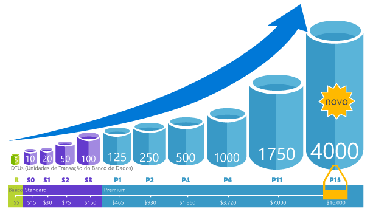
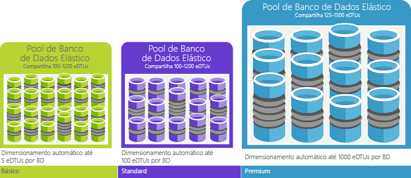

# O que é o serviço de banco de dados do Azure SQL Olá? 

O Banco de Dados SQL é um serviço de banco de dados relacional de uso geral no Microsoft Azure que dá suporte a estruturas como XML, JSON, espacial e dados relacionais. Ele oferece [desempenho dinamicamente escalonável](sql-database-service-tiers.md) e fornece opções como [índices columnstore](https://docs.microsoft.com/sql/relational-databases/indexes/columnstore-indexes-overview) para análise e geração de relatórios extremas e [OLTP in-memory](sql-database-in-memory.md) para processamento transacional extremo. Microsoft trata todos os patches e atualizar diretamente da base de código SQL Olá e abstrai todo o gerenciamento de saudação infra-estrutura subjacente. 

Banco de dados SQL compartilha sua base de código com hello [mecanismo de banco de dados do Microsoft SQL Server](https://docs.microsoft.com/sql/sql-server/sql-server-technical-documentation). Estratégia de nuvem da Microsoft, recursos mais recentes de saudação do SQL Server são lançada tooSQL primeiro banco de dados e, em seguida, tooSQL próprio servidor. Essa abordagem fornece Olá recursos mais recentes do SQL Server com nenhuma sobrecarga para aplicação de patch ou atualizando - e com esses novos recursos são testados em milhões de bancos de dados. Para obter informações sobre novos recursos conforme vão são anunciados, consulte:

- **[Roteiro do Azure para o banco de dados SQL](https://azure.microsoft.com/roadmap/?category=databases)**: toofind um lugar novidades e o que é o próximo passo. 
- **[Blog do Banco de Dados SQL do Azure](https://azure.microsoft.com/blog/topics/database)**: um local onde membros da equipe de produto do SQL Server postam sobre notícias e recursos do Banco de Dados SQL. 

O Banco de Dados SQL oferece um desempenho previsível em vários níveis de serviço que fornece escalabilidade dinâmica sem tempo de inatividade, otimização inteligente interna, escalabilidade e disponibilidade globais e opções avançadas de segurança, tudo com quase nenhuma administração. Esses recursos permitem que você toofocus desenvolvimento rápido de aplicativos e acelerando o toomarket de tempo, em vez de alocação de tempo e recursos toomanaging VMs e infraestrutura. Olá banco de dados do SQL service está atualmente em 38 dados gira em torno de Olá, mundo, com mais data centers entram online regularmente, que permite que você toorun seu banco de dados em um data center perto de você.

> [!NOTE]
> Confira a [Central de Confiabilidade do Azure](https://azure.microsoft.com/support/trust-center/security/) para saber mais sobre a segurança da plataforma do Azure.
>

## Pools e desempenho dimensionável

Com o Banco de Dados SQL, cada banco de dados é isolado de outro e é portátil, cada um com sua própria [camada de serviço](sql-database-service-tiers.md) com um nível de desempenho garantido. Banco de dados SQL fornece diferentes níveis de desempenho para diferentes necessidades e permite que bancos de dados toobe toomaximize em pool Olá usar os recursos e economizar dinheiro.

### Ajuste de desempenho e dimensionamento sem tempo de inatividade

Banco de dados SQL oferece quatro camadas de serviço cargas de trabalho de banco de dados de tooheavyweight leve toosupport: Basic, Standard, Premium e RS Premium. Você pode criar seu primeiro aplicativo em um banco de dados pequeno, o único a um baixo custo por mês e altere sua camada de serviço manualmente ou programaticamente qualquer necessidades de saudação do tempo toomeet de sua solução. Você pode ajustar o desempenho sem tempo de inatividade tooyour aplicativo tooyour clientes. Habilita o dimensionamento dinâmico tootransparently seu banco de dados responder toorapidly alterando os requisitos de recursos e permite que você tooonly pagar por recursos de saudação que é necessário quando você precisar deles.

   

### Utilização de recursos de toomaximize pools Elásticos

Para muitas empresas e aplicativos, sendo toocreate capaz de bancos de dados único e discar desempenho para cima ou para baixo sob demanda é suficiente, principalmente se os padrões de uso são relativamente previsíveis. Mas se você tiver os padrões de uso imprevisíveis, ele pode tornar os custos de disco rígido toomanage e seu modelo de negócios. [Pools Elásticos](sql-database-elastic-pool.md) é projetada toosolve esse problema. o conceito de saudação é simple. Aloque o pool de tooa de recursos de desempenho em vez de um banco de dados individual e pagar para recursos de desempenho coletivo de saudação do pool de saudação em vez de desempenho do banco de dados único. 

   

Com pools Elásticos, você não precisa toofocus no desempenho do banco de dados para cima e para baixo de discagem conforme a demanda por recursos varia. Olá em pool de bancos de dados consomem recursos de desempenho de saudação do pool Elástico Olá conforme necessário. Bancos de dados em pool consumirem, mas não excedem os limites de saudação do pool de hello, para que seu custo permaneça previsível, mesmo que o uso do banco de dados individuais não. O que é mais, você pode [adicionar e remover bancos de dados toohello pool](sql-database-elastic-pool-manage-portal.md), dimensionar seu aplicativo a partir de uma série de toothousands de bancos de dados, dentro de um orçamento que você controle. Você também pode mínimo do controle hello e Olá de toodatabases de máximo de recursos disponíveis no hello pool tooensure que nenhum banco de dados no pool de saudação usa todos os recursos do pool e se cada banco de dados em pool tem uma quantidade mínima garantida de recursos. toolearn mais informações sobre padrões de design para aplicativos SaaS usando pools Elásticos, consulte [padrões de Design para aplicativos de SaaS multilocatário com o banco de dados SQL](sql-database-design-patterns-multi-tenancy-saas-applications.md).

### Combinar bancos de dados individuais a bancos de dados agrupados

Seja qual for a sua escolha (bancos de dados únicos ou pools elásticos), você não está limitado. Bancos de dados único com pools Elásticos do blend e alterar as camadas de serviço Olá de bancos de dados único e de pools Elásticos rapidamente e facilmente tooadapt tooyour situação. Com energia hello e o alcance do Azure, é possível combinação e correspondência outros Azure serviços com o banco de dados SQL toomeet necessidades, a unidade de custo e a eficiência de recursos de design de seu aplicativo exclusivo e desbloquear as novas oportunidades de negócios.

### Monitoramento abrangente e recursos de alerta

Mas como você comparar o desempenho relativo de saudação de bancos de dados único e de pools Elásticos? Como você sabe Olá parar clique com botão direito ao discar para cima e para baixo? Use Olá [monitoramento de desempenho interno](sql-database-performance.md) e [alertas](sql-database-insights-alerts-portal.md) ferramentas, combinadas com classificações de desempenho de saudação com base em [unidades de transação de banco de dados (DTUs) para bancos de dados único e DTUs Elásticos (eDTUs) para pools Elásticos](sql-database-what-is-a-dtu.md). Usando essas ferramentas, você pode avaliar rapidamente impacto de saudação de dimensionamento para cima ou para baixo com base no seu atual ou necessidades de desempenho do projeto. Confira [Opções e desempenho de Banco de Dados SQL: saiba o que está disponível em cada camada de serviço](sql-database-service-tiers.md) para obter detalhes.

Além disso, o Banco de Dados SQL pode [emitir métrica e logs de diagnóstico](sql-database-metrics-diag-logging.md) para facilitar o monitoramento. Você pode configurar o uso de recursos do banco de dados SQL toostore, trabalhadores e sessões e conectividade em um desses recursos do Azure:

- **Armazenamento do Azure**: para o arquivamento de grandes quantidades de telemetria por um pequeno baixo
- **Hub de Eventos do Azure**: para a integração de telemetria de Banco de Dados SQL com a sua solução de monitoramento personalizada ou pipelines ativos
- **Azure Log Analytics**: para solução de monitoramento interna com relatórios, alertas e recursos de mitigação

    

## Recursos de disponibilidade

Os acordos de nível de serviço [(SLA)](http://azure.microsoft.com/support/legal/sla/)de disponibilidade de 99,99% de líderes do setor do Azure, alimentados por uma rede global de datacenters gerenciados pela Microsoft, ajuda a manter seu aplicativo em execução 24/7. Além disso, o Banco de Dados SQL fornece recursos internos de [continuidade dos negócios e a escalabilidade global](sql-database-business-continuity.md), incluindo:

- **[Backups automáticos](sql-database-automated-backups.md)**: o Banco de Dados SQL executa backups de log de transações, completos e diferenciais.
- **[Restaurações point-in-time](sql-database-recovery-using-backups.md)**: banco de dados SQL dá suporte à recuperação tooany ponto no tempo dentro do período de retenção de backup automático hello.
- **[Replicação geográfica ativa](sql-database-geo-replication-overview.md)**: banco de dados SQL permite que você tooconfigure backup secundário legível toofour bancos de dados em qualquer Olá mesmo ou distribuída globalmente data centers do Azure.  Por exemplo, se você tiver um aplicativo de SaaS com um banco de dados de catálogo que tem um alto volume de transações simultâneas de somente leitura, use replicação geográfica ativa tooenable global escala de leitura e remover afunilamentos em Olá primário vencidas tooread cargas de trabalho. 
- **[Grupos de failover](sql-database-geo-replication-overview.md)**: banco de dados SQL permite que você tooenable alta disponibilidade e balanceamento de carga em escala global, incluindo a replicação geográfica transparente e failover de grandes conjuntos de bancos de dados e de pools elásticos. Os grupos de failover e permite a criação replicação geográfica ativa globalmente distribuídos aplicativos SaaS com administração mínima sobrecarga deixar todos os Olá complexo monitoramento, roteamento e coordenação de failover tooSQL banco de dados.

## Inteligência interna

Com o banco de dados SQL, você obtém inteligência interna que ajuda a reduzir significativamente os custos de saudação de execução e gerenciamento de bancos de dados e maximiza o desempenho e segurança de seu aplicativo. Banco de dados SQL executando milhões de cliente cargas de trabalho 24 horas por dia, coleta e processa uma grande quantidade de dados de telemetria, enquanto também totalmente respeitar a privacidade do cliente em segundo plano da saudação. Vários algoritmos continuamente estão avaliando dados de telemetria Olá para que o serviço de saudação pode aprender e se adaptar ao seu aplicativo. Serviço de saudação com base nesta análise, surge com desempenho melhora a carga de trabalho específica recomendações tooyour personalizada. 

### Ajuste automático de desempenho

Banco de dados SQL fornece informações detalhadas sobre Olá consultas que você precisa toomonitor. Do banco de dados SQL aprende sobre seus padrões de banco de dados e permite que você tooadapt sua carga de trabalho de tooyour de esquema de banco de dados. O Banco de Dados SQL fornece recomendações de ajuste de desempenho usando o [Assistente do Banco de Dados SQL](sql-database-advisor.md), em que você pode revisar as ações de ajuste e aplicá-las. No entanto, monitorar o banco de dados é uma tarefa difícil e entediante, especialmente ao lidar com muitos bancos de dados. Gerenciar um grande número de bancos de dados pode ser impossível toodo com eficiência mesmo com todas as ferramentas disponíveis e relatórios que fornecem banco de dados SQL e o portal do Azure. Em vez de monitorar e ajustar o banco de dados manualmente, você pode considerar delegar algumas Olá monitorando e ajustando tooSQL ações usando o recurso de ajuste automático do banco de dados. Banco de dados SQL aplicar recomendações, testes e verifica cada um dos seu desempenho de saudação do ajuste ações tooensure mantém melhorando automaticamente. Dessa forma, banco de dados SQL automaticamente se adapta tooyour de carga de trabalho de maneira segura e controlada. Ajuste automático significa que o desempenho de saudação do banco de dados cuidadosamente é monitorado e comparado antes e depois de cada ação de ajuste, e se não melhorar o desempenho de hello, Olá ação de ajuste é revertida.

Hoje, muitos dos nossos parceiros executando [SaaS multilocatários aplicativos](sql-database-design-patterns-multi-tenancy-saas-applications.md) sobre o banco de dados SQL confiam em toomake-se de que seus aplicativos sempre têm desempenho estável e previsível de ajuste de desempenho automático. Para eles, esse recurso reduz risco de saudação de ter um incidente de desempenho no meio de saudação da noite hello. Além disso, como parte de sua base de clientes também usa o SQL Server, eles estão usando Olá mesmas recomendações de indexação fornecidos pelo banco de dados SQL toohelp seus clientes do SQL Server.

Há dois aspectos de ajuste automático que estão disponíveis no Banco de Dados SQL:

- **[Gerenciamento de índice automático](sql-database-automatic-tuning.md#automatic-index-management)**: identifica os índices que devem ser adicionados ao seu banco de dados e os índices que devem ser removidos.
- **[Correção automática de plano](sql-database-automatic-tuning.md#automatic-plan-choice-correction)**: identifica planos problemáticos e corrige problemas de desempenho do plano SQL (em breve; já está disponível no SQL Server 2017).

### Processamento de consulta adaptável

Também estamos adicionando Olá [processamento de consulta adaptável](/sql/relational-databases/performance/adaptive-query-processing) família de recursos tooSQL banco de dados, incluindo a execução intercalada de funções com valor de tabela de várias instruções, comentários de concessão de memória do modo de lote e junções adaptável do modo de lote . Cada um desses recursos de processamento de consulta adaptável aplica técnicas "Saiba mais e adaptar" semelhantes, ajudar a solucionar problemas de otimização do desempenho problemas relacionados toohistorically intractable consulta.

### Detecção de ameaças inteligente

 [Detecção de ameaças SQL](sql-database-threat-detection.md) aproveita [auditoria de banco de dados SQL](sql-database-auditing.md) toocontinuously monitor SQL do Azure bancos de dados para dados confidenciais de tooaccess tentativas potencialmente prejudiciais. Detecção de ameaças SQL fornece uma nova camada de segurança, que permite que os clientes toodetect e responde a ameaças de toopotential conforme elas ocorrem, fornecendo alertas de segurança em atividades anormais. Os usuários recebem alertas em caso de atividades suspeitas em bancos de dados, possíveis vulnerabilidades e ataques de injeção de SQL, bem como padrões anômalos de acesso ao banco de dados. Ameaça SQL alertas de detecção de fornecem detalhes de atividade suspeita e recomendarão a ação sobre como tooinvestigate e atenuar a ameaça de saudação. Os usuários podem explorar Olá eventos suspeitos toodetermine se Olá resultados de eventos de uma tentativa de tooaccess, violação ou explorar dados no banco de dados de saudação. A detecção de ameaças torna simples tooaddress potenciais ameaças toohello banco de dados sem a necessidade de saudação toobe um especialista em segurança ou gerenciar os sistemas de monitoramento de segurança avançada.

## Segurança e conformidade avançadas

Banco de dados SQL fornece uma variedade de [recursos internos de segurança e conformidade](sql-database-security-overview.md) toohelp seu aplicativo atende aos vários requisitos de conformidade e segurança. 

### Auditoria de segurança e conformidade

[Auditoria de banco de dados SQL](sql-database-auditing.md) rastreia eventos de banco de dados e grava o log de auditoria tooan em sua conta de armazenamento do Azure. A auditoria pode ajudar você a manter uma conformidade regulatória, a entender a atividade do banco de dados e a obter informações sobre discrepâncias e anomalias que poderiam indicar preocupações de negócios ou suspeitas de violações de segurança.

### Criptografia de dados em repouso

Banco de dados SQL [criptografia transparente de dados](https://docs.microsoft.com/sql/relational-databases/security/encryption/transparent-data-encryption-with-azure-sql-database) ajuda a proteger contra a ameaça de saudação de atividades mal-intencionadas executando criptografia em tempo real e a descriptografia do banco de dados de hello, backups associados, e arquivos de log de transações em repouso sem a necessidade de alterações toohello aplicativo. A partir de maio de 2017, todos os Bancos de Dados SQL do Azure são protegidos automaticamente com TDE (Transparent Data Encryption). A TDE é do SQL comprovada tecnologia de criptografia em repouso exigido por muitos tooprotect padrões de conformidade contra roubo de mídia de armazenamento. Os clientes podem gerenciar chaves de criptografia de TDE hello e outros segredos de forma segura e em conformidade usando o Cofre de chaves do Azure.

### Criptografia dos dados em trânsito

Banco de dados SQL é Olá somente banco de dados system toooffer proteção de dados confidenciais em trânsito, inativos e durante a consulta de processamento com [sempre criptografado](https://docs.microsoft.com/sql/relational-databases/security/encryption/always-encrypted-database-engine). Sempre criptografado é um primeiro setor que oferece dados incomparáveis segurança contra violações que envolve o roubo de saudação de dados críticos. Por exemplo, com o sempre criptografado, números de cartão de crédito de clientes são armazenados criptografados no banco de dados de saudação sempre, mesmo durante o processamento de consulta, permitindo descriptografia no ponto de saudação de uso por aplicativos que precisam de tooprocess ou pessoal autorizado dados.

### Mascaramento de dados dinâmicos

[Mascaramento de dados dinâmicos do banco de dados SQL](sql-database-dynamic-data-masking-get-started.md) limita a exposição de dados confidenciais mascarando-os usuários privilegiados toonon. Mascaramento de dados dinâmicos ajuda a impedir que os dados de toosensitive de acesso não autorizado, permitindo que os clientes toodesignate quanto da saudação dados confidenciais tooreveal com impacto mínimo sobre a camada de aplicativo hello. É um recurso de segurança baseado em políticas que oculta os dados confidenciais de saudação no conjunto de resultados de saudação de uma consulta em relação aos campos do banco de dados designados, enquanto Olá dados no banco de dados de saudação não são alterados.

### Segurança em nível de linha

[Segurança em nível de linha](https://docs.microsoft.com/sql/relational-databases/security/row-level-security) permite que os clientes toocontrol acesso toorows em uma tabela de banco de dados com base nas características de saudação do usuário Olá executando uma consulta (como pelo contexto de execução ou associação de grupo). Segurança de nível de linha (RLS) simplifica o design de saudação e codificação de segurança em seu aplicativo. O RLS permite tooimplement restrições no acesso de linha de dados. Por exemplo, garantindo que os funcionários podem acessar somente as linhas de dados que são pertinentes tootheir departamento ou restringir um dados acesso tooonly Olá dados tootheir relevantes da empresa do cliente.

### Integração do Azure Active Directory e autenticação multifator

Permite que o banco de dados SQL toocentrally você gerenciar identidades de usuário de banco de dados e outros serviços da Microsoft com [integração do Active Directory do Azure](sql-database-aad-authentication.md). Esse recurso simplifica o gerenciamento de permissão e aprimora a segurança. O Active Directory do Azure suporta [autenticação multifator](sql-database-ssms-mfa-authentication.md) (MFA) tooincrease dados e segurança de aplicativos e dar suporte a um único processo de sing.

### Certificação de conformidade

O Banco de Dados SQL participa de auditorias regulares e foi certificado por vários padrões de conformidade. Para obter mais informações, consulte Olá [Microsoft Azure Trust Center](https://azure.microsoft.com/support/trust-center/), onde você pode encontrar a lista atualizada de saudação do [certificações de conformidade do banco de dados SQL](https://azure.microsoft.com/support/trust-center/services/).

## Ferramentas fáceis de usar

O Banco de Dados SQL torna a compilação e o gerenciamento de aplicativos mais fáceis e produtivos. Banco de dados SQL permite que você toofocus sobre o que fazer melhor: criação de ótimos aplicativos. Você pode gerenciar e desenvolver no Banco de Dados SQL usando ferramentas e técnicas já existentes.

- **[Olá portal do Azure](https://portal.azure.com/)**: um aplicativo baseado na web para gerenciar todos os serviços do Azure 
- **[SQL Server Management Studio](https://docs.microsoft.com/sql/ssms/download-sql-server-management-studio-ssms)**: um aplicativo cliente livre, que pode ser baixado para gerenciar qualquer infraestrutura SQL, do SQL Server tooSQL banco de dados
- **[SQL Server Data Tools no Visual Studio](https://docs.microsoft.com/sql/ssdt/download-sql-server-data-tools-ssdt)**: um aplicativo cliente livre que pode ser baixado para o desenvolvimento de bancos de dados relacionais do SQL Server, bancos de dados SQL do Azure, pacotes do Integration Services, modelos de dados do Analysis Services e relatórios do Reporting Services.
- **[Código do Visual Studio](https://code.visualstudio.com/docs)**: um, que pode ser baixado software livre, editor de códigos para Windows, macOS e Linux que oferece suporte a extensões, incluindo Olá [mssql extensão](https://aka.ms/mssql-marketplace) para consultar o Microsoft SQL Server, Banco de dados SQL do Azure e SQL Data Warehouse.

Banco de dados SQL dá suporte a criar aplicativos com Python, Java, Node.js, PHP, Ruby, .NET em Olá MacOS, Linux e Windows. Banco de dados SQL suporta Olá mesmo [bibliotecas de conexão](sql-database-libraries.md) como o SQL Server.

## Entre em contato com a equipe de engenharia do hello do SQL Server

- [DBA Stack Exchange](https://dba.stackexchange.com/questions/tagged/sql-server): faça perguntas sobre administração de banco de dados
- [Stack Overflow](http://stackoverflow.com/questions/tagged/sql-server): faça perguntas sobre desenvolvimento
- [Fóruns do MSDN](https://social.msdn.microsoft.com/Forums/en-US/home?category=sqlserver): Faça perguntas técnicas
- [Microsoft Connect](https://connect.microsoft.com/SQLServer/Feedback): relate bugs e solicite recursos
- [Reddit](https://www.reddit.com/r/SQLServer/): debata sobre o SQL Server

## Próximas etapas

- Consulte Olá [página de preços](https://azure.microsoft.com/pricing/details/sql-database/) para comparações de custo de pools Elásticos e calculadoras e único banco de dados.

- Consulte que esses rápida inicia tooget que é iniciado:

  - [Criar um banco de dados SQL no hello portal do Azure](sql-database-get-started-portal.md)  
  - [Criar um banco de dados do SQL com hello CLI do Azure](sql-database-get-started-cli.md)
  - [Criar um banco de dados SQL usando o PowerShell](sql-database-get-started-powershell.md)

- Para ver vários exemplos da CLI do Azure e do PowerShell, consulte:
  - [Exemplos da CLI do Azure para o Banco de Dados SQL do Azure](sql-database-cli-samples.md)
  - [Exemplos do Azure PowerShell para o Banco de Dados SQL do Azure](sql-database-powershell-samples.md)
