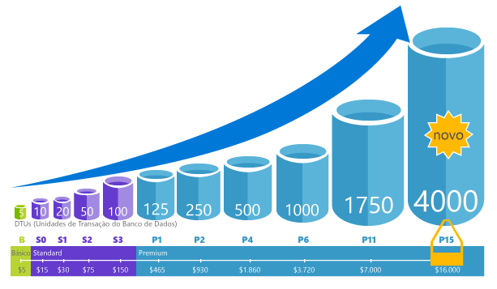

# Explicação de DTUs (Unidades de transação de banco de dados) e eDTUs (Unidades de transação de banco de dados elástico)Explaining Database Transaction Units (DTUs) and elastic Database Transaction Units (eDTUs)
Este artigo explica as DTUs (Unidades de transação de banco de dados) e eDTUs (Unidades de transação de banco de dados elástico), e o que acontece quando você atinge o máximo de DTUs ou eDTUs.This article explains Database Transaction Units (DTUs) and elastic Database Transaction Units (eDTUs) and what happens when you hit the maximum DTUs or eDTUs.  

## O que são DTUs (Unidades de transação do banco de dados)What are Database Transaction Units (DTUs)
Para um único Banco de Dados SQL do Azure em um nível de desempenho específico dentro de uma [camada de serviço](sql-database-service-tiers.md#single-database-service-tiers-and-performance-levels), a Microsoft garante um certo nível de recursos para o banco de dados (independente de qualquer outro banco de dados na nuvem do Azure) e fornecendo um nível previsível de desempenho.For a single Azure SQL database at a specific performance level within a [service tier](sql-database-service-tiers.md#single-database-service-tiers-and-performance-levels), Microsoft guarantees a certain level of resources for that database (independent of any other database in the Azure cloud) and providing a predictable level of performance. Essa quantidade de recursos é calculada como um número de unidades de transação do banco de dados ou DTUs e é uma medida combinada de CPU, memória, E/S (E/S de dados e log de transações).This amount of resources is calculated as a number of Database Transaction Units or DTUs, and is a blended measure of CPU, memory, I/O (data and transaction log I/O). A proporção entre esses recursos originalmente foi determinada por uma [carga de trabalho de parâmetro de comparação de OLTP](sql-database-benchmark-overview.md) projetada para ser o cenário típico de cargas de trabalho OLTP reais.The ratio amongst these resources was originally determined by an [OLTP benchmark workload](sql-database-benchmark-overview.md) designed to be typical of real-world OLTP workloads. Quando sua carga de trabalho excede o valor de qualquer um desses recursos, a taxa de transferência é restringida, resultando em desempenho mais lento e inatividade.When your workload exceeds the amount of any of these resources, your throughput is throttled - resulting in slower performance and timeouts. Os recursos usados pela sua carga de trabalho não afetam os recursos disponíveis para outros Bancos de Dados SQL na nuvem do Azure, e os recursos usados por outras cargas de trabalho não afetam os recursos disponíveis para o Banco de Dados SQL.The resources used by your workload do not impact the resources available to other SQL databases in the Azure cloud, and the resource used by other workloads do not impact the resources available to your SQL database.

DTUs são úteis para entender a quantidade relativa de recursos entre Bancos de Dados SQL do Azure em diferentes níveis de desempenho e de serviço.DTUs are most useful for understanding the relative amount of resources between Azure SQL Databases at different performance levels and service tiers. Por exemplo, dobrar as DTUs aumentando o nível de desempenho de um banco de dados equivale a dobrar o conjunto de recursos disponíveis para esse banco de dados.For example, doubling the DTUs by increasing the performance level of a database equates to doubling the set of resource available to that database. Por exemplo, um banco de dados Premium P11 com 1.750 DTUs fornece 350x mais capacidade de computação DTU que um banco de dados básico com 5 DTUs.For example, a Premium P11 database with 1750 DTUs provides 350x more DTU compute power than a Basic database with 5 DTUs.  

Para ver informações mais aprofundadas sobre o consumo de recursos (DTU) da sua carga de trabalho, use a [Análise de Desempenho de Consultas do Banco de Dados SQL do Azure](sql-database-query-performance.md) para:To gain deeper insight into the resource (DTU) consumption of your workload, use [Azure SQL Database Query Performance Insight](sql-database-query-performance.md) to:

- Identifique as principais consultas por contagem de CPU/Duração/Execução, que potencialmente podem ser ajustadas para melhorar o desempenho.Identify the top queries by CPU/Duration/Execution count that can potentially be tuned for improved performance. Por exemplo, uma consulta com uso intensivo de E/S pode se beneficiar do uso de [técnicas de otimização de memória](sql-database-in-memory.md) para fazer melhor uso da memória disponível em uma determinada camada de serviço e nível de desempenho.For example, an I/O intensive query might benefit from the use of [in-memory optimization techniques](sql-database-in-memory.md) to make better use of the available memory at a certain service tier and performance level.
- Analise detalhadamente os dados de uma consulta e exiba o texto e o histórico de utilização de recursos.Drill down into the details of a query, view its text and history of resource utilization.
- Acesse recomendações de ajuste de desempenho que mostram as ações executadas pelo [Assistente do Banco de Dados SQL do Azure](sql-database-advisor.md).Access performance tuning recommendations that show actions performed by [SQL Database Advisor](sql-database-advisor.md).

Você pode [alterar os níveis de serviço](sql-database-service-tiers.md) a qualquer momento com tempo de inatividade mínimo para seu aplicativo (tempo médio de quatro segundos).You can [change service tiers](sql-database-service-tiers.md) at any time with minimal downtime to your application (generally averaging under four seconds). Para muitos negócios e aplicativos, ser capaz de criar bancos de dados e ajustar o desempenho sob demanda é o suficiente, especialmente se os padrões de uso forem relativamente previsíveis.For many businesses and apps, being able to create databases and dial performance up or down on demand is enough, especially if usage patterns are relatively predictable. Mas se você tiver os padrões de uso imprevisíveis, pode ser difícil de gerenciar os custos e o seu modelo de negócios.But if you have unpredictable usage patterns, it can make it hard to manage costs and your business model. Para este cenário, você pode usar um pool elástico com um determinado número de eDTUs que são compartilhados entre vários banco de dados no pool.For this scenario, you use an elastic pool with a certain number of eDTUs that are shared among multiple database in the pool.

## O que são eDTUs (Unidades de transação de banco de dados elástico)What are elastic Database Transaction Units (eDTUs)
Em vez de fornecer um conjunto dedicado de recursos (DTUs) para um Banco de Dados SQL que está sempre disponível independentemente de ser necessário ou não, é possível colocar os bancos de dados em um [pool elástico](sql-database-elastic-pool.md) em um servidor de Banco de Dados SQL que compartilha um pool de recursos entre esses bancos de dados.Rather than provide a dedicated set of resources (DTUs) to a SQL Database that is always available regardless of whether needed not, you can place databases into an [elastic pool](sql-database-elastic-pool.md) on a SQL Database server that shares a pool of resources among those database. Os recursos compartilhados em um pool elástico medidos por Unidades de Transação de Banco de Dados elástico ou eDTUs.The shared resources in an elastic pool measured by elastic Database Transaction Units or eDTUs. Pools elásticos fornecem uma solução simples e econômica para gerenciar as metas de desempenho para vários bancos de dados que têm padrões de uso muito variáveis e imprevisíveis.Elastic pools provide a simple cost effective solution to manage the performance goals for multiple databases that have widely varying and unpredictable usage patterns. Em um pool elástico, é possível garantir que nenhum banco de dados use todos os recursos no pool, bem como que uma quantidade mínima de recursos esteja sempre disponível para um banco de dados em um pool elástico.In an elastic pool, you can guarantee that no one database uses all of the resources in the pool and also that a minimum amount of resources is always available to a database in an elastic pool. Confira [pools elásticos](sql-database-elastic-pool.md) para obter mais informações.See  [elastic pools](sql-database-elastic-pool.md) for more information.

Um pool é fornecido com um número definido de eDTUs por um preço definido.A pool is given a set number of eDTUs, for a set price. No pool elástico, os bancos de dados individuais recebem a flexibilidade do dimensionamento automático dentro dos limites configurados.Within the elastic pool, individual databases are given the flexibility to auto-scale within the configured boundaries. Sob carga pesada, um banco de dados pode consumir mais eDTUs para atender à demanda, enquanto os bancos de dados sob carga leve consomem menos, até o ponto que os bancos de dados sem carga não consomem qualquer eDTU.Under heavy load, a database can consume more eDTUs to meet demand while databases under light loads consume less, up to the point that databases under no load consume no eDTUs. Ao provisionar recursos para o pool inteiro, em vez de por banco de dados, as tarefas de gerenciamento são simplificadas, e você tem um orçamento previsível para o pool.By provisioning resources for the entire pool, rather than per database, management tasks are simplified and you have a predictable budget for the pool.

eDTUs adicionais podem ser adicionados a um pool existente sem tempo de inatividade do banco de dados ou impacto sobre os bancos de dados no pool.Additional eDTUs can be added to an existing pool with no database downtime and with no impact on the databases in the pool. Da mesma forma, se eDTUs extras não forem mais necessários, eles poderão ser removidos de um pool existente a qualquer momento.Similarly, if extra eDTUs are no longer needed, they can be removed from an existing pool at any point in time. Você pode adicionar ou subtrair bancos de dados para o pool ou limitar a quantidade de eDTUs que um banco de dados pode usar sob carga pesada para reservar eDTUs para outros bancos de dados.You can add or subtract databases to the pool, or limit the amount of eDTUs a database can use under heavy load to reserve eDTUs for other databases. Se um banco de dados estiver subutilizando recursos de forma previsível, você poderá movê-lo para fora do pool e configurá-lo como um único banco de dados com a quantidade previsível de recursos necessários.If a database is predictably under-utilizing resources, you can move it out of the pool and configure it as a single database with predictable amount of resources it requires.

## Como determinar o número de DTUs necessárias para minha carga de trabalho?How can I determine the number of DTUs needed by my workload?
Se você quiser migrar uma carga de trabalho local existente, ou uma carga de trabalho virtual, para o Banco de Dados SQL do Azure, use a [Calculadora de DTU](http://dtucalculator.azurewebsites.net/) para aproximar o número de DTUs necessárias.If you are looking to migrate an existing on-premises or SQL Server virtual machine workload to Azure SQL Database, you can use the [DTU Calculator](http://dtucalculator.azurewebsites.net/) to approximate the number of DTUs needed. Para uma carga de trabalho existente do Banco de Dados SQL do Azure, use [Análise de Desempenho de Consultas do Banco de Dados SQL](sql-database-query-performance.md) para compreender o consumo de recursos do banco de dados (DTUs) e saber mais sobre como otimizar sua carga de trabalho.For an existing Azure SQL Database workload, you can use [SQL Database Query Performance Insight](sql-database-query-performance.md) to understand your database resource consumption (DTUs) to get deeper insight into how to optimize your workload. Você também pode usar o DMV [sys.dm_db_ resource_stats](https://msdn.microsoft.com/library/dn800981.aspx) para obter as informações de consumo de recursos da última hora.You can also use the [sys.dm_db_ resource_stats](https://msdn.microsoft.com/library/dn800981.aspx) DMV to get the resource consumption information for the last one hour. Como alternativa, também é possível consultar o modo de exibição de catálogo [Sys. resource_stats](http://msdn.microsoft.com/library/dn269979.aspx) para obter os mesmos dados para os últimos 14 dias, porém com uma fidelidade menor de médias de cinco minutos.Alternatively, the catalog view [sys.resource_stats](http://msdn.microsoft.com/library/dn269979.aspx) can also be queried to get the same data for the last 14 days, although at a lower fidelity of five-minute averages.

## Como posso saber se eu teria benefícios com um pool elástico de recursos?How do I know if I could benefit from an elastic pool of resources?
Pools também são indicados para um grande número de bancos de dados com padrões de utilização específicos.Pools are suited for a large number of databases with specific utilization patterns. Para um determinado banco de dados, esse padrão é caracterizado por baixa utilização média com picos de utilização relativamente pouco frequentes.For a given database, this pattern is characterized by low average utilization with relatively infrequent utilization spikes. O Banco de Dados SQL avalia automaticamente a utilização histórica de recursos dos bancos de dados em um servidor de Banco de Dados SQL existente e recomenda a configuração de pool apropriada no portal do Azure.SQL Database automatically evaluates the historical resource usage of databases in an existing SQL Database server and recommends the appropriate pool configuration in the Azure portal. Para saber mais , confira [Quando um pool elástico deve ser usado?](sql-database-elastic-pool.md)For more information, see [when should an elastic pool be used?](sql-database-elastic-pool.md)

## O que acontece quando eu atinjo o máximo de DTUsWhat happens when I hit my maximum DTUs
Os níveis de desempenho são calibrados e controlados para fornecer os recursos necessários para executar sua carga de trabalho de banco de dados até os limites máximos permitidos para a sua camada de serviço e nível de desempenho selecionados.Performance levels are calibrated and governed to provide the needed resources to run your database workload up to the max limits allowed for your selected service tier/performance level. Se a sua carga de trabalho está atingindo os limites em um dos limites de CPU/E/S de dados/E/S de Log, você continuará a receber os recursos no nível máximo permitido, mas provavelmente você observará latências maiores para suas consultas.If your workload is hitting the limits in one of CPU/Data IO/Log IO limits, you continue to receive the resources at the maximum allowed level, but you are likely to see increased latencies for your queries. Esses limites não resultam em erros, mas apenas em uma lentidão na carga de trabalho, a menos que a lentidão se torne tão grave que as consultas comecem a não serem executadas a tempo.These limits do not result in any errors, but rather a slowdown in the workload, unless the slowdown becomes so severe that queries start timing out. Se você está atingindo os limites do máximo permitido de sessões/solicitações de usuários simultâneos (threads de trabalho), você verá erros explícitos.If you are hitting limits of maximum allowed concurrent user sessions/requests (worker threads), you see explicit errors. Confira [Limites de recursos do Banco de Dados SQL](sql-database-resource-limits.md) para saber mais sobre limite de recursos, além de CPU, memória, E/S de dados e E/S do log de transações.See [Azure SQL Database resource limits](sql-database-resource-limits.md) for information on limit on resources other than CPU, memory, data I/O, and transaction log I/O.

## Próximas etapasNext steps
* Confira [Camada de serviço](sql-database-service-tiers.md) para obter informações sobre as DTUs e eDTUs disponíveis para bancos de dados individuais e pools elásticos.See [Service tier](sql-database-service-tiers.md) for information on the DTUs and eDTUs available for single databases and for elastic pools.
* Confira [Limites de recursos do Banco de Dados SQL](sql-database-resource-limits.md) para saber mais sobre limite de recursos, além de CPU, memória, E/S de dados e E/S do log de transações.See [Azure SQL Database resource limits](sql-database-resource-limits.md) for information on limit on resources other than CPU, memory, data I/O, and transaction log I/O.
* Confira [Análise de Desempenho de Consultas de Banco de Dados SQL](sql-database-query-performance.md) para compreender o consumo (DTUs).See [SQL Database Query Performance Insight](sql-database-query-performance.md) to understand your (DTUs) consumption.
* Confira [Visão geral do parâmetro de Banco de Dados SQL](sql-database-benchmark-overview.md) para entender a metodologia por trás da carga de trabalho OLTP de parâmetro usada para determinar a combinação de DTU.See [SQL Database benchmark overview](sql-database-benchmark-overview.md) to understand the methodology behind the OLTP benchmark workload used to determine the DTU blend.
