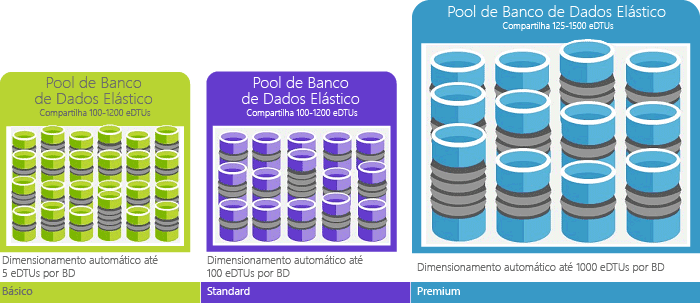

# Explicação de DTUs (Unidades de transação de banco de dados) e eDTUs (Unidades de transação de banco de dados elástico)Explaining Database Transaction Units (DTUs) and elastic Database Transaction Units (eDTUs)
Este artigo explica como unidades de transação do banco de dados (DTUs) e unidades de transação de banco de dados Elástico (eDTUs) e o que acontece quando você atinge Olá máximo de DTUs ou eDTUs.This article explains Database Transaction Units (DTUs) and elastic Database Transaction Units (eDTUs) and what happens when you hit hello maximum DTUs or eDTUs.  

## O que são DTUs (Unidades de transação do banco de dados)What are Database Transaction Units (DTUs)
Para um único banco de dados do SQL Azure em um nível de desempenho específicos dentro de um [camada de serviço](sql-database-service-tiers.md#single-database-service-tiers-and-performance-levels), Microsoft garante um certo nível de recursos do banco de dados (independente de qualquer outro banco de dados na nuvem do Azure de saudação) e fornecendo um previsível nível de desempenho.For a single Azure SQL database at a specific performance level within a [service tier](sql-database-service-tiers.md#single-database-service-tiers-and-performance-levels), Microsoft guarantees a certain level of resources for that database (independent of any other database in hello Azure cloud) and providing a predictable level of performance. Essa quantidade de recursos é calculada como um número de unidades de transação do banco de dados ou DTUs e é uma medida combinada de CPU, memória, E/S (E/S de dados e log de transações).This amount of resources is calculated as a number of Database Transaction Units or DTUs, and is a blended measure of CPU, memory, I/O (data and transaction log I/O). taxa de saudação entre esses recursos originalmente foi determinada por uma [carga de trabalho OLTP benchmark](sql-database-benchmark-overview.md) projetado toobe típico de cargas de trabalho OLTP reais.hello ratio amongst these resources was originally determined by an [OLTP benchmark workload](sql-database-benchmark-overview.md) designed toobe typical of real-world OLTP workloads. Quando sua carga de trabalho excede a quantidade de saudação de qualquer um desses recursos, a taxa de transferência está limitado - resultando em desempenho mais lento e tempos limite.When your workload exceeds hello amount of any of these resources, your throughput is throttled - resulting in slower performance and timeouts. recursos de saudação usados pela sua carga de trabalho não afetem Olá recursos tooother disponíveis bancos de dados SQL Olá nuvem do Azure e o recurso de saudação usado por outras cargas de trabalho não afeta o banco de dados SQL tooyour disponíveis de recursos de saudação.hello resources used by your workload do not impact hello resources available tooother SQL databases in hello Azure cloud, and hello resource used by other workloads do not impact hello resources available tooyour SQL database.

DTUs são mais úteis para a quantidade relativa do hello compreensão de recursos entre bancos de dados SQL Azure em diferentes níveis de desempenho e as camadas de serviço.DTUs are most useful for understanding hello relative amount of resources between Azure SQL Databases at different performance levels and service tiers. Por exemplo, dobrar Olá DTUs aumentando o nível de desempenho de saudação do banco de dados equivale toodoubling conjunto de saudação do banco de dados do recurso toothat disponíveis.For example, doubling hello DTUs by increasing hello performance level of a database equates toodoubling hello set of resource available toothat database. Por exemplo, um banco de dados Premium P11 com 1.750 DTUs fornece 350x mais capacidade de computação DTU que um banco de dados básico com 5 DTUs.For example, a Premium P11 database with 1750 DTUs provides 350x more DTU compute power than a Basic database with 5 DTUs.  

toogain mais aprofundado sobre consumo de recursos (DTU) de saudação da carga de trabalho, use [análise de desempenho de consulta do banco de dados de SQL do Azure](sql-database-query-performance.md) para:toogain deeper insight into hello resource (DTU) consumption of your workload, use [Azure SQL Database Query Performance Insight](sql-database-query-performance.md) to:

- Identificar as principais consultas de saudação por contagem de duração/CPU/execução potencialmente pode ser ajustada para melhorar o desempenho.Identify hello top queries by CPU/Duration/Execution count that can potentially be tuned for improved performance. Por exemplo, uma consulta com uso intensivo de e/s pode se beneficiar do uso de saudação do [técnicas de otimização de memória](sql-database-in-memory.md) toomake melhor o uso de memória disponível de saudação em determinados níveis de serviço da camada e o desempenho.For example, an I/O intensive query might benefit from hello use of [in-memory optimization techniques](sql-database-in-memory.md) toomake better use of hello available memory at a certain service tier and performance level.
- Fazer drill down nos detalhes de saudação de uma consulta, exibir seu texto e o histórico de utilização de recursos.Drill down into hello details of a query, view its text and history of resource utilization.
- Acesse recomendações de ajuste de desempenho que mostram as ações executadas pelo [Assistente do Banco de Dados SQL do Azure](sql-database-advisor.md).Access performance tuning recommendations that show actions performed by [SQL Database Advisor](sql-database-advisor.md).

Você pode [alterar as camadas de serviço](sql-database-service-tiers.md) a qualquer momento com aplicativos do tempo de inatividade mínimo tooyour (geralmente média em quatro segundos).You can [change service tiers](sql-database-service-tiers.md) at any time with minimal downtime tooyour application (generally averaging under four seconds). Para muitas empresas e aplicativos, sendo toocreate capaz de bancos de dados e desempenho para cima ou para baixo sob demanda de discagem é suficiente, principalmente se os padrões de uso são relativamente previsíveis.For many businesses and apps, being able toocreate databases and dial performance up or down on demand is enough, especially if usage patterns are relatively predictable. Mas se você tiver os padrões de uso imprevisíveis, ele pode tornar os custos de disco rígido toomanage e seu modelo de negócios.But if you have unpredictable usage patterns, it can make it hard toomanage costs and your business model. Para este cenário, você pode usar um pool Elástico com um determinado número de eDTUs que são compartilhadas entre várias banco de dados no pool de saudação.For this scenario, you use an elastic pool with a certain number of eDTUs that are shared among multiple database in hello pool.

## O que são eDTUs (Unidades de transação de banco de dados elástico)What are elastic Database Transaction Units (eDTUs)
Em vez de fornecer um conjunto dedicado de recursos (DTUs) tooa banco de dados SQL que está sempre disponível independentemente de se não necessário, você pode colocar bancos de dados em um [pool Elástico](sql-database-elastic-pool.md) em um servidor de banco de dados SQL que compartilha um pool de recursos entre os banco de dados.Rather than provide a dedicated set of resources (DTUs) tooa SQL Database that is always available regardless of whether needed not, you can place databases into an [elastic pool](sql-database-elastic-pool.md) on a SQL Database server that shares a pool of resources among those database. recursos de saudação compartilhado em um pool Elástico medido por Elástico unidades de transação do banco de dados ou eDTUs.hello shared resources in an elastic pool measured by elastic Database Transaction Units or eDTUs. Pools Elásticos fornecem uma solução econômica simples toomanage metas de desempenho de saudação para vários bancos de dados com diferentes amplamente e padrões de uso imprevisível.Elastic pools provide a simple cost effective solution toomanage hello performance goals for multiple databases that have widely varying and unpredictable usage patterns. Em um pool Elástico, você pode garantir que não há um banco de dados usa todos os recursos de saudação no pool de saudação e também que uma quantidade mínima de recursos é sempre o banco de dados tooa disponível em um pool Elástico.In an elastic pool, you can guarantee that no one database uses all of hello resources in hello pool and also that a minimum amount of resources is always available tooa database in an elastic pool. Confira [pools elásticos](sql-database-elastic-pool.md) para obter mais informações.See  [elastic pools](sql-database-elastic-pool.md) for more information.

Um pool é fornecido com um número definido de eDTUs por um preço definido.A pool is given a set number of eDTUs, for a set price. Em pool Elástico de hello, bancos de dados individuais recebem Olá flexibilidade tooauto escala dentro dos limites de saudação configurado.Within hello elastic pool, individual databases are given hello flexibility tooauto-scale within hello configured boundaries. Sob carga pesada, um banco de dados pode consumir mais demanda de toomeet eDTUs enquanto bancos de dados sob carga leve consumam menos, bancos de dados em nenhuma carga não consomem nenhum eDTUs de ponto de toohello.Under heavy load, a database can consume more eDTUs toomeet demand while databases under light loads consume less, up toohello point that databases under no load consume no eDTUs. Provisionando recursos para o pool inteiro Olá, em vez de por banco de dados, as tarefas de gerenciamento são simplificadas e têm um orçamento previsível para o pool de saudação.By provisioning resources for hello entire pool, rather than per database, management tasks are simplified and you have a predictable budget for hello pool.

EDTUs adicionais podem ser adicionados tooan o pool existente sem tempo de inatividade do banco de dados e sem nenhum impacto em bancos de dados Olá no pool de saudação.Additional eDTUs can be added tooan existing pool with no database downtime and with no impact on hello databases in hello pool. Da mesma forma, se eDTUs extras não forem mais necessários, eles poderão ser removidos de um pool existente a qualquer momento.Similarly, if extra eDTUs are no longer needed, they can be removed from an existing pool at any point in time. Você pode adicionar ou subtrair o pool de toohello de bancos de dados, ou o valor do limite de saudação do eDTUs de um banco de dados pode usar sob carga pesada tooreserve eDTUs para outros bancos de dados.You can add or subtract databases toohello pool, or limit hello amount of eDTUs a database can use under heavy load tooreserve eDTUs for other databases. Se um banco de dados é previsível subutilizados recursos, você pode movê-lo do pool de saudação e configurá-lo como um único banco de dados com uma quantidade previsível de recursos necessários.If a database is predictably under-utilizing resources, you can move it out of hello pool and configure it as a single database with predictable amount of resources it requires.

## Como determinar o número de saudação de DTUs necessários ao meu carga de trabalho?How can I determine hello number of DTUs needed by my workload?
Se você estiver procurando toomigrate local existente ou tooAzure de carga de trabalho de máquina virtual do SQL Server banco de dados SQL, você pode usar o hello [DTU Calculadora](http://dtucalculator.azurewebsites.net/) tooapproximate o número de saudação de DTUs necessário.If you are looking toomigrate an existing on-premises or SQL Server virtual machine workload tooAzure SQL Database, you can use hello [DTU Calculator](http://dtucalculator.azurewebsites.net/) tooapproximate hello number of DTUs needed. Para uma carga de trabalho existente do banco de dados SQL, você pode usar [análise de desempenho de consulta de banco de dados SQL](sql-database-query-performance.md) toounderstand seu banco de dados recurso consumo (DTUs) tooget mais informações sobre como toooptimize sua carga de trabalho.For an existing Azure SQL Database workload, you can use [SQL Database Query Performance Insight](sql-database-query-performance.md) toounderstand your database resource consumption (DTUs) tooget deeper insight into how toooptimize your workload. Você também pode usar o hello [sys.dm_db_ resource_stats](https://msdn.microsoft.com/library/dn800981.aspx) DMV tooget Olá consumo informações de recursos para Olá última hora.You can also use hello [sys.dm_db_ resource_stats](https://msdn.microsoft.com/library/dn800981.aspx) DMV tooget hello resource consumption information for hello last one hour. Olá como alternativa, o modo de exibição de catálogo [sys. resource_stats](http://msdn.microsoft.com/library/dn269979.aspx) podem também ser consultado tooget Olá mesmos dados para Olá últimos 14 dias, ainda que com uma menor fidelidade de médias de cinco minutos.Alternatively, hello catalog view [sys.resource_stats](http://msdn.microsoft.com/library/dn269979.aspx) can also be queried tooget hello same data for hello last 14 days, although at a lower fidelity of five-minute averages.

## Como posso saber se eu teria benefícios com um pool elástico de recursos?How do I know if I could benefit from an elastic pool of resources?
Pools também são indicados para um grande número de bancos de dados com padrões de utilização específicos.Pools are suited for a large number of databases with specific utilization patterns. Para um determinado banco de dados, esse padrão é caracterizado por baixa utilização média com picos de utilização relativamente pouco frequentes.For a given database, this pattern is characterized by low average utilization with relatively infrequent utilization spikes. Banco de dados SQL avalia Olá históricos de uso dos bancos de dados em um servidor de banco de dados SQL e recomenda Olá configuração de pool apropriado no portal do Azure de saudação automaticamente.SQL Database automatically evaluates hello historical resource usage of databases in an existing SQL Database server and recommends hello appropriate pool configuration in hello Azure portal. Para saber mais , confira [Quando um pool elástico deve ser usado?](sql-database-elastic-pool.md)For more information, see [when should an elastic pool be used?](sql-database-elastic-pool.md)

## O que acontece quando eu atinjo o máximo de DTUsWhat happens when I hit my maximum DTUs
Níveis de desempenho são calibrados e tooprovide controlados Olá necessária recursos toorun sua carga de trabalho do banco de dados para cima toohello limites máximo permitido para seu nível de camada e desempenho do serviço selecionado.Performance levels are calibrated and governed tooprovide hello needed resources toorun your database workload up toohello max limits allowed for your selected service tier/performance level. Se sua carga de trabalho está atingindo os limites de saudação em um dos limites de dados de CPU/es/Log es, continuar recursos de saudação tooreceive nível Olá máximo permitido, mas são provavelmente toosee aumentado latências de suas consultas.If your workload is hitting hello limits in one of CPU/Data IO/Log IO limits, you continue tooreceive hello resources at hello maximum allowed level, but you are likely toosee increased latencies for your queries. Esses limites não resultam em erros, mas em vez disso, uma diminuição na carga de trabalho hello, a menos que lentidão Olá fica tão grave que consultas iniciam o tempo. Se você está atingindo os limites do máximo permitido de sessões/solicitações de usuários simultâneos (threads de trabalho), você verá erros explícitos.These limits do not result in any errors, but rather a slowdown in hello workload, unless hello slowdown becomes so severe that queries start timing out. If you are hitting limits of maximum allowed concurrent user sessions/requests (worker threads), you see explicit errors. Confira [Limites de recursos do Banco de Dados SQL](sql-database-resource-limits.md) para saber mais sobre limite de recursos, além de CPU, memória, E/S de dados e E/S do log de transações.See [Azure SQL Database resource limits](sql-database-resource-limits.md) for information on limit on resources other than CPU, memory, data I/O, and transaction log I/O.

## Próximas etapasNext steps
* Consulte [camada de serviço](sql-database-service-tiers.md) para obter informações sobre Olá DTUs e eDTUs disponível para bancos de dados único e pools elásticos.See [Service tier](sql-database-service-tiers.md) for information on hello DTUs and eDTUs available for single databases and for elastic pools.
* Confira [Limites de recursos do Banco de Dados SQL](sql-database-resource-limits.md) para saber mais sobre limite de recursos, além de CPU, memória, E/S de dados e E/S do log de transações.See [Azure SQL Database resource limits](sql-database-resource-limits.md) for information on limit on resources other than CPU, memory, data I/O, and transaction log I/O.
* Consulte [análise de desempenho de consulta de banco de dados SQL](sql-database-query-performance.md) toounderstand seu consumo (DTUs).See [SQL Database Query Performance Insight](sql-database-query-performance.md) toounderstand your (DTUs) consumption.
* Consulte [visão geral do banco de dados SQL benchmark](sql-database-benchmark-overview.md) metodologia de saudação toounderstand por trás da carga de trabalho de parâmetro de comparação OLTP Olá usado Olá toodetermine DTU de mesclagem.See [SQL Database benchmark overview](sql-database-benchmark-overview.md) toounderstand hello methodology behind hello OLTP benchmark workload used toodetermine hello DTU blend.
