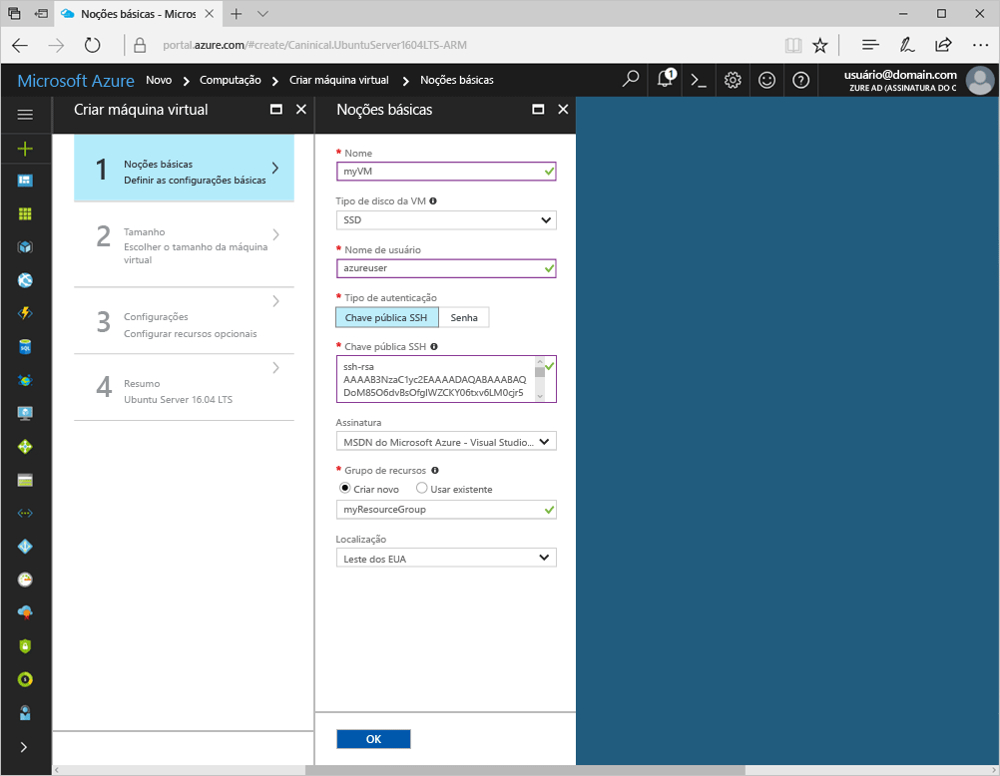
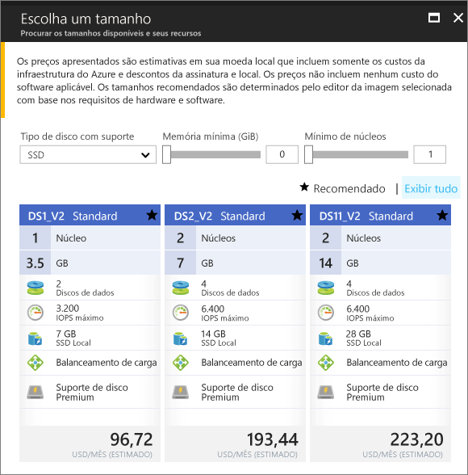
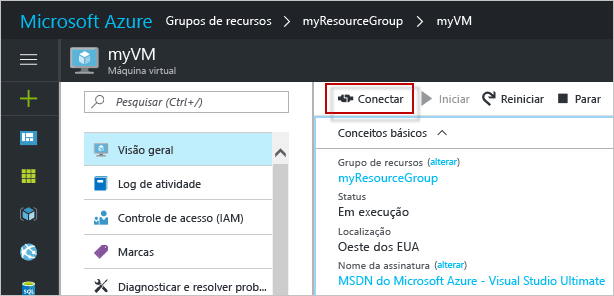

# <a name="create-a-linux-virtual-machine-with-hello-azure-portal"></a>Criar uma máquina virtual Linux com hello portal do Azure

Máquinas virtuais do Azure podem ser criadas por meio de saudação portal do Azure. Esse método fornece uma interface do usuário baseada em navegador para a criação e configuração de máquinas virtuais e todos os recursos relacionados. Este guia de início rápido percorre criando uma máquina virtual e instalar um servidor Web no hello VM.

Se você não tiver uma assinatura do Azure, crie uma [conta gratuita](https://azure.microsoft.com/free/?WT.mc_id=A261C142F) antes de começar.

## <a name="create-ssh-key-pair"></a>Criar o par de chaves SSH

É necessário um toocomplete do par de chaves de SSH esse início rápido. Se você já tiver um par de chave SSH, essa etapa pode ser ignorada.

De um shell Bash, execute este comando e siga Olá na tela de instruções. saída do comando Olá inclui nome de arquivo de saudação do arquivo de chave pública hello. Copie o conteúdo de saudação da área de transferência de toohello do arquivo de chave pública de saudação.

```bash
ssh-keygen -t rsa -b 2048
```

## <a name="log-in-tooazure"></a>Faça logon no tooAzure 

Faça logon em toohello portal do Azure em http://portal.azure.com.

## <a name="create-virtual-machine"></a>Criar máquina virtual

1. Clique em Olá **novo** botão localizado no canto superior esquerdo de saudação do hello portal do Azure.

2. Selecione **Computação** e, em seguida, selecione **Ubuntu Server 16.04 LTS**. 

3. Insira informações da máquina virtual hello. Para **Tipo de autenticação**, selecione **Chave pública SSH**. Ao colar na sua chave pública SSH, tome cuidado tooremove qualquer espaço em branco à esquerda ou à direita. Ao concluir, clique em **OK**.

    

4. Selecione um tamanho para Olá VM. toosee mais tamanhos, selecione **exibir todos os** ou alterar Olá **suporte para o tipo de disco** filtro. 

      

5. Na folha de configurações hello, lembre-Olá padrões e clique em **Okey**.

6. Na página de resumo de saudação, clique em **Okey** toostart implantação da máquina virtual hello.

7. Olá VM será fixado toohello painel do portal do Azure. Após a conclusão da implantação hello, folha de resumo de VM Olá é aberto automaticamente.


## <a name="connect-toovirtual-machine"></a>Conectar máquina toovirtual

Crie uma conexão SSH com a máquina virtual de saudação.

1. Clique em Olá **conectar** botão na folha de máquina virtual de saudação. Olá conectar botão exibe uma cadeia de caracteres de conexão SSH que pode ser usado tooconnect toohello virtual máquina.

     

2. Comando a seguir de execução Olá toocreate uma sessão SSH. Substitua cadeia de caracteres de conexão Olá Olá que você copiado da saudação portal do Azure.

```bash 
ssh azureuser@40.112.21.50
```

## <a name="install-nginx"></a>Instalar o NGINX

Use a seguir de saudação bash origens do pacote do script tooupdate e instala pacote NGINX mais recente de saudação. 

```bash 
#!/bin/bash

# update package source
sudo apt-get -y update

# install NGINX
sudo apt-get -y install nginx
```

Quando terminar, saia Olá SSH sessão e retornar propriedades da VM Olá no hello portal do Azure.


## <a name="open-port-80-for-web-traffic"></a>Abra a porta 80 para tráfego da Web 

Um Grupo de Segurança de Rede (NSG) protege o tráfego de entrada e saída. Quando uma máquina virtual é criada a partir Olá portal do Azure, uma regra de entrada é criada na porta 22 para conexões SSH. Como essa VM hospeda um servidor Web, uma regra NSG necessita toobe criado para a porta 80.

1. Na máquina virtual de Olá, clique em nome de saudação do hello **grupo de recursos**.
2. Selecione Olá **grupo de segurança de rede**. Olá NSG pode ser identificado usando Olá **tipo** coluna. 
3. No menu esquerdo hello, em configurações, clique em **regras de segurança de entrada**.
4. Clique em **Adicionar**.
5. Em **Nome**, digite **http**. Certifique-se de **intervalo de portas** é definir too80 e **ação** está definido muito**permitir**. 
6. Clique em **OK**.


## <a name="view-hello-nginx-welcome-page"></a>Página de boas-vindas do modo de exibição Olá NGINX

Com NGINX instalado e a porta 80 abra tooyour VM, Olá servidorweb agora pode ser acessado de saudação à internet. Abra um navegador da web e digite o endereço IP público de saudação do hello VM. endereço IP público de saudação pode ser encontrado na folha VM Olá no hello portal do Azure.

 

## <a name="clean-up-resources"></a>Limpar recursos

Quando não é mais necessário, exclua o grupo de recursos de saudação, máquina virtual e todos os recursos relacionados. toodo, portanto, selecione o grupo de recursos de saudação da folha de máquina virtual hello e clique em **excluir**.

## <a name="next-steps"></a>Próximas etapas

Neste início rápido, você implantou uma máquina virtual simples, uma regra de grupo de segurança de rede e instalou um servidor Web. toolearn mais sobre máquinas virtuais do Azure, continuar toohello tutorial para VMs do Linux.

> [!div class="nextstepaction"]
> [Tutoriais de máquina virtual do Linux Azure](./tutorial-manage-vm.md)
