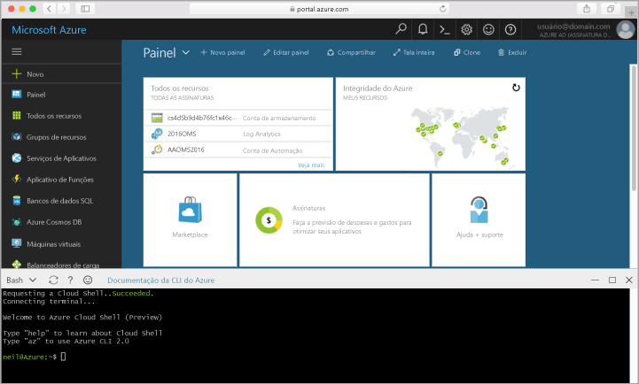

## Iniciar o Azure Cloud ShellLaunch Azure Cloud Shell

Olá Shell de nuvem do Azure é um shell Bash livre que podem ser executados diretamente no hello portal do Azure.hello Azure Cloud Shell is a free Bash shell that you can run directly within hello Azure portal. Ele tem Olá CLI do Azure pré-instalado e configurado toouse com sua conta.It has hello Azure CLI preinstalled and configured toouse with your account. Clique em Olá **nuvem Shell** botão no menu Olá Olá de superior direito da saudação [portal do Azure](https://portal.azure.com).Click hello **Cloud Shell** button on hello menu in hello upper-right of hello [Azure portal](https://portal.azure.com).

botão Olá inicia um shell interativo que você pode usar toorun Olá todas as etapas neste tópico:hello button launches an interactive shell that you can use toorun all of hello steps in this topic:

