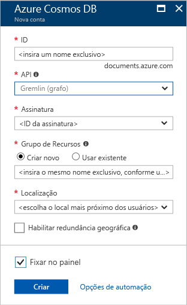

1. Em uma nova janela, entre no [portal do Azure](https://portal.azure.com/).In a new window, sign in to the [Azure portal](https://portal.azure.com/).
2. No painel esquerdo, clique em **Novo**, clique em **Bancos de Dados** e então em **Azure Cosmos DB**, clique em **Criar**.In the left pane, click **New**, click **Databases**, and then under **Azure Cosmos DB**, click **Create**.
   
   

3. Na folha **Nova conta**, especifique a configuração desejada para essa conta do Azure Cosmos DB.In the **New account** blade, specify the configuration that you want for this Azure Cosmos DB account. 

    Com o Azure Cosmos DB, você pode escolher um dos quatro modelos de programação: Gremlin (gráfico), MongoDB, SQL (DocumentDB) e Tabela (chave-valor), cada um exigindo uma conta separada.With Azure Cosmos DB, you can choose one of four programming models: Gremlin (graph), MongoDB, SQL (DocumentDB), and Table (key-value), each which currently require a separate account.
       
    Neste artigo de início rápido, programaremos a API do Graph de modo que você escolherá **Gremlin (gráfico)** quando preencher o formulário.In this quick-start article, we program against the Graph API, so choose **Gremlin (graph)** as you fill out the form. Se você tiver dados de documento de um aplicativo de catálogo, dados de chave/valor (tabela) ou dados migrados de um aplicativo do MongoDB, perceba que o Azure Cosmos DB pode fornecer uma plataforma de serviço de banco de dados altamente disponível, distribuída globalmente para todos os aplicativos críticos.If you have document data from a catalog app, key/value (table) data, or data that's migrated from a MongoDB app, realize that Azure Cosmos DB can provide a highly available, globally distributed database service platform for all your mission-critical applications.

    Preencha os campos da folha **Nova conta** usando as informações na próxima captura de tela como guia - seus valores podem ser diferentes dos valores na captura de tela.Complete the fields on the **New account** blade, using the information in the following screenshot as a guide - your values may be different than the values in the screenshot.
 
    

    ConfiguraçãoSetting|Valor sugeridoSuggested value|DescriçãoDescription
    ---|---|---
    IDID|*Valor exclusivo**Unique value*|Um nome exclusivo que identifica essa conta do Azure Cosmos DB.A unique name that identifies this Azure Cosmos DB account. Como *documents.Azure.com* é acrescentado à ID que você fornece para criar o URI, use uma ID exclusiva mas identificável.Because *documents.azure.com* is appended to the ID that you provide to create your URI, use a unique but identifiable ID. A ID deve conter apenas letras minúsculas, números e hifens (-), e deve conter de 3 a 50 caracteres.The ID must contain only lowercase letters, numbers, and the hyphen (-) character, and it must contain from 3 to 50 characters.
    APIAPI|Gremlin (gráfico)Gremlin (graph)|Nós programaremos a [API do Graph](../articles/cosmos-db/graph-introduction.md) posteriormente neste artigo.We program against the [Graph API](../articles/cosmos-db/graph-introduction.md) later in this article.|
    AssinaturaSubscription|*Sua assinatura**Your subscription*|A assinatura do Azure que você deseja usar para essa conta do Azure Cosmos DB.The Azure subscription that you want to use for this Azure Cosmos DB account. 
    Grupo de recursosResource Group|*O mesmo valor que a ID**The same value as ID*|O novo nome de grupo de recursos para sua conta.The new resource group name for your account. Para simplificar, você pode usar um nome igual à sua ID.For simplicity, you can use the same name as your ID. 
    LocalLocation|*A região mais próxima de seus usuários**The region closest to your users*|A localização geográfica na qual hospedar a sua conta do BD Cosmos do Azure.The geographic location in which to host your Azure Cosmos DB account. Escolha o local mais próximo dos usuários para fornecer a eles acesso mais rápido aos dados.Choose the location closest to your users to give them the fastest access to the data.

4. Clique em **Criar** para criar a conta.Click **Create** to create the account.
5. Na barra de ferramentas superior, clique no ícone **Notificações**  para monitorar o processo de implantação.On the top toolbar, click the **Notifications** icon  to monitor the deployment process.

    

6.  Quando a janela Notificações indicar que a implantação foi bem-sucedida, feche a janela de notificação e abra a nova conta no bloco **Todos os Recursos** no painel.When the Notifications window indicates the deployment succeeded, close the notification window and open the new account from the **All Resources** tile on the Dashboard. 

    