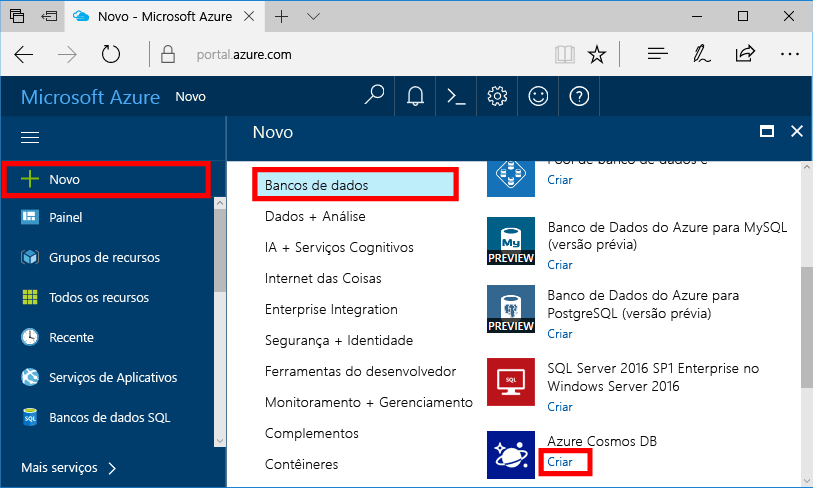
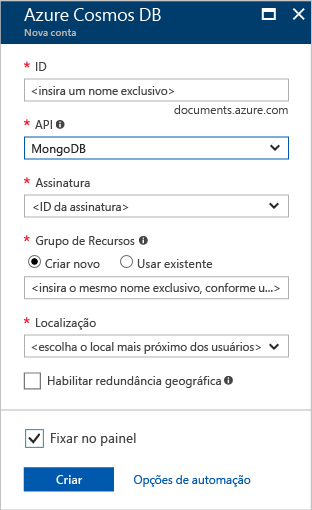
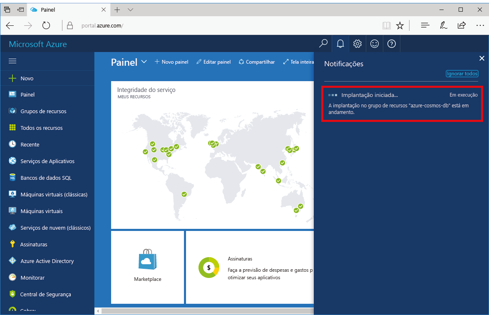
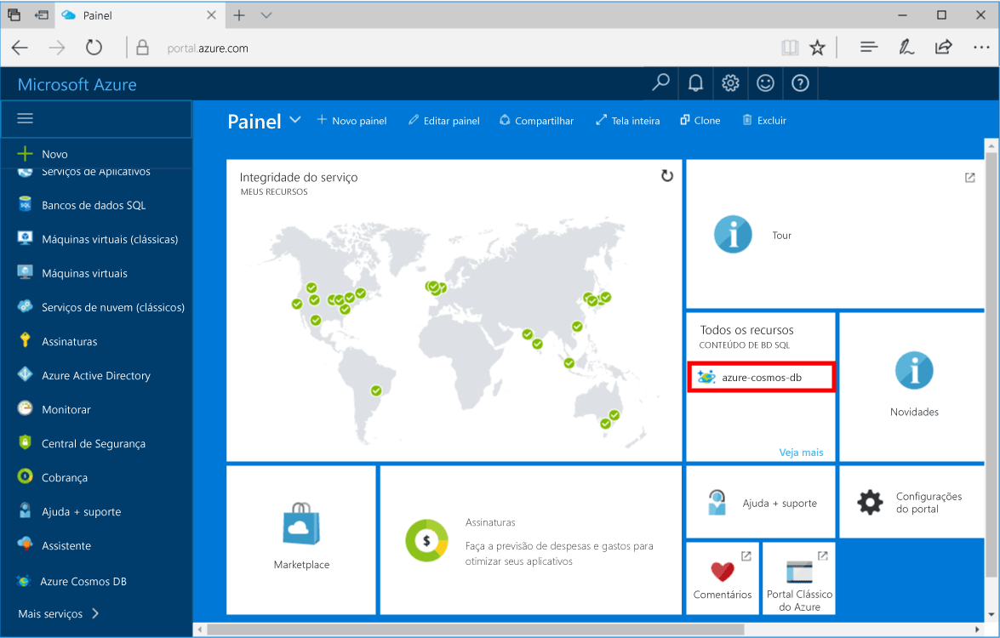

1. Em uma nova janela, entrar toohello [portal do Azure](https://portal.azure.com/).
2. No menu à esquerda do hello, clique em **novo**, clique em **bancos de dados**e, em seguida, em **o banco de dados do Azure Cosmos**, clique em **criar**.
   
   

3. Em Olá **nova conta** folha, especifique a configuração desejada Olá para hello Azure Cosmos DB conta. 

    Com o BD Cosmos do Azure, você pode escolher um dos quatro modelos de programação: Gremlin (gráfico), MongoDB, SQL (DocumentDB) e Tabela (chave-valor). 
       
    Nesse início rápido é vai ser programar Olá MongoDB API para que você escolherá **MongoDB** ao preencher o formulário de saudação. Mas se você tiver dados gráficos de um aplicativo de mídia social, dados de documento de um aplicativo de catálogo ou dados de chave/valor (tabela), perceba que o BD Cosmos do Azure poderá fornecer uma plataforma de serviço de banco de dados altamente disponível, distribuída globalmente para todos os aplicativos críticos.

    Preencha Olá **nova conta** folha com informações de saudação da tabela de saudação como um guia.
 
    
   
    Configuração|Valor sugerido|Descrição
    ---|---|---
    ID|*Valor exclusivo*|Um nome exclusivo que você escolher conta de banco de dados do Azure Cosmos tooidentify hello. *Documents.Azure.com* é acrescentado toohello ID fornecer toocreate seu URI, use uma ID exclusiva e identificação Olá ID pode conter apenas letras minúsculas, números e Olá '-' caracteres e deve ser entre 3 e 50 caracteres.
    API|MongoDB|Podemos vai ser programar Olá [MongoDB API](../articles/documentdb/documentdb-protocol-mongodb.md) posteriormente neste artigo.|
    Assinatura|*Sua assinatura*|Olá assinatura do Azure que você deseja toouse para a conta de banco de dados do Azure Cosmos hello. 
    Grupo de recursos|*Olá mesmo valor ID*|Olá novo recurso nome de grupo para sua conta. Para simplificar, você pode usar o hello mesmo nome como sua ID. 
    Local|*Olá região mais próxima tooyour os usuários*|Olá localização geográfica na qual toohost sua conta de banco de dados do Azure Cosmos. Escolha o local de saudação usuários mais próximos de tooyour toogive-los Olá toohello acessar os dados mais rápidos.

4. Clique em **criar** toocreate conta de saudação.
5. Na barra de ferramentas hello, clique em **notificações** toomonitor processo de implantação de saudação.

    

6.  Quando Olá implantação estiver concluída, a nova conta Olá aberto de saudação todos os recursos lado a lado. 

    
