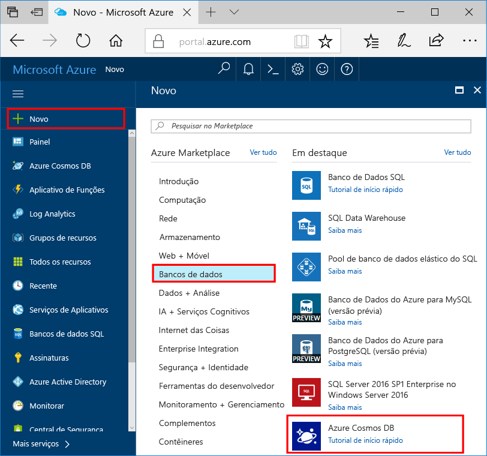

1. Em uma nova janela, entre no [portal do Azure](https://portal.azure.com/).In a new window, sign in to the [Azure portal](https://portal.azure.com/).
2. No menu esquerdo, clique em **Novo**, clique em **Bancos de Dados** e então em **Azure Cosmos DB**, clique em **Criar**.In the left menu, click **New**, click **Databases**, and then under **Azure Cosmos DB**, click **Create**.
   
   

3. Na folha **Nova conta**, especifique a configuração desejada para a conta do BD Cosmos do Azure.In the **New account** blade, specify the desired configuration for the Azure Cosmos DB account. 

    Com o BD Cosmos do Azure, você pode escolher um dos quatro modelos de programação: Gremlin (gráfico), MongoDB, SQL (DocumentDB) e Tabela (chave-valor).With Azure Cosmos DB, you can choose one of four programming models: Gremlin (graph), MongoDB, SQL (DocumentDB), and Table (key-value). 
    
    Neste início rápido, programaremos a API de Tabela de modo que você escolherá **Tabela (chave/valor)** quando preencher o formulário.In this quick start we'll be programming against the Table API so you'll choose **Table (key-value)** as you fill out the form. Mas se você tiver dados gráficos de um aplicativo de mídia social, dados de documento de um aplicativo de catálogo ou dados migrados de um aplicativo do MongoDB, perceba que o BD Cosmos do Azure poderá fornecer uma plataforma de serviço de banco de dados altamente disponível, distribuída globalmente para todos os aplicativos críticos.But if you have graph data for a social media app, document data from a catalog app, or data migrated from a MongoDB app, realize that Azure Cosmos DB can provide a highly available, globally-distributed database service platform for all your mission-critical applications.

    Preencha a nova folha de conta usando as informações na captura de tela como guia.Fill out the New account blade using the information in the screenshot as a guide. Você escolherá valores exclusivos quando configurar sua conta, de modo que seus valores não corresponderão exatamente à captura de tela.You will choose unique values as you set up your account so your values will not match the screenshot exactly. 
 
    

    ConfiguraçãoSetting|Valor sugeridoSuggested value|DescriçãoDescription
    ---|---|---
    IDID|*Valor exclusivo**Unique value*|Um nome exclusivo que você escolhe para identificar a conta do BD Cosmos do Azure.A unique name you choose to identify the Azure Cosmos DB account. *documents.Azure.com* é acrescentado à ID que você fornece para criar o URI, portanto, use uma ID exclusiva mas identificável.*documents.azure.com* is appended to the ID you provide to create your URI, so use a unique but identifiable ID. A ID pode conter somente letras minúsculas, números e o caractere '-', e deve ter entre 3 e 50 caracteres.The ID may contain only lowercase letters, numbers, and the '-' character, and must be between 3 and 50 characters.
    APIAPI|Tabela (chave/valor)Table (key-value)|Programaremos para a [API de Tabela](../articles/cosmos-db/table-introduction.md) posteriormente neste artigo.We'll be programming against the [Table API](../articles/cosmos-db/table-introduction.md) later in this article.|
    AssinaturaSubscription|*Sua assinatura**Your subscription*|A assinatura do Azure que você deseja usar para a conta do BD Cosmos do Azure.The Azure subscription that you want to use for the Azure Cosmos DB account. 
    Grupo de recursosResource Group|*O mesmo valor que a ID**The same value as ID*|O novo nome de grupo de recursos para sua conta.The new resource group name for your account. Para simplificar, você pode usar um nome igual à sua ID.For simplicity, you can use the same name as your ID. 
    LocalLocation|*A região mais próxima de seus usuários**The region closest to your users*|A localização geográfica na qual hospedar a sua conta do BD Cosmos do Azure.The geographic location in which to host your Azure Cosmos DB account. Escolha o local mais próximo dos usuários para fornecer a eles acesso mais rápido aos dados.Choose the location closest to your users to give them the fastest access to the data.   

4. Clique em **Criar** para criar a conta.Click **Create** to create the account.
5. Na barra de ferramentas, clique em **Notificações** para monitorar o processo de implantação.On the toolbar, click **Notifications** to monitor the deployment process.

    

6.  Quando a implantação for concluída, abra a nova conta no bloco Todos os Recursos.When the deployment is complete, open the new account from the All Resources tile. 

    
