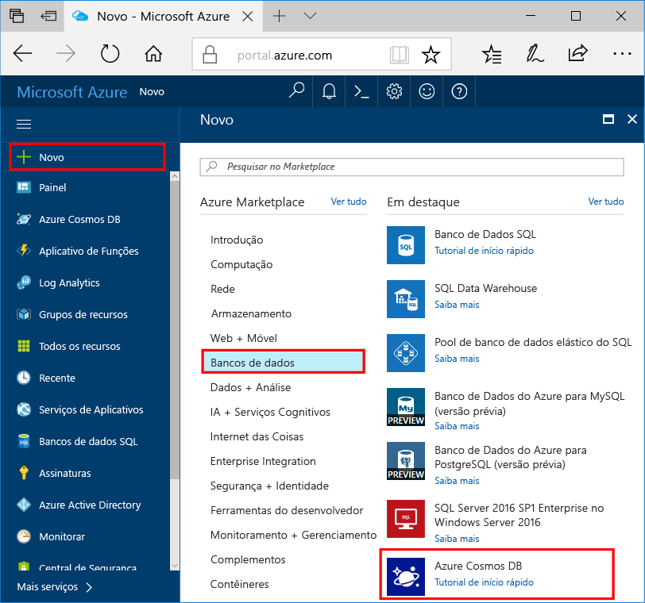

1. Em uma nova janela, entrar toohello [portal do Azure](https://portal.azure.com/).
2. No painel esquerdo do hello, clique em **novo**, clique em **bancos de dados**e, em seguida, em **o banco de dados do Azure Cosmos**, clique em **criar**.
   
   

3. Em Olá **nova conta** folha, especificar a configuração de saudação que você deseja para esta conta de banco de dados do Azure Cosmos. 

    Com o Azure Cosmos DB, você pode escolher um dos quatro modelos de programação: Gremlin (gráfico), MongoDB, SQL (DocumentDB) e Tabela (chave-valor), cada um exigindo uma conta separada.
    
    Neste artigo de início rápido é programar Olá API DocumentDB, portanto escolha **SQL (documentos)** como preencher o formulário de saudação. Se você tiver dados gráficos de um aplicativo de mídia social, dados de chave/valor (tabela) ou dados migrados de um aplicativo do MongoDB, perceba que o Azure Cosmos DB poderá fornecer uma plataforma de serviço de banco de dados altamente disponível, distribuída globalmente para todos os aplicativos críticos.

    Preencha os campos de saudação em Olá **nova conta** folha, usando os valores de informações Olá Olá como um guia de captura de tela a seguir pode ser diferente de valores de saudação na captura de tela de saudação.
 
    

    Configuração|Valor sugerido|Descrição
    ---|---|---
    ID|*Valor exclusivo*|Um nome exclusivo que identifica essa conta do Azure Cosmos DB. Porque *documents.azure.com* é acrescentado toohello ID da ID que você forneça toocreate seu URI, use um exclusivo mas identificável. Olá ID pode conter apenas letras minúsculas, números e caracteres de hífen (-) hello e ele deve conter 3 caracteres too50.
    API|SQL (DocumentDB)|Podemos fazer programações Olá [API DocumentDB](../articles/documentdb/documentdb-introduction.md) posteriormente neste artigo.|
    Assinatura|*Sua assinatura*|Olá assinatura do Azure que você deseja toouse para esta conta de banco de dados do Azure Cosmos. 
    Grupo de recursos|*Olá mesmo valor ID*|Olá novo grupo de recursos nome para sua conta. Para simplificar, você pode usar o hello mesmo nome como sua ID. 
    Local|*Olá região mais próxima tooyour os usuários*|Olá localização geográfica na qual toohost sua conta de banco de dados do Azure Cosmos. Escolha local hello mais próximo toogive de usuários tooyour-los Olá toohello acessar os dados mais rápidos.
4. Clique em **criar** toocreate conta de saudação.
5. Na barra de ferramentas superior hello, clique em Olá **notificações** ícone  toomonitor processo de implantação de saudação.

    

6.  Quando a janela de notificações de saudação indica a janela de notificação Olá implantação Olá bem-sucedido, feche e abra Olá nova conta de saudação **todos os recursos** bloco Olá painel. 

    
 
