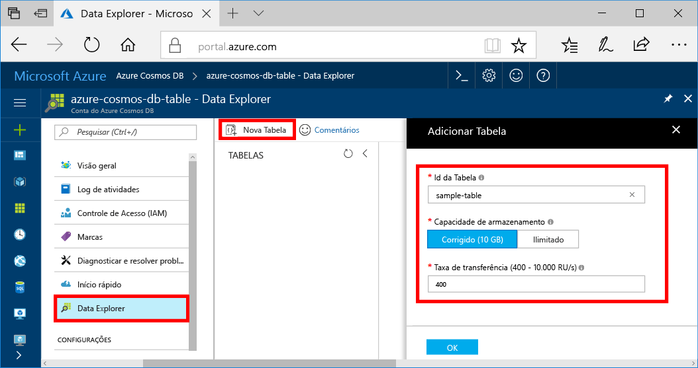

Agora você pode usar o Explorador de dados toocreate uma tabela e adicionar dados tooyour banco de dados. 

1. No hello portal do Azure, no menu de navegação hello, clique em **Gerenciador de dados (visualização)**. 
2. Na folha de dados Explorer hello, clique em **nova tabela**, em seguida, preencha a página hello usando Olá informações a seguir.

    

    Configuração|Valor sugerido|Descrição
    ---|---|---
    Id da Tabela|tabela de exemplo|Olá ID para a nova tabela. Nomes de tabela têm Olá mesmo caractere requisitos como ids de banco de dados. Os nomes de banco de dados devem ter entre um e 255 caracteres e não podem conter `/ \ # ?` nem espaços à direita.
    Capacidade de armazenamento| 10 GB|Deixe o valor padrão de saudação. Isso é a capacidade de armazenamento de saudação do banco de dados de saudação.
    Taxa de transferência|400 RUs|Deixe o valor padrão de saudação. Você pode escalar verticalmente Olá [taxa de transferência](../articles/cosmos-db/request-units.md) posterior se você quiser tooreduce latência.

3. Depois de preencher o formulário Olá, clique em **Okey**.
