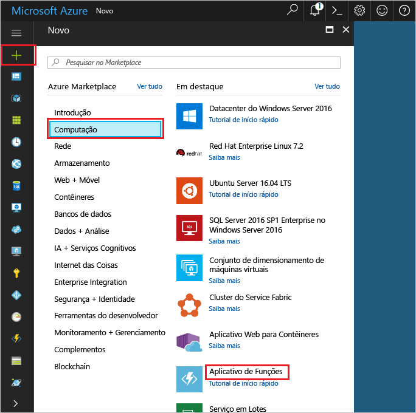

1. Clique em Olá **novo** botão localizado no canto superior esquerdo de saudação do hello portal do Azure.Click hello **New** button found on hello upper left-hand corner of hello Azure portal.

1. Clique em **Computação** > **Aplicativo de Funções** e selecione sua **Assinatura**.Click **Compute** > **Function App**, select your **Subscription**. Em seguida, use as configurações de aplicativo de função hello conforme especificado na tabela de saudação.Then, use hello function app settings as specified in hello table.

    

    | ConfiguraçãoSetting      | Valor sugeridoSuggested value  | DescriçãoDescription                                        |
    | ------------ |  ------- | -------------------------------------------------- |
    | **Nome do aplicativo****App name** | Nome globalmente exclusivoGlobally unique name | Nome que identifica seu novo aplicativo de funções.Name that identifies your new function app. | 
    | **[Grupo de Recursos](../articles/azure-resource-manager/resource-group-overview.md)****[Resource Group](../articles/azure-resource-manager/resource-group-overview.md)** |  myResourceGroupmyResourceGroup | Nome para o novo grupo de recursos hello, no qual toocreate seu aplicativo de função.Name for hello new resource group in which toocreate your function app. | 
    | **[Plano de hospedagem](../articles/azure-functions/functions-scale.md)****[Hosting plan](../articles/azure-functions/functions-scale.md)** |   Plano de consumoConsumption plan | Plano de hospedagem que define como os recursos são alocados tooyour função app.Hosting plan that defines how resources are allocated tooyour function app. No padrão de saudação **consumo planejar**, os recursos são adicionados dinamicamente conforme exigido por suas funções.In hello default **Consumption Plan**, resources are added dynamically as required by your functions. Você só paga pelo tempo de saudação que executar suas funções.You only pay for hello time your functions run.   |
    | **Localidade****Location** | Europa OcidentalWest Europe | Escolha uma localização perto de você ou perto de outros serviços que suas funções acessarão.Choose a location near you or near other services your functions will access. |
    | **[Conta de armazenamento](../articles/storage/common/storage-create-storage-account.md#create-a-storage-account)****[Storage account](../articles/storage/common/storage-create-storage-account.md#create-a-storage-account)** |  Nome globalmente exclusivoGlobally unique name |  Nome da conta de armazenamento novo Olá usada pelo seu aplicativo de função.Name of hello new storage account used by your function app. Os nomes da conta de armazenamento devem ter entre 3 e 24 caracteres e podem conter apenas números e letras minúsculas.Storage account names must be between 3 and 24 characters in length and may contain numbers and lowercase letters only. Você também pode usar uma conta existente.You can also use an existing account. |

1. Clique em **criar** tooprovision e implantar o novo aplicativo de função hello.Click **Create** tooprovision and deploy hello new function app.
