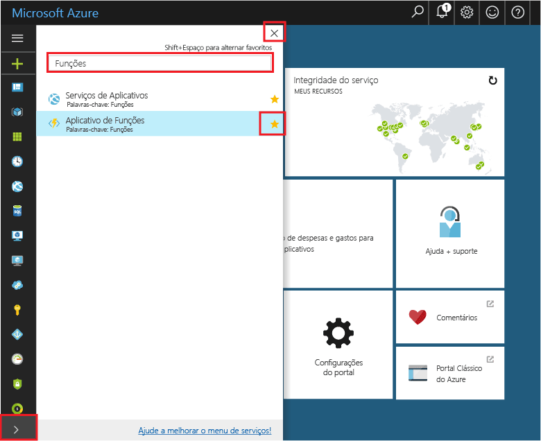
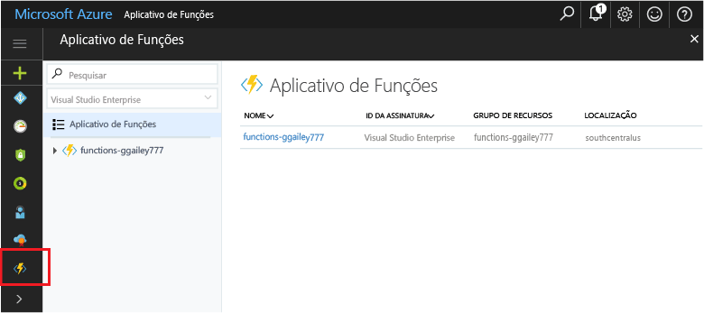

## Adicionar aplicativos de função tooyour portais FavoritosAdd Function Apps tooyour portal favorites 

Se ainda não o fez, adicione favoritos de tooyour aplicativos de função no Olá portal do Azure.If you haven't already done so, add Function Apps tooyour favorites in hello Azure portal. Isso torna mais fácil toofind seus aplicativos de função.This makes it easier toofind your function apps. Se você já tiver feito isso, ignore toohello próxima seção.If you have already done this, skip toohello next section. 

1. Faça logon no toohello [portal do Azure](https://portal.azure.com/).Log in toohello [Azure portal](https://portal.azure.com/).

2. Clique em seta Olá Olá inferior esquerdo tooexpand todos os serviços, digite `Functions` em Olá **filtro** campo e, em seguida, clique em estrela Olá Avançar muito**função aplicativos**.Click hello arrow at hello bottom left tooexpand all services, type `Functions` in hello **Filter** field, and then click hello star next too**Function Apps**.  
 
    

    Isso adiciona o menu de toohello do ícone de funções hello esquerda de saudação do portal de saudação.This adds hello Functions icon toohello menu on hello left of hello portal.

3. Feche o menu hello e role para baixo do ícone de funções toohello inferior toosee hello.Close hello menu, then scroll down toohello bottom toosee hello Functions icon. Clique em toosee este ícone uma lista de todos os seus aplicativos de função.Click this icon toosee a list of all your function apps. Clique em seu toowork do aplicativo de função com funções neste aplicativo.Click your function app toowork with functions in this app. 
 
    
 
     