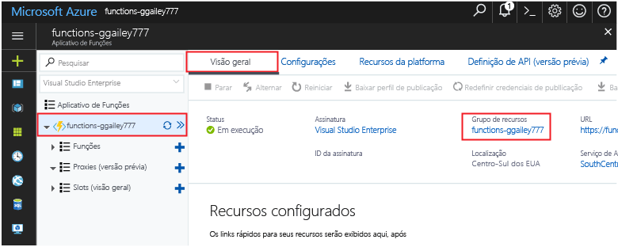

Outros inícios rápidos nessa coleção aproveitam esse início rápido. Se você planeja toocontinue toowork subsequentes inícios rápidos ou com tutoriais hello, não limpar os recursos de saudação criados nesse rápido inicie. 

Se você não planeja toocontinue, clique em Olá **grupo de recursos** para o aplicativo de função hello no portal de Olá e depois clique em **excluir**. 

