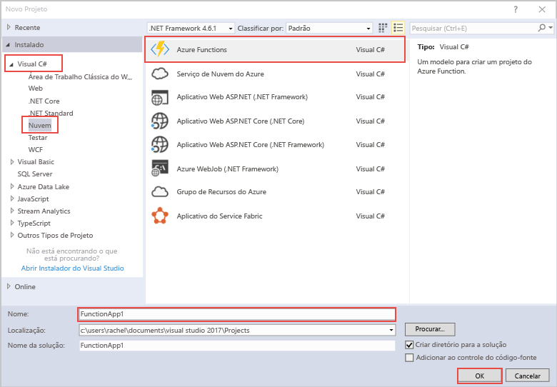

modelo de projeto Olá funções do Azure no Visual Studio cria um projeto que pode ser publicado tooa função aplicativo no Azure.hello Azure Functions project template in Visual Studio creates a project that can be published tooa function app in Azure. Um aplicativo de funções permite a você agrupar funções como uma unidade lógica para facilitar o gerenciamento, implantação e compartilhamento de recursos.A function app lets you group functions as a logic unit for easier management, deployment, and sharing of resources.   

1. Botão direito do mouse no nó do projeto Olá em **Solution Explorer**, em seguida, escolha **adicionar** > **Novo Item**.Right mouse click on hello project node in **Solution Explorer**, then choose **Add** > **New Item**. Escolha **função Azure** Olá caixa de diálogo.Choose **Azure Function** from hello dialog box.

2. Em Olá **novo projeto** caixa de diálogo, expanda **Visual C#** > **nuvem** nó, selecione **funções do Azure**, digite um **Nome** para seu projeto e clique em **Okey**.In hello **New Project** dialog, expand **Visual C#** > **Cloud** node, select **Azure Functions**, type a **Name** for your project, and click **OK**. nome do aplicativo de função Hello deve ser válido como um namespace do c#, portanto, não usar outros caracteres não alfanuméricos, hífens ou sublinhados.hello function app name must be valid as a C# namespace, so don't use underscores, hyphens, or any other nonalphanumeric characters. 

    
