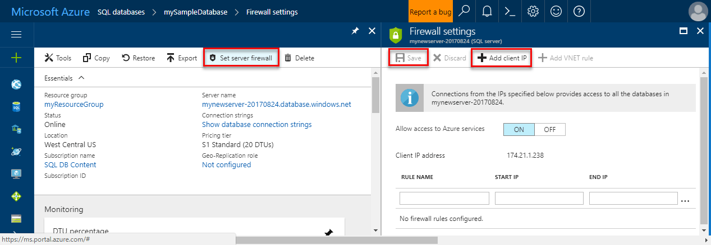

<!--
includes/sql-database-create-new-server-firewall-portal.md

Latest Freshness check:  2016-11-28 , rickbyh.

As of circa 2016-04-11, hello following topics might include this include:
articles/sql-database/sql-database-get-started.md
articles/sql-database/sql-database-configure-firewall-settings
articles/sql-data-warehouse-get-started-provision.md

-->
### Criar uma regra de firewall de nível de servidor no hello portal do AzureCreate a server-level firewall rule in hello Azure portal

1. Na folha de servidor SQL hello, em configurações, clique em **Firewall** tooopen folha de Firewall Olá para o SQL server de saudação.On hello SQL server blade, under Settings, click **Firewall** tooopen hello Firewall blade for hello SQL server.

    <!--  -->

2. Examine o endereço IP do cliente Olá exibido e confirme se esse é o endereço IP na Internet usando um navegador de sua escolha de saudação (perguntar "qual é o endereço IP).Review hello client IP address displayed and validate that this is your IP address on hello Internet using a browser of your choice (ask "what is my IP address). Ocasionalmente, eles não coincidem por vários motivos.Occasionally they do not match for a various reasons.

    <!--  -->

3. Supondo que os endereços IP hello corresponderem, clique em **Adicionar IP do cliente** na barra de ferramentas de saudação.Assuming that hello IP addresses match, click **Add client IP** on hello toolbar.

    

    > [!NOTE]
    > Você pode abrir o firewall do banco de dados SQL Olá em Olá tooa único endereço IP de servidor ou todo um intervalo de endereços.You can open hello SQL Database firewall on hello server tooa single IP address or an entire range of addresses. Abertura Olá firewall permite os administradores do SQL e os usuários toologin tooany banco de dados Olá toowhich servidor tiverem credenciais válidas.Opening hello firewall enables SQL administrators and users toologin tooany database on hello server toowhich they have valid credentials.
    >

4. Clique em **salvar** em Olá barra de ferramentas toosave essa regra de firewall de nível de servidor e, em seguida, clique em **Okey**.Click **Save** on hello toolbar toosave this server-level firewall rule and then click **OK**.

    

> [!Tip]
> Para obter um tutorial, confira [Tutorial do banco de dados SQL: criar um servidor, uma regra de firewall de nível de servidor, um banco de dados de exemplo, uma regra de firewall de nível de banco de dados e conectar-se com o SQL Server](../articles/sql-database/sql-database-get-started.md).For a tutorial, see [SQL Database tutorial: Create a server, a server-level firewall rule, a sample database, a database-level firewall rule and connect with SQL Server](../articles/sql-database/sql-database-get-started.md).    
>
