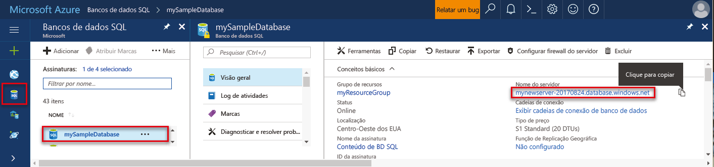

## Faça logon no toohello portal do AzureLog in toohello Azure portal

Faça logon no toohello [portal do Azure](https://portal.azure.com/).Log in toohello [Azure portal](https://portal.azure.com/).

## Criar um banco de dados SQL em branco usando Olá portal do AzureCreate a blank SQL database using hello Azure portal

Um banco de dados SQL do Azure é criado com um conjunto definido de [recursos de computação e armazenamento](../articles/sql-database/sql-database-service-tiers.md).An Azure SQL database is created with a defined set of [compute and storage resources](../articles/sql-database/sql-database-service-tiers.md). banco de dados de saudação é criado em um [grupo de recursos do Azure](../articles/azure-resource-manager/resource-group-overview.md) e, em um [servidor lógico do banco de dados do Azure SQL](../articles/sql-database/sql-database-features.md).hello database is created within an [Azure resource group](../articles/azure-resource-manager/resource-group-overview.md) and in an [Azure SQL Database logical server](../articles/sql-database/sql-database-features.md). 

Siga essas etapas toocreate um banco de dados SQL em branco.Follow these steps toocreate a blank SQL database. 

1. Clique em Olá **novo** botão localizado no canto superior esquerdo de saudação do hello portal do Azure.Click hello **New** button found on hello upper left-hand corner of hello Azure portal.

2. Selecione **bancos de dados** de saudação **novo** página e selecione **banco de dados SQL** de saudação **bancos de dados** página.Select **Databases** from hello **New** page, and select **SQL Database** from hello **Databases** page. 

   

3. Preencha formulário de banco de dados SQL Olá com hello seguintes informações, conforme mostrado na saudação anterior imagem:Fill out hello SQL Database form with hello following information, as shown on hello preceding image:   

   | ConfiguraçãoSetting | Valor sugeridoSuggested value | DescriçãoDescription |
   | --------| --------------- | ----------- | 
   | **Nome do banco de dados****Database name** | mySampleDatabasemySampleDatabase | Para ver os nomes do banco de dados válidos, consulte [Identificadores do Banco de Dados](https://docs.microsoft.com/sql/relational-databases/databases/database-identifiers).For valid database names, see [Database Identifiers](https://docs.microsoft.com/sql/relational-databases/databases/database-identifiers). | 
   | **Assinatura****Subscription** | Sua assinaturaYour subscription  | Para obter detalhes sobre suas assinaturas, consulte [Assinaturas](https://account.windowsazure.com/Subscriptions).For details about your subscriptions, see [Subscriptions](https://account.windowsazure.com/Subscriptions). |
   | **Grupo de recursos****Resource group** | myResourceGroupmyResourceGroup | Para ver os nomes do grupo de recursos válidos, consulte [Regras e restrições de nomenclatura](https://docs.microsoft.com/azure/architecture/best-practices/naming-conventions).For valid resource group names, see [Naming rules and restrictions](https://docs.microsoft.com/azure/architecture/best-practices/naming-conventions). |
   | **Selecionar fonte****Select source** | Banco de dados em brancoBlank database | Especifica que um banco de dados em branco deve ser criado.Specifies that a blank database should be created. |
   ||||

4. Clique em **Server** toocreate e configurar um novo servidor para o novo banco de dados.Click **Server** toocreate and configure a new server for your new database. Preencha Olá **novo formulário de servidor** com hello informações a seguir:Fill out hello **New server form** with hello following information: 

   | ConfiguraçãoSetting | Valor sugeridoSuggested value | DescriçãoDescription |
   | --------| --------------- | ----------- | 
   | **Nome do servidor****Server name** | Qualquer nome exclusivo globalmente.Any globally unique name. | Para ver os nomes do servidor válidos, consulte [Regras e restrições de nomenclatura](https://docs.microsoft.com/azure/architecture/best-practices/naming-conventions).For valid server names, see [Naming rules and restrictions](https://docs.microsoft.com/azure/architecture/best-practices/naming-conventions). | 
   | **Logon de administrador do servidor****Server admin login** | Qualquer nome válido.Any valid name. | Para ver os nomes de logon válidos, consulte [Identificadores do Banco de Dados](https://docs.microsoft.com/sql/relational-databases/databases/database-identifiers).For valid login names, see [Database Identifiers](https://docs.microsoft.com/sql/relational-databases/databases/database-identifiers).|
   | **Senha****Password** | Qualquer senha válida.Any valid password. | Sua senha deve ter pelo menos oito caracteres e deve conter caracteres de três das Olá categorias a seguir: caracteres em letras maiusculas, letras minúsculas, números e caracteres não alfanuméricos.Your password must have at least eight characters and must contain characters from three of hello following categories: upper case characters, lower case characters, numbers, and non-alphanumeric characters. |
   | **Localidade****Location** | Qualquer local válido.Any valid location. | Para obter mais informações sobre as regiões, consulte [Regiões do Azure](https://azure.microsoft.com/regions/).For information about regions, see [Azure Regions](https://azure.microsoft.com/regions/). |
   ||||

   

5. Clique em **Selecionar**.Click **Select**.

6. Clique em **preço** toospecify Olá desempenho e da camada de nível de serviço para o novo banco de dados.Click **Pricing tier** toospecify hello service tier and performance level for your new database. Para este tutorial, selecione **20 DTUs** e **250** GB de armazenamento.For this tutorial, select **20 DTUs** and **250** GB of storage.

   

7. Clique em **Aplicar**.Click **Apply**.  

8. Selecione um **agrupamento** para banco de dados em branco (para este tutorial, usar o valor padrão Olá) hello.Select a **collation** for hello blank database (for this tutorial, use hello default value). Para obter mais informações sobre agrupamentos, consulte [Agrupamentos](https://docs.microsoft.com/sql/t-sql/statements/collations)For more information about collations, see [Collations](https://docs.microsoft.com/sql/t-sql/statements/collations)

9. Clique em **criar** banco de dados do tooprovision hello.Click **Create** tooprovision hello database. Provisionamento leva sobre toocomplete um minuto e meia.Provisioning takes about a minute and a half toocomplete. 

10. Na barra de ferramentas hello, clique em **notificações** toomonitor processo de implantação de saudação.On hello toolbar, click **Notifications** toomonitor hello deployment process.

   

## Criar uma regra de firewall de nível de servidor usando Olá portal do AzureCreate a server-level firewall rule using hello Azure portal

Olá serviço de banco de dados SQL cria um firewall no nível de servidor de saudação.hello SQL Database service creates a firewall at hello server-level. Inicialmente firewall Olá impede ferramentas externas e aplicativos de conexão de servidor toohello ou tooany bancos de dados no servidor de saudação.Initially hello firewall prevents external tools and applications from connecting toohello server, or tooany databases on hello server. Conexões são permitidas depois que uma regra de firewall é criada tooopen endereços IP específicos.Connections are allowed after a firewall rule is created tooopen specific IP addresses. Siga estas etapas toocreate um [regra de firewall de nível de servidor de banco de dados SQL](../articles/sql-database/sql-database-firewall-configure.md) para o endereço IP e a conectividade externa tooenable através do firewall do banco de dados SQL Olá para seu endereço de IP do cliente.Follow these steps toocreate a [SQL Database server-level firewall rule](../articles/sql-database/sql-database-firewall-configure.md) for your client's IP address, and tooenable external connectivity through hello SQL Database firewall for your IP address only. 

> [!NOTE]
> O Banco de Dados SQL do Azure se comunica pela porta 1433.Azure SQL Database communicates over port 1433. Você pode conectar tooSQL banco de dados somente depois que o firewall de saudação da sua rede permite o tráfego de saída pela porta 1433.You can connect tooSQL Database only after hello firewall of your network allows outbound traffic through port 1433.

1. Após a conclusão da implantação hello, clique em **bancos de dados SQL** no menu esquerdo hello e clique **mySampleDatabase** em Olá **bancos de dados SQL** página.After hello deployment completes, click **SQL databases** from hello left-hand menu and then click **mySampleDatabase** on hello **SQL databases** page. Olá, página de visão geral para o banco de dados abre, mostrando a você Olá totalmente qualificado nome do servidor (como **mynewserver20170313.database.windows.net**) e fornece opções de configuração adicional.hello overview page for your database opens, showing you hello fully qualified server name (such as **mynewserver20170313.database.windows.net**) and provides options for further configuration. Copie esse nome totalmente qualificado do servidor para um uso posterior.Copy this fully qualified server name for use later.

   > [!IMPORTANT]
   > É necessário que este servidor de tooyour de tooconnect de nome totalmente qualificado do servidor e seus bancos de dados em início rápido subsequente.You need this fully qualified server name tooconnect tooyour server and its databases in subsequent quick starts.
   > 

    

2. Clique em **definir o firewall do servidor** na barra de ferramentas Olá conforme mostrado na imagem anterior hello.Click **Set server firewall** on hello toolbar as shown in hello previous image. Olá **configurações de Firewall** página para o servidor de banco de dados SQL Olá é aberta.hello **Firewall settings** page for hello SQL Database server opens. 

    

3. Clique em **Adicionar IP do cliente** em Olá barra de ferramentas tooadd seu atual endereço IP tooa nova regra de firewall.Click **Add client IP** on hello toolbar tooadd your current IP address tooa new firewall rule. Uma regra de firewall pode abrir a porta 1433 para um único endereço IP ou um intervalo de endereços IP.A firewall rule can open port 1433 for a single IP address or a range of IP addresses.

4. Clique em **Salvar**.Click **Save**. Uma regra de firewall de nível de servidor é criada para seu endereço IP atual, abrir a porta 1433 no servidor lógico hello.A server-level firewall rule is created for your current IP address opening port 1433 on hello logical server.

    

4. Clique em **Okey** e, em seguida, feche Olá **configurações de Firewall** página.Click **OK** and then close hello **Firewall settings** page.

Agora você pode conectar o servidor de banco de dados do Azure SQL toohello e seus bancos de dados usando uma ferramenta como o SQL Server Management Studio (SSMS).You can now connect toohello Azure SQL Database server and its databases by using a tool such as SQL Server Management Studio (SSMS). conexão Hello está usando esse endereço IP e usa a conta de administrador de servidor de saudação criada anteriormente.hello connection is from this IP address, and it uses hello server admin account created previously.

> [!IMPORTANT]
> Por padrão, o acesso através do firewall do banco de dados SQL hello está habilitado para todos os serviços do Azure.By default, access through hello SQL Database firewall is enabled for all Azure services. Clique em **OFF** em toodisable essa página para todos os serviços do Azure.Click **OFF** on this page toodisable for all Azure services.

## Obter valores de cadeia de caracteres de conexão usando Olá portal do AzureGet connection string values using hello Azure portal

Obter nome de totalmente qualificado do servidor de saudação de seu servidor de banco de dados do Azure SQL Olá portal do Azure.Get hello fully qualified server name for your Azure SQL Database server in hello Azure portal. Você usa Olá totalmente qualificado nome tooconnect tooyour server usando o SQL Server Management Studio.You use hello fully qualified server name tooconnect tooyour server using SQL Server Management Studio.

1. Faça logon no toohello [portal do Azure](https://portal.azure.com/).Log in toohello [Azure portal](https://portal.azure.com/).

2. Selecione **bancos de dados SQL** no menu esquerdo do hello e clique em seu banco de dados em Olá **bancos de dados SQL** página.Select **SQL Databases** from hello left-hand menu, and click your database on hello **SQL databases** page. 

3. Em Olá **Essentials** painel Olá página do portal do Azure para seu banco de dados, localize e copie Olá **nome do servidor**.In hello **Essentials** pane in hello Azure portal page for your database, locate and then copy hello **Server name**.

    
